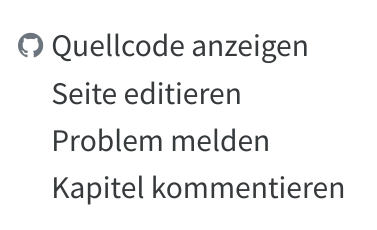

Dieses Handbuch wird in einem offenen Prozess erarbeitet und verbessert. Mitarbeit ist dabei grundsätzlich sehr willkommen und in verschiedener Form möglich. Voraussetzung ist ein Verständnis des [Arbeitsablauf], Einhaltung des [Styleguide] und die freie [Lizenzierung](#lizenz) der eigenen Beiträge. Das Verfahren zur Aktualisierung des Handbuchs ist unter [Technik](#technik) beschrieben.

## Kurzfassung

Neue Kapitel entstehen in Book-Sprints vor Ort. Kapitel die anschließend für Lektorat und weitere Änderungen freigegeben sind, können über die Feedback-Links verbessert werden:

- **Seite editieren** führt zum Markdown-Quelltext und kann am schnellsten in die Publikation einfließen, benötigt aber einen GitHub-Account.
- **Problem melden** führt zum [Issue-Tracker](https://github.com/pro4bib/handbuch-it-in-bibliotheken/issues) für allgemeine Hinweise (benötigt ebenfalls GitHub-Account).
- **Kapitel kommentieren** führt zu einer Kopie des Kapitels bei Google-Docs. Das ist zum Beitragen am einfachsten, muss aber später redaktionell in die Markdown-Quellen eingearbeitet werden.

Die ganz Technik-affinen können sich auch [das git-Repository klonen](https://github.com/pro4bib/handbuch-it-in-bibliotheken) und für das Look-and-Feel der HTML-Version mit [Quarto](https://quarto.org/) bearbeiten.

## Arbeitsablauf {.unnumbered}

Der aktuelle Workflow beinhaltet folgende Schritte:

Schreiben
  : Neue Themen werden durch Gruppen im Rahmen von Book Sprints erstellt. Als Werkzeug zum freien Schreiben dient dabei beispielsweise Google Docs.

Lektorat
  : Fertige Kapitel werden einmalig nach Markdown konvertiert und im [git-Repository](#technik) des Handbuch abgelegt. Anschließend werden daraus *DOCX*-Dateien erstellt (Word) und in einem [Google Drive Verzeichnis](https://drive.google.com/drive/folders/1JMBLJlk71JqQMQY7j_uXwV47fX8NA_N2) zum Korrekturlesen und Kommentieren bereitgestellt. Änderungen können auch [mittels GitHub-Issues](https://github.com/pro4bib/handbuch-it-in-bibliotheken/issues) oder per Hinweis an [die Autor*innen](#autorinnen) erfolgen.

Redaktion
  : Änderungen an bestehenden Kapiteln und an der Gesamtstruktur des Buches können direkt im git-Repository vorgenommen werden. Alternativ muss jemand Änderungsvorschläge aus den Kapitel-Kopien bei Google Docse einarbeiten und die DOCX-Datei aktualisieren.

Publikation
  : Änderungen an der Markdown-Dateien im git-Repository führen dazu, dass das Buch mittels [quarto] in HTML und anderen Formaten aus den Quellen zusammengebaut wird. Eine Druckversion liegt noch nicht vor.

[quarto]: https://quarto.org/

## Styleguide {#styleguide .unnumbered}

Dieser Styleguide soll eine einheitliche Form trotz [unterschiedlicher Autor*innen](#mitarbeit-autorinnen) gewährleisten. Dazu gibt es Hinweise zu [Zielgruppe](#zielgruppe), [Stil und Aktualität](#schreibstil), [Schreibweise](#schreibweise) und [Struktur](#struktur) sowie Vorgaben zu besonderen Inhalten wie [Bildern und anderen Medien](#mitarbeit-medien), [Literaturverzeichnis](#mitarbeit-literatur) und [Abkürzungsverzeichnis](#mitarbeit-glossar).

### Zielgruppe {#zielgruppe}

Zur Klärung der Zielgruppe dieses Handbuchs wurden einige sogenannte
*Personas* definiert:

-   **Janine** Buchinger: Janine leitet die Stadtbibliothek in einer
    Stadt mit 250.000 Einwohnern. Die Bibliothek besteht aus einer
    Zentrale und zwei Zweigstellen. Mit den Schulbüchereien besteht
    eine Kooperation für fachliche Beratung und gemeinsame Aktivitäten
    bei der Informationskompetenz-Vermittlung.

-   Dr. **Tillmann** Schuppe: Tillmann ist Leiter einer
    Fachhochschulbibliothek mit 500.000 Medieneinheiten. Die
    Bibliothek gehört einem Bibliotheksverbund an. Die Bibliothek
    plant einen Neubau, der gemeinsam mit dem Rechen- und
    Medienzentrum bezogen werden soll.

-   **Magda** Olsowski: Magda ist studierte Informatikerin und leitet
    die Gruppe Forschungsdatenmanagement an einer großen
    Universitätsbibliothek. Sie hat keine bibliothekarische
    Vorbildung.

-   **Alicia** Meyer: Alicia studiert Bibliotheksmanagement und plant
    eine Masterarbeit, in der sie die Implementierungsprozesse von
    Software analysieren möchte.

-   **Robert** Pohlmann: Robert leitet die IT-Abteilung einer
    mittelgroßen Universitätsbibliothek und ist nebenberuflich
    Lehrbeauftragter für einen bibliothekarischen Studiengang.

### Stil und Aktualität {#schreibstil .unnumbered}

-   **Journalistische oder enzyklopädische Neutralität sind nicht oberstes Prinzip dieses Buches.** Es soll vielmehr fundiert und praxisorientiert informieren und beraten und darf dabei auch parteiisch sein.

-   **Dieses Buch ist keine wissenschaftliche Forschungsveröffentlichung.** Nicht jede Aussage muss mit einer Quelle belegt werden. Für die Anwendung in der Hochschullehre reicht es, wenn das Buch zentrale Aussagen belegt bzw. auf die wichtigsten aktuellen Studien verweist und somit auch Tipps zur weiterführenden Lektüre bietet.

-   **Das Buch sollte in 2-5 Jahren noch aktuell und verständlich sein, aber nicht mehr unbedingt in 10 Jahren.**

-   **Das Buch soll als Nachschlagewerk dienen, das nicht vollständig durchgelesen werden muss.** Dabei helfen Redundanz und Querverweise (siehe [Hinweise zur Struktur](#struktur)).

### Struktur {#struktur .unnumbered}

#### Struktur des Texts {.unnumbered}

-   Wir verwenden **kurze, unverschachtelte Sätze**.

-   Wir erzeugen **Sinnabschnitte**, die möglichst für sich stehend verständlich sind.

-   Wir schreiben **stark strukturiert**, also

    - mit vielen **Zwischenüberschriften**, bis maximal zur vierten Gliederungsebene,

    - wo es inhaltlich passt, in stichpunktartigen **Listen** und

    - mit Hervorhebung **wichtiger Begriff durch Fettdruck** als Gliederungshilfe.

-   Wir verwenden **[Infoboxen](https://quarto.org/docs/authoring/callouts.html)**, die auch
    unabhängig vom übrigen Text lesbar sind.

-   Wir liefern **wichtige Informationen zusätzlich** zum Text in Form von Bildern, Tabellen, Listen, Infoboxen und/oder Zusammenfassungen.

#### Struktur der Hauptkapitel {.unnumbered}

Das Handbuch behandelt [aufgeteilt in Hauptkapitel](#inhalt) die wesentlichen Themen rund um IT in Bibliotheken.

-   Jedes Kapitel beginnt mit einer **Kurzfassung** als Infobox gefolgt von einer **Einleitung** und endet mit einem Abschnitt **Zusammenfassung und Ausblick**.

-   Kapitel haben normalerweise einen Umfang von rund 4.000 Wörtern. Deutlich längere Kapitel sind darauf zu prüfen, ob sie sich in mehrere Kapitel trennen lassen, und wenn das nicht möglich ist, müssen sie sorgfältig in Unterkapitel aufgeteilt werden.

-   Die Strukturierung in Unterkapitel sollte stimmig und ausgewogen sein, insbesondere mit Blick auf die Ziele des Buches.

-   Die Übergänge zwischen einzelnen Unterabschnitten sollten stimmig sein.

-   Jedes Kapitel beinhaltet ein aussagekräftiges Metadatenfeld `description` [für Suchmaschinen](https://developers.google.com/search/docs/advanced/appearance/snippet) (maximal 158 Zeichen)

### Schreibweise, Fachbegriffe und Verweise {#schreibweise .unnumbered}

-   Wir verwenden im gesamten Buch gendergerechte Schreibweise mit Sternchen (\*). In Markdown ist es sicherer dem Sternchen einen Backslash voranzustellen, z.B. `Autor\*innen`.

-   Eine Schreibweise für häufig verwendete Fachbegriffe sollte quer durch das Buch eingehalten werden, so z.B. BMS für Bibliotheksmanagementsysteme

-   Fachbegriffe (z.B. Bibliotheksverbund) werden dort verwendet, wo sie wiederholt relevant sind, und werden bei ihrer ersten Erwähnung
    definiert. Abkürzungen werden zusätzlich [im Abkürzungsverzeichnis](#mitarbeit-glossar) erfasst.

-   Wir vermeiden IT-Jargon.

-   Wir vermeiden Substantivierung ("Digitalisierungswürdigkeit") und unnötige Passiv-Formen.

-   Quellen sollten nur dann genannt werden wenn in der jeweiligen Textpassage auch wirklich paraphrasiert oder wörtlich zitiert wird.

#### Typografie

-   Abkürzungen werden durch geschützte Leerzeichen getrennt (z. B.)

-   Gerade Anführungszeichen `"..."` werden automatisch durch die Deutschland und Österreich übliche Anführungszeichen ("...") ersetzt.

   Externe Links, die nur auf Anbieter oder andere Websites verweisen, werden inline verlinkt.

-   Links, die auf später entstehende Kapitel verweisen, werden durch eckige Klammern kenntlich gemacht.

-   *Kursive* Hervorhebung sollte nur für Namen und [Glossareinträge](#mitarbeit-glossar) verwendet werden.

-   Wir verzichten auf Fußnoten.

### Bilder und andere Medien {#mitarbeit-medien .unnumbered}

- Bilder und andere Mediendateien kommen in das Verzeichnis `media` im [git-Repository](#technik). Alternativ können sie von externen Quellen per URL eingebunden werden wenn die Quelle voraussichtlich dauerhaft verfügbar ist.

- Bilder sollten möglichst als Vektorgrafik (SVG) bereitgestellt werden.

- Standardschriftart ist [Source Sans Pro](https://de.wikipedia.org/wiki/Source_Sans_Pro) und Standard-Farbe für Hervorhebungen ist Blau mit dem Farbcode `#2780e3` und darauf aufbauende Hellblau-Töne.

- Bitte nutzt sprechende Dateinamen!

### Literaturverzeichnis {#mitarbeit-literatur .unnumbered}

Die zitierte und weiterführende Literatur wird in einer Zotero-Gruppe unter <https://www.zotero.org/groups/4673379/it_in_bibliotheken> verwaltet. Der BibLaTex-Export dieser Bibliographie wird mit Aufruf von `make refs` von dort heruntergeladen und unter `references.bib` gespeichert. Diese Datei sollte also nicht direkt bearbeitet werden! Innerhalb des Markdown-Quelltext kann mittels [Pandoc-Citation Syntax](https://quarto.org/docs/authoring/footnotes-and-citations.html#sec-citations) und dem jeweiligen Citekey aus `references.bib` auf Literatur verwiesen werden.

### Glossar {#mitarbeit-glossar .unnumbered}

Das Abkürzungsverzeichnis in der Datei `glossar.yml` enthält erklärungswürdige Begriffe mit Kurzbeschreibung und optionalem Link auf eine weiterführende Quelle (meist Wikipedia). Es werden \_keine\_ Firmennamen aufgenommen, auch wenn sie Akronyme sind. Die Glossarbegriffe werden in den Textdateien zur Hervorhebung *kursiv* gesetzt (in Markdown so `ein *Fachbegriff*`). Bei Erzeugung der HTML-Version des Handbuchs wird die Hervorhebung in einen Tooltip umgewandelt.

### Autor\*innen-Verzeichnis {#mitarbeit-autorinnen .unnumbered}

Wenn Du etwas beigetragen hast und möchtest, dass Du im [Verzeichnis der Autor\*innen](#autorinnen) auftauchst, trage Dich in der YAML-Datei [`contributors.yml`](https://github.com/pro4bib/handbuch-it-in-bibliotheken/blob/main/contributors.yml) ein. Die Einträge sollten nach Nachname sortiert werden. Die Felder `email`, `position` und `orcid` sind optional.

## Technik {.unnumbered}

Die Master-Version des Handbuch liegt in einem git-Repository unter <https://github.com/pro4bib/handbuch-it-in-bibliotheken>. Die Ergebnisdateien werden automatisch via GitHub und einen Server der *VZG* aktualisiert, so dass unter <https://it-in-bibliotheken.de/> immer der aktuellste Stand einsehbar sein sollte.

### Verzeichnisstruktur {.unnumbered}

Die Markdown-Dateien im Wurzelverzeichnis (`*.md`) sind die Masterdateien.

* `metadata.yml` bibliographische Metadaten (Titel, Abstract...)

* `_quarto.yml` zentrale Konfigurationsdatei zur Anpassung der [Konvertierung mit Quarto](#konvertierung)

* [`contributors.yml`](contributors.yml) [Autor*innen-Verzeichnis](#autorinnen-verzeichnis)

* `references.bib` [Literaturverzeichnis](#literaturverzeichnis) (bitte nicht direkt bearbeiten!)

Weitere Unterverzeichnisse:

* `media/` [Bilder und andere Medien](#bilder-und-andere-medien)

Die Dateien in folgenden Verzeichnissen sollen nicht per Hand geändert werden:

* `docs/` aus den Masterdateien mit quarto erzeugte Publikation

* `_gdrive/` von bzw. nach Google-Drive importierte bzw. exportierte Kapitel (siehe [README.md](_gdrive/README.md))

### Konvertierung {.unnumbered}

Zur Anpassung der Konvertierung des Handbuchs mit [Quarto](https://quarto.org) muss das Repository lokale geklont und Quarto installiert werden. Für die DOCX-Ausgabe muss außerdem `rsvg-convert` installiert werden (Paket `librsvg2-bin` bzw. `libsrvg`).

Die Aufrufe sind zur Vereinfachung in [`Makefile`](../Makefile) zusammengefasst:

* `make preview` konvertiert das Handbuch nach HTML und startet einen Webserver mit Vorschau unter <http://localhost:15745/> (PLZ von Wildau). Die HTML-Ansicht wird automatisch aktualisiert wenn die Quelldateien lokale geändert werden.

* `make build` konvertiert das Handbuch in alle konfigurierten Formate und legt die Ergebnisse im Verzeichnis `_book` ab. Dieser Schritt wird auch automatisch nach jedem Push auf GitHub ausgeführt.

* `make all` ruft make `build` und `docx` auf und kopiert die DOCX-Dateien ins Publikationsverzeichnis `_book`.

* `make html` erzeugt nur HTML in `_book`.

* `make docx` erzeugt nur DOCX in `_book`.

* `make refs` aktualisiert das [Literaturverzeichnis](#literaturverzeichnis) in `references.bib` von Zotero.

## Lizenz {.unnumbered}

Alle Beiträge werden unter der Lizenz *Creative Commons Namensnennung 3.0 Deutschland* ([CC BY 3.0 DE](https://creativecommons.org/licenses/by/3.0/de/)) veröffentlicht. Für Abbildungen kann auch eine CC-BY-Lizenz (kein -NC oder -ND) verwendet werden.

