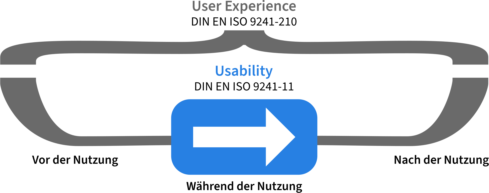

# IT-Entwicklung {#anforderungen}

:::{.callout-note}
## Zusammenfassung
Dieses Kapitel behandelt die Entwicklung von IT-Systemen. Der Schwerpunkt liegt hier auf der Einbeziehung von Nutzer*innen, um im besten Fall die tatsächlichen Bedürfnisse passend zu erfüllen.
:::

## Einleitung

Im Kapitel [Management von IT-Systemen](#management)
wurde bereits auf Themen wie Barrierefreiheit und software-ergonomische
Anforderungen sowie den permanenten Anpassungsbedarf an Systeme
im Laufe ihrer Lebenszeit eingegangen.

Betrachtet man sein persönliches Nutzungsverhalten im digitalen
Bereich wird klar, dass sich auch die eigenen Präferenzen bezüglich
der Nutzung von Apps oder Webseiten ändern. Ursachen dafür sind
beispielsweise Veränderungen an Lebens- oder Arbeitskontexten,
Erwartungen an die Bedienbarkeit von Systemen oder durch die digitale
Transformation beziehungsweise technischen Fortschritt möglich gewordene
neue Nutzungsformen von Medien.

IT-Entwicklung sollte sich daher auch an
den [Bedürfnissen](#bedarfsermittlung) von [Nutzer\*innen](#einbeziehung) ausrichten.
Es gibt verschiedene Methoden, die entsprechenden Bedarfe und Anforderungen zu ermitteln und sie in die Entwicklung einzubeziehen. Dazu gehören unter anderem der Einsatz von Personas, Use Cases oder Storyboards. Weitere [Methoden](#methoden) sind zum Beispiel Storyboards, Wireframes oder auch Prototypen.

## Nutzer\*innenorientierten Gestaltung

Nutzer\*innenorientierte Gestaltung heißt, die Bedürfnisse von Nutzenden
in den gesamten Entwicklungsprozess einzubeziehen. Das bedeutet, dass
deren Bedarfe nicht nur als Quelle von initialen Anforderungen dienen,
sondern kontinuierlich in den Entwicklungsprozess einbezogen werden.
Hierbei ist es besonders wichtig, die Fähigkeiten und Bedürfnisse der
Nutzenden sowie ihre Arbeitskontexte und -aufgaben in den Entwurf von
IT-Systemen einzubeziehen. Diese Aspekte finden sich auch in den
zugrundeliegenden Definitionen, wie der Usability (siehe Abschnitt [Was
beeinflusst den Nutzungseindruck?](#was-beeinflusst-den-nutzungseindruck))
wieder.

Beim nutzer\*innenorientierten Design oder dem User-Centered Design
(UCD) handelt es sich nicht im formale Methoden im engeren Sinn, sondern
um eine Sammlung i.d.R. empirisch abgesicherter Techniken mit drei
Kernideen [@gould_designing_1987].

1.  Fokussierung auf Nutzer\*innen und deren Aufgaben von Beginn der
    Entwicklung an

2.  deren kontinuierliche Einbeziehung und Auswertung von
    Nutzer\*innen-Feedback sowie Performance-Messung

3.  Nutzung eines iterativen Design-Prozesses

Kling und Leigh Star ergänzen, dass die ganz individuellen Fähigkeiten der
Nutzenden in Betracht gezogen werden müssen [@kling_human_1998], was allein
schon aus Gründen der digitalen Teilhabe sinnvoll erscheint.

Generell zielt UCD darauf ab, interaktive Systeme zu entwickeln, welche einfach
zu nutzen und nützlich sind. Hierbei wird ein Fokus auf Aspekte wie
Effektivität, Effizienz, Benutzerzufriedenheit und Zugänglichkeit gelegt
[@deutsches_institut_fur_normung_e_v_din_din_2020]. Diese Aspekte werden in
Abschnitt [Was beeinflusst den
Nutzungseindruck?](#was-beeinflusst-den-nutzungseindruck) weiter erläutert.

Das Central Digital and Data Office des Vereinigten Köngreichs fasst
die zentral zu bearbeitenden Arbeitspunkte im nutzer\*innenzentrierten
Gestaltungsprozess und den Weg dahin prägnant in seinen "Government
Design Principles" zusammen @noauthor_government_2012:

1.  Start with user needs

2.  Do less

3.  Design with data

4.  Do the hard work to make it simple

5.  Iterate. Then iterate again

6.  This is for everyone

7.  Understand context

8.  Build digital services, not websites

9.  Be consistent, not uniform

10. Make things open: it makes things better

Unter der oben genannten Website des Central Digital and Data Office
finden sich auch umfangreiche Hinweise, wie sich die einzelnen Punkte
praktisch umsetzen lassen.

### Was beeinflusst den Nutzungseindruck?

Gut bedienbare, interaktive Systeme sollen Zufriedenheit auslösen und
zugänglich sein. Die Erreichung dieser Ziele und zentrale
Begriffsdefinitionen sind Teil des Arbeits- und Forschungsgebiets der
Software-Ergonomie und finden sich in den einschlägigen Normen wie der
DIN EN ISO 9241-11 wieder [@deutsches_institut_fur_normung_e_v_din_din_2020].

Von zentraler Bedeutung sind dabei zwei Kernbegriffe: die Usability
(Gebrauchstauglichkeit) und die User Experience (Nutzer\*innenerfahrung)

::: {.callout-tip}

**Usability** ist das "Ausmaß, in dem ein System, ein Produkt oder eine
Dienstleistung durch bestimmte Benutzer in einem bestimmten Nutzungskontext
genutzt werden kann, um festgelegte Ziele effektiv, effizient und
zufriedenstellend zu erreichen" DIN EN ISO 9241-11

**User Experience** bezeichnet die "Wahrnehmungen und Reaktionen einer Person,
die aus der tatsächlichen und/oder der erwarteten Benutzung eines Produkts,
eines Systems oder einer Dienstleistung resultieren" DIN ISO 9241-210:2011

:::

Bei Usability handelt es sich um eine Eigenschaft eines Systems, die 
während der konkreten Interaktion
mit diesem relevant wird und beispielsweise angibt, inwiefern Hürden bei
der Bedienung auftreten (@fig-usux). Zur Vermeidung von Usability-Problemen
existieren ein Vielzahl von Heuristiken, die in den einschlägigen Normen
skizziert werden bzw. durch Autoren wie Shneiderman in seinen "8 golden
rules" [@shneiderman_designing_2005] oder Nielsen mit seinen "[10
Heuristics](https://www.nngroup.com/articles/ten-usability-heuristics/)"
benannt werden.

Die User Experience hingen bezieht sich auf die Wahrnehmung der
Nutzenden sowohl vor, nach und auch während der Interaktion. Sie
bezeichnet sozusagen die Positionierung gegenüber einem System und hat
damit Auswirkungen darauf, ob Nutzende ein System erneut benutzen werden
oder, z. B. aufgrund von schlechter Bedienbarkeit, d. h. schlechter
Usability, vor einer zukünftigen Nutzung zurückschrecken. Es reicht
folglich nicht aus, einzelne Aspekte einer Nutzer\*innenschnittstelle zu
optimieren. Vielmehr muss der gesamte angebotene Service aus Sicht der
Nutzenden optimiert werden, damit sich ein positives Nutzungserlebnis
einstellt. Diese Optimierung beschränkt sich dabei nicht nur auf die
digitalisierten Anteile eines Services sondern bezieht alle
Arbeitsschritte, egal ob analog oder digital, mit ein.

{#fig-usux}

## Wie beziehen wir unsere Nutzer\*innen ein? {#einbeziehung}

Mit der Einführung einer neuen IT-Lösung werden bestimmte strategische
Ziele verfolgt wie die Ablösung eines veralteten Systems, die Einführung
einer neuen Dienstleistung und dergleichen. Die konkrete Ausgestaltung
dieser strategischen Ziele sollte unter Einbeziehungen der
beabsichtigten Nutzenden erfolgen. Die konsequente Bedarfsorientierung
sichert die Qualität der Dienste und verhindert, dass eigene Bedürfnisse
und Einschätzungen von Expert\*innen die Entwicklung dominieren. Für die
Einbeziehung von Nutzer\*innen gibt es verschiedene Methoden, die im
Folgenden kurz dargestellt werden sollen.

### Bedarfsermittlung {#bedarfsermittlung}

#### Klassische Methoden zur Bedarfsermittlung

Zu den in Bibliotheken auch jenseits der Entwicklung von digitalen
Diensten häufig genutzten Methoden der Bedarfsermittlung gehören
qualitative und quantitative Befragungen sowie Beobachtungen. Diese
Methoden sind aus der empirischen Sozialforschung entlehnt. Für viele
Software-Projekte sind groß angelegte Befragungen zu aufwändig,
allerdings ist es empfehlenswert, sich über Studien aus vergleichbaren
Projekten zu informieren und daraus nach Möglichkeiten Ableitungen für
eigene Zielsetzungen zu entwickeln.

Beobachtungen können sehr flexibel angelegt und geplant werden. Dadurch
können valide Ergebnisse mit vertretbarem Aufwand produziert werden und
die Studie bei Bedarf gut skaliert werden. Der Fokus bei solchen Studien
liegt darauf, Nutzer\*innen in ihrem Arbeitsalltag zu beobachten, um
ihre Herangehensweise bei der Lösung von Aufgaben und Problemen zu
ermitteln. Übertragen auf digitale Dienste kann das zum Beispiel im
Rahmen eines Usability-Tests passieren, in dem eine oder mehrere
Personen ein System nutzen. Typischerweise werden während des Tests
nicht nur Notizen oder Aufnahmen gesichert, sondern die Tester\*innen
nutzen das Think-Aloud-Protokoll. Dabei sollen Nutzende in Echtzeit laut
kommentieren, was sie denken, sehen und tun (siehe Abschnitt
[Methoden](#methoden)).

Fokusgruppen dagegen sind eine qualitative Methode, in der
Vertreter\*innen verschiedener Zielgruppen gemeinsam an einem
bestimmten, vorher formulierten Thema arbeiten. Das können sowohl
Diskussionen über Anforderungen und Wünsche an ein bestimmtes System
sein, als auch die Planung von Einsatzszenarien oder Workflows. Durch
die freie Wahl von Themen und Mitgliedern, z. B. Nutzende ohne
Vorerfahrungen und/oder Expert\*innen, sind Fokusgruppen ebenfalls eine
sehr flexible, breit anwendbare Methode.

#### Bedarfsermittlung mit Personas und Use Cases

Personas sind fiktive Persönlichkeiten, die stellvertretend für einzelne
Zielgruppen eines Dienstes entwickelt werden. Die Beschreibungen
enthalten vielfältige Informationen über die Persona und laden damit
dazu ein, den zu entwickelnden Dienst aus der Perspektive der jeweiligen
Persona zu beurteilen, jenseits von abstrakten Anforderungen. Darüber
hinaus helfen Personas dabei, Prioritäten zu setzen und die
Zielerreichung zu überprüfen. Es empfiehlt sich, für jedes strategische
Ziel eine Persona zu erstellen, mindestens drei bis fünf Personas
insgesamt.

Abgeleitet von solchen Personas fällt es häufig leicht, konkrete Use
Cases für die Interaktion mit einem System zu definieren. Ein Use Case
beschreibt dabei eine Reihe von Aktionen, die eine Person in bzw. mit
einem System durchführen kann. Das kann beispielsweise in einem
Fließtext passieren, in dem ein Szenario beschrieben wird.

](media/missing.svg){#fig-3}

Außerdem kann es sich lohnen, solche Use Cases zu visualisieren. Dabei können
Start, Ende, mögliche Verzweigungen, alternative Aktionen und mehr mit
verschiedenen Formen modelliert werden. Dafür können formalisierte Systeme wie
die Unified Modelling Language (UML) zum Einsatz kommen. Sie bietet ein Set
verschiedener Formen, um Start, Ende, Verzweigungen, Alternativen und mehr
visuell zu beschreiben. Aber auch Skizzen können Nutzungsszenarien bereits
verdeutlichen und als Diskussionsgrundlage dienen, z. B. in Form von
Storyboards, die in einem eigenen [Unterkapitel zu dieser
Methode](#storyboards-als-frühe-methode) noch beschrieben werden.

Use Cases können sowohl als Grundlage für den Entwicklungsprozess dienen
als auch für die Evaluation eines Systems (siehe Abschnitt
[Evaluierung](#evaluierung)). Für die Nutzenden-Personas
einer Bibliothek kann eine breite Palette von Use Cases existieren.
Manche sind dabei eher allgemein zu verstehen, andere
bibliotheksspezifisch und natürlich sind alle je nach Einrichtung bzw.
Anforderungen beliebig erweiterbar. Zu beachten ist, dass sowohl
Personas als auch Use Cases zwingend auf der Grundlage
vertrauenswürdiger Daten wie denen aus der Bedarfsermittlung erstellt
werden sollten. Solche Methoden ohne Kenntnisse der Zielgruppen
anzuwenden kann nur zur Reproduktion der eigenen Meinung führen.

### Methoden {#methoden}

Testaufgaben für Usability-Tests werden erstellt, um typische
Nutzungsszenarien mit Hinblick auf die Usability des Systems hin zu
überprüfen. Die folgenden Methoden können relativ einfach umgesetzt
werden, generieren jedoch bereits wertvolle Erkenntnisse.

#### Think-Aloud-Protokolle

Die zentrale Idee bei Think-Aloud-Protokollen ist, dass Proband\*innen
während der Interaktion mit dem zu evaluierenden System ihre Meinungen,
Gedanken und Gefühle laut aussprechen.

Dadurch wird es den Beobachter\*innen ermöglicht, zuvor unsichtbare,
kognitive Prozesse der Proband\*innen zu beobachten sowie einen Einblick
in typische Nutzungsweisen zu gewinnen. Durch die Verbalisierung und
Beschreibung des Systems durch die Nutzenden lernt man zeitgleich die
Nutzer\*innenterminologie für bestimmte Sachverhalte kennen, die teils
erheblich von der Fachsprache abweichen wird. Die Ergebnisse der Methode
können z. B. durch Notizen oder Audioaufnahmen festgehalten werden.

#### Co-Discovery Learning

Die Kernherausforderung bei der Erstellung von Think-Aloud-Protokollen
ist es, die Proband\*innen kontinuierlich zu motivieren, selbst kleinste
Gedanken zu verbalisieren. Beim Co-Discovery Learning arbeiten zwei
Testpersonen gleichzeitig an einem System und helfen sich gegenseitig
bei der Erfüllung der Aufgaben. Dadurch entstehen Gespräche und
gewissermaßen automatisch ein Think-Aloud-Protokoll beider Personen.

Die Methode bildet einerseits eine realistische Arbeitssituation des
gegenseitigen Helfens ab und normalisiert andererseits das laute
Aussprechen von Gedanken innerhalb einer Dialogsituation.

#### Quantitative Methoden

Beobachtungsmethoden generieren primär qualitative Daten, ebenso wie
viele Inspektionsmethoden. Aus Managementsicht werden jedoch oft
Entscheidungen auf Grundlage von quantitativen Daten bevorzugt, da diese
häufiger als Fakten wahrgenommen werden.

Einfache, relativ leicht zu erhebende quantitative Metriken im Rahmen
von Usability-Tests sind z.B.:

-   Nutzungsfehler pro Zeiteinheit,

-   Anzahl nicht benötigter Befehle (Menus, Icons, Links)

-   Benötigte Zeit für den Abschluss einer Arbeitsaufgabe (insbesondere
    im Vergleich mit einer vorherigen Iteration)

-   Benötigte Anzahl an Klicks/Links, um an ein bestimmtes Ziel zu
    kommen.

Der "Benutzungsfragebogen ISONORM 9241/10" bietet einen interessanten
Kompromiss zwischen qualitativen und quantitativen Daten, da er
qualitative Aussagen bezüglich der Usability eines Systems (z.B.
Aufgabenangemessenheit und Selbstbeschreibungsfähigkeit) mithilfe einer
siebenstufigen Likert-Skala abbildet. Der
[Fragebogen](https://people.f3.htw-berlin.de/Professoren/Pruemper/instrumente.html)
ist frei im Internet verfügbar. Beachtet werden muss, dass für
belastbare quantitative Daten die Größe der Testgruppe deutlich steigen
muss, um Verfälschungen durch Einzelpersonen zu vermeiden.

### Einbeziehung von Nutzenden in die Entwicklung

Als Grundlage für Personas oder Use Cases und alle weiteren Schritte ist
die Einbeziehung von tatsächlichen Nutzenden in die Entwicklung also
bereits in einem frühen Stadium möglich und sinnvoll. Diese Einbeziehung
sichert ab, dass wesentliche Ziele der Nutzenden erreicht werden und in
mitunter komplexen Entwicklungsprozessen die richtigen Schwerpunkte
gesetzt werden. Dafür stehen verschiedene Methoden zur Verfügung.

Nachfolgend werden drei Ansätze vorgestellt:

-   Storyboards - Skizzierung von Interaktionskonzepten

-   Wireframes und Mock-Ups - Skizzen der Oberflächen

-   Prototypen - erste funktionsfähige Iterationen

#### Storyboards als frühe Methode

Ein Storyboard illustriert, wie ein User Interface (UI,
Nutzer\*innenoberfläche) auf Eingaben reagiert ohne das Interface
visuell perfekt darzustellen. Es kann genutzt werden, um in Use Cases
bestimmte Aktionen zu illustrieren.

Die Visualisierung von Interaktionsideen kann Beteiligten helfen,
mögliche Abläufe nachzuvollziehen. Storyboards sind dabei oft leichter
verständlich als z. B. technische Diagramme mit der oben genannten UML.
Trotzdem ist darauf zu achten, dass Ideen und Konzepte für Stakeholder
und Nutzende klar beschrieben werden, um Missverständnisse zu vermeiden.
IN dieser Form lassen sich Storyboards nutzen, um z.B. verbale
Beschreibungen oder Nutzungsszenarien zu ergänzen.

Durch die noch vage Darstellung der Idee können dann Diskussionen
angeregt werden. Beispielsweise können Storyboards in Fokusgruppen
vorgestellt und diskutiert oder auch in Einzelgesprächen mit
verschiedenen Stakeholdern analysiert werden. Möglichst alle Fragen und
Ideen sollten dabei ohne Limitierungen behandelt werden können und die
Ergebnisse festgehalten werden.

Vor- und Nachteile von Storyboards im Überblick:

  -----------------------------------------------------------------------
  Vorteile                            Nachteile
  ----------------------------------- -----------------------------------
  leicht verständlich, für alle       nicht jeder Use Case oder jede
  Stakeholder geeignet                Interaktionsmöglichkeit ist
                                      darstellbar

  bereits im frühen Entwurfsprozess   digitale, nichtlineare Produkte
  einsetzbar                          (z.B. Websites) sind schwer
                                      darstellbar

  schnelle Erstellung ohne            ggf. Unklarheiten bei der Nutzung
  Vorkenntnisse möglich               (z.B. durch unklare Symbole)
  -----------------------------------------------------------------------

#### Wireframes und Mock-Ups

Wireframes und Mock-Ups werden vor allem dazu genutzt, erste Skizzen für
Struktur, Layout und Funktionalitäten eines Interface vorzustellen.
Ähnlich wie Storyboards dienen sie als einfach zu erstellende
Diskussionsgrundlage, mit deren Hilfe ein Abgleich der Vorstellungen von
einem System und der Gestaltungsmöglichkeiten durchgeführt werden kann.

{#fig-5}

Ein Wireframe ("Drahtmodell") ist eine noch undetaillierte ("low-level")
Ausarbeitung eines Interfaces, v. a. darauf ausgerichtet, die
Positionierung der einzelnen Elemente zu planen. Daher sind z.B. Bilder
oder Buttons als Kästchen dargestellt, Text als Striche und ähnliches
(siehe @fig-5). Ein Mock-Up ist, im Kontext Design, eine
ausgereifte ("high-level") Version des Interfaces mit realistischen
Farben, Schriftarten und Elementen. Sowohl Wireframes als auch Mock-Ups
sind also rein statische Entwürfe des zukünftigen Produkts im Gegensatz
zu Prototypen, die interaktiv sind und damit echte Funktionalitäten
enthalten.

#### (Interaktive) Prototypen

Die nächsthöhere Form eines geplanten Produkts, (interaktive)
Prototypen, besitzen bereits erste Funktionen des geplanten Interfaces.
Auch hier gibt es eine Spanne von rudimentären, low-level bis hin zu
ausgereiften, high-level Prototypen, die durch Iterationen schrittweise
erreicht werden. Üblich ist außerdem die Unterteilung in "vertical
slice", die qualitativ hochwertige Umsetzung nur eines bestimmten Teils
des Produkts, und "horizontal slice", die prototypische Umsetzung einer
möglichst großen Bandbreite des späteren Systems.

Erste Prototypen müssen dabei noch nicht zwingend programmiert werden,
sondern können durch entsprechende Prototyping Software, wie
[Figma](https://www.figma.com) oder
[Axure](https://www.axure.com), umgesetzt werden. Diese
besitzen eine Art Bausystem für Interfaces mit mehreren Ansichten, die
über Aktionen wie den Klick auf einen Button verbunden werden können. So
kann Nutzenden gewissermaßen ein Produkt vorgetäuscht werden, das dann
mit rudimentären Funktionen bereits getestet werden kann.

Während des eigentlichen Softwareentwicklungsprozesses wird der
anfängliche Prototyp mit jeder Iteration hochwertiger und nimmt mehr den
Charakter eines vollen Systems an. Es empfiehlt sich, nach Iterationen
regelmäßig zu evaluieren, ob neue Funktionen oder Änderungen noch für
die Zielgruppen geeignet sind.

### Evaluierung

Die vorangegangenen Abschnitte haben herausgestellt, wie wichtig es ist,
regelmäßig Feedback der Nutzenden zu erhalten. Eine zentrale Datenquelle
dafür ist die Begleitung eines Projekts durch Evaluierungen. Ein
Beispiel für eine lebendige Evaluierungskultur ist das "[User Research
Center" der Harvard Library](https://urc.library.harvard.edu/), das regelmäßig
verschiedene Methoden anwendet, um Angebote gemeinsam mit Nutzenden zu
evaluieren und diese öffentlich in einem
[Wiki](https://wiki.harvard.edu/confluence/pages/viewpage.action?pageId=232199222)
teilt.

Im Rahmen der Usability-Evaluierung entscheidet man dabei grob zwei
Methoden: Beobachtungs- und Inspektionstests (@fig-6).
Während erstgenannte unter Einbeziehung von Nutzer\*innen durchgeführt
werden, werden Inspektionstests häufig durch Usability-Expert\*innen
realisiert.

{#fig-6} 

Als Vorteil der Beobachtungstests erweist sich aus der Praxissicht, dass
diese auch ohne eine formale Usability-Ausbildung durch engagierte
Mitarbeiter\*innen durchgeführt werden können. Im Folgenden soll deshalb
das prinzipielle Vorgehen bei einem Beobachtungstest skizziert werden.

#### Testgruppen

Die Testgruppe muss die potentielle Nutzungsgruppe bestmöglich
repräsentieren, jedoch nicht sehr groß sein. Die Erfahrung zeigt, dass
ca. fünf Testpersonen ausreichen, um die wichtigsten Usabilityprobleme
eines Systems zu identifizieren @jakob_nielsen_why_2000. Statt eines einzigen Tests mit
vielen Teilnehmenden bieten sich daher schnell durchzuführende Tests mit
wenigen Teilnehmenden an, um ein Produkt iterativ zu verbessern. Möchte
man jedoch verschiedene Typen von Nutzer\*innen analysieren oder
quantitative Ergebnisse sammeln, muss die Gruppengröße entsprechend
wachsen.

Neben den typischen Streuungsmerkmalen wie demographischen und
kulturellen Faktoren (z.B. Bildungshintergrund) bietet es sich an,
Nutzer\*innen auszuwählen, die über ein unterschiedliches Maß an
Vorwissen über das zu entwickelnde oder verwandte Produkte verfügen.
Außerdem sollten Personen integriert werden, welche von Einschränkungen
betroffen sind, die in Abschnitt
[Accessibility](#accessibility) thematisiert wurden.

#### Testablauf und Vorbereitungen

Nach der Rekrutierung repräsentativer Nutzer\*innen und der Vorbereitung
der benötigten Materialien und der Testumgebung bietet sich ein
Pilottest mit Proband\*innen an. Dieser dient der Validierung der
eigenen Annahmen über die Testaufgaben (s.u.) und die Machbarkeit des
Ablaufs.

Die Testumgebung sollte eine entspannte und natürliche Arbeitsumgebung
vermitteln. Diese ist in jedem Fall einer künstlichen Laborumgebung
vorzuziehen. Während der Beobachtungstests ist sicherzustellen, dass
keine Unterbrechungen, z.B. in Form von Telefonanrufen erfolgen, damit
die Proband\*innen das zu evaluierende System konzentriert testen
können.

Nach dem Beobachtungstest sollte es den Proband\*innen ermöglicht
werden, die Testergebnisse zu erhalten. Außerdem ist es neben dem
obligatorischen Dank für die Teilnahme üblich, eine Aufmerksamkeit - je
nach Dauer z. B. Kaffee, Süßes, Gutscheine - auszuhändigen, um die
eigene Wertschätzung für das zeitliche Investment der Proband\*innen
auszudrücken. In einer Erklärung zum Datenschutz ist die anonyme
Datennutzung zuzusichern.

#### Testaufgaben

Wie die Testgruppen müssen auch die Testaufgaben repräsentativ für den
späteren Einsatzzweck des Systems sein. Die von den Proband\*innen zu
bearbeitenden Testaufgaben müssen realistische Aufgaben in bzw. mit dem
System sein und in der gegebenen Zeit absolvierbar sein. Dabei ist zu
beachten, dass sich die Arbeitsaufgaben an tatsächlichen Use Cases
orientieren und nicht trivial sind.

Die Formulierung der Arbeitsaufgaben muss unmissverständlich für die
Proband\*innen sein und auf deren (mitunter variierendes) Vorwissen
eingehen. Ein Pilottest hilft, dies zu überprüfen.

Die Gestaltung der einzelnen Aufgaben sollte einer Dramaturgie folgen,
um die Proband\*innen während des gesamten Tests zu motivieren. Das
heißt konkret, dass die ersten Teilaufgaben leicht zu lösen sein sollten
und deren Schwierigkeit dann kontinuierlich zunimmt, um durch komplexere
Aufgaben belastbare Aussagen zu erhalten.

## Zusammenfassung und Ausblick

Es gibt verschiedenste Methoden mit denen Bedarfe ermittelt und Nutzende in die Entwicklung von Software einbezogen werden können - je nach Umfang des Produkts und des Anwender\*innenkreises. Usertests erfordern ein anderes Zeitmanagement als die Entwicklung von Personas. Auch der Anwendungsfall nimmt Einfluss auf die Methodenauswahl. So kann für die Entwicklung eines neuen Designs die Verwendung von Wireframes und Mockups bei der Bedarfsermittlung hilfreich sein. Wird ein Portal mit neuen Interaktionsmöglichkeiten entwickelt, empfehlen sich Prototypen, mit denen auch die Interaktionen getestet werden können.
