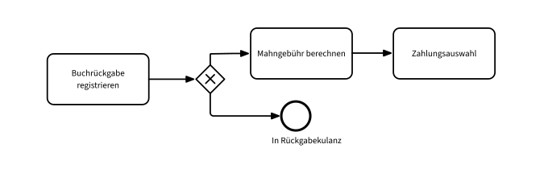

# Bibliotheksmanagementsysteme {#sec-bibliotheksmanagementsysteme}

::: {.callout-note title="Zusammenfassung"}

Ein Bibliotheksmanagementsystem (BMS) ist ein IT-System, das die [Kernprozesse](#prozessabbildung) einer Bibliothek unterstützt. Das modular aufgebaute System verfügt über verschiedene [Komponenten](#komponenten) für die jeweiligen Kernprozesse Erwerbung, lokales Metadatenmanagement, Nutzerdatenmanagement, Ausleihe sowie für die Recherche. Die [Entwicklungsgeschichte](#geschichte) der BMS in Bibliotheken erstreckt sich mittlerweile über drei Generationen. Relevant für die Arbeit mit den BMS ist auch die [Anbindung an Verbundkataloge](#verbundkataloge) sowie die [Integration anderer Systeme](#integration).

:::

## Einleitung
Das BMS spielt eine zentrale Rolle für die meisten klassischen Geschäftsprozesse in Bibliotheken. 

::: {.callout-important title="Definition"}

Ein **Bibliotheksmanagementsystem (BMS)** ist ein Softwareprodukt, mit dem die Arbeitsprozesse
rund um die Erwerbung, Bestandsmanagement, Ausleihe, den Zugriff und die Auffindbarmachung
von Bibliotheksbeständen über Kataloge abgebildet und automatisiert werden
können.

:::

Durch die Ausweitung der Aufgaben in
den Bereichen Publikationsdienste, Open Science oder auch Lernort sind
in neuerer Zeit jedoch noch weitere Aufgaben hinzugekommen, die durch
die klassischen BMS nicht abgebildet werden. Darüber hinaus haben die
frühen Systeme nur sehr unzureichende Möglichkeiten, die nötigen
Informationen zu elektronischen Ressourcen und ihrer Zugänglichkeit
abzubilden. Auch zur Unterstützung von neueren Aufgaben wie der
Publikationsunterstützung oder der Verwaltung räumlicher Ressourcen
werden separate Systeme genutzt. Daraus ergibt sich der Bedarf, das BMS
an diese separaten Systeme anzubinden, was die Bedeutung von
Schnittstellen und offenen Architekturen erhöht hat.

In diesem Text wird der Begriff Bibliotheksmanagementsystem
verwendet. Teilweise wird im Deutschen auch der allgemeinere Begriff
*(lokales) Bibliothekssystem* verwendet. In der angloamerikanischen Literatur finden sich
die Begriffe *Integrated Library System (ILS)* und *Library Management System
(LMS)*, zuletzt aber auch *Library Services Platform*.

## Geschichte der Bibliotheksmanagementsysteme

Ihren Ursprung haben Bibliotheksmanagementsysteme in
den 1960er Jahren, als Bibliotheken damit begannen, Katalogdaten
untereinander auszutauschen und auf diese Weise Prozesse zu optimieren.
In dieser Zeit entwickelten sich auch die heute noch gebräuchlichen
Austauschformate für Katalogdaten, z.B. *MARC*.

In den 1970er Jahren erlaubte die fortschreitende technische
Entwicklung die Automatisierung weiterer Prozesse über den
Datenaustausch hinaus. Zunächst war dies vor allem die Ausleihe mit der
Verbuchung von Medien und der Erzeugung von Mahnschreiben. Auch die
Verwaltung von Bestellungen im Rahmen der Erwerbung wurde möglich, so
dass man in der Folge von *Integrated Library Systems* zu sprechen
begann. Davon, dass Katalog-, Erwerbungs- und Nutzer\*innen-Daten an
einem Ort gehalten und bearbeitet wurden, versprach man sich eine
größere Effizienz der Arbeitsprozesse. Diese **erste Generation** von
BMS beinhaltete teilweise auch schon digitale Funktionen für
Bibliotheksnutzer\*innen wie über Telnet erreichbare Kataloge, die von
Anfang an als integraler Bestandteil der BMS gesehen wurden [@borgman_acting_1997].

Die Entstehung des World Wide Web in den 1990er Jahren hatte zunächst
vor allem Einfluss auf die Benutzbarkeit der Kataloge, die
Web-Oberflächen erhielten. Aber auch die anderen Komponenten der BMS
wurden überarbeitet, und zwar zunehmend auch von kommerziellen
Anbietern, während die ersten Systeme als Eigenentwicklungen von
Bibliotheken entstanden. Die Landschaft an **Systemen der 2.
Generation** war von den späten 1990er bis in die Nullerjahre sehr
divers, ist zuletzt aber von vielen Übernahmen geprägt worden, sodass
man von einem konsolidierten Markt sprechen kann [@breeding_library_nodate].

::: {.callout-tip}

Die **erste Generation** der Bibliotheksmanagementsysteme umfasste Grundfunktionen für die Ausleihe wie Verbuchung und Mahnung, für die Erwerbung die Verwaltung von Bestellungen und teilweise auch über Telnet erreichbare Kataloge für die Bibliotheksnutzer\*innen. Die **zweite BMS-Generation** verfügte über erweiterte Funktionalitäten zur Unterstützung der Kernprozesse und zeichnete sich durch die Bereitstellung der (Nutzer)-kataloge über eine Weboberfläche aus. Die **dritte Generation** zeichnete sich durch stärkere Modularisierung und mehr Schnittstellen zur Anbindung weiterer Systeme aus. 

:::

Seit den 2010er-Jahren entstand eine neue Generation von BMS, die
**Next-Generation Library Management Systems (LMS)**, die auch **Library
Services Platforms (LSP)** genannt werden. Diese zeichnen sich durch
verschiedene technische und funktionale Neuerungen aus. Die Datenhaltung
erfolgt in der Regel cloudbasiert (auch wenn dies bei bei älteren Systemen
durch Hosting auch schon möglich war), außerdem werden in der Regel mehr
Schnittstellen zur Integration des Systems mit anderen Lösungen angeboten.
Funktional wurden die Systeme vor allem um die Möglichkeit der Verwaltung von
elektronischen Ressourcen erweitert sowie Statistik- und
Reporting-Funktionalitäten verbessert.

Seit dem Ende der 1990er Jahre spielen auch wieder Lösungen eine Rolle,
die nicht kommerziell sind. Diese Open Source-Lösungen haben in der
Regel eine große Anwender-Community und lassen einen vielfältigen Markt
für Support- und Wartungsdienstleistungen zu.

{#fig-bmsevol}

::: {.callout-tip}

Nach @matthews_library_2020 lässt sich die Geschichte der BMS in sechs
überlappende Epochen einteilen (siehe @fig-bmsevol):

1.  **System-Epoche**: Erste Schritte in den 1950er bis in die
    1970er-Jahre hin zur Entwicklung von Software, z. T sehr
    experimentell, die die klassischen Geschäftsgänge von
    Bibliotheken in einem digitalen System abbilden sollen --
    dadurch prägt sich der Begriff "Bibliothekssystem". Das
    Augenmerk bei der Entwicklung liegt besonders auf Nachbildungen
    des Leihverkehrs unter besonderer Beachtung der Identifikation
    überfälliger Medien.

2.  **Epoche der Funktionalität**: Kommerzielle
    Bibliothekssoftware-Anbieter beginnen sich zu formieren, die
    erstmals eine integrierte Lösung der verschiedenen
    Automationsbereiche (Erwerbung, Katalogisierung,
    Zeitschriftenakzession, Verbuchung, Leihverkehr usw.) anbieten.
    Hierdurch entsteht die Bezeichnung "Integriertes
    Bibliothekssystem" (IBS), der auf den aus dem
    US-amerikanischen Raum übernommenen Begriff "Integrated
    Library System" (ILS) zurückgeht. In den 1980ern entstehen
    die ersten Online-Kataloge (OPAC), die die in Bibliotheken
    traditionellen Zettelkataloge nachbilden.

3.  **Nutzer\*innen-Fokus-Epoche**: Durch die Erkenntnis, dass sich
    die Gewohnheiten von Bibliotheksnutzer\*innen im Zugang zu und
    Umgang mit Medien u.a. mit dem Aufkommen des WWW in ihrem
    Alltag zunehmend ändern (z.B. durch die Nutzung von
    Online-Shopping und Suchmaschinen), rücken die Bedürfnisse der
    Nutzer\*innen immer mehr in den Fokus bei der Entwicklung von
    Bibliothekssystemen.

4.  **Epoche der Verbreiterung der Informationsressourcen**: Der
    Übergang in eine Phase, bei der Medien nicht mehr erworben,
    sondern digital lizenziert werden. Entsprechend entwickelt sich
    das Bedürfnis nach einem Electronic Resource Management (*ERM*)
    und neuartige BMS unterfüttern zum Ende der Epoche diesen
    Wandel mit einer von Medientypen unabhängigen
    Ressourcenverwaltung.

5.  **Discovery-System-Epoche**: Systeme, die über den lokalen
    Medienbestand hinaus auch extern lizenzierte Inhalte über eine
    alleinige Suchplattform zugänglich machen, erfreuen sich
    zunehmender Beliebtheit bei den BMS-Betreiber\*innen. Sie
    sollen den Nutzer\*innen einen deutlichen Mehrwert bieten. Seit
    den 2010er Jahren sind es überwiegend kommerzielle Verlage, die
    umfangreiche e-Medien-Pakete oder Indizes von Volltext- und
    Bibliografie-Datenbank als lizenzierbare Resource Discovery
    Services anbieten.

6.  **Wissensinnovation**: Bibliotheken realisieren überwiegend, dass
    Discovery-Systeme nicht ihre gewünschte Wirkung entfalten und
    sie sich deutlicher von Plattformen großer Tech-Unternehmen
    abgrenzen müssen. Wissen soll neu erschlossen werden mit
    innovativen Technologien wie 3D-Druck, Virtual Reality (VR),
    Open-Access-Repositorien etc.

:::

  ------------------------------------------------------------------------------
             Organisation    Marktstatus                Open       Individuelle
                                                        Source     Entwicklung
  ---------- --------------- -------------------------- ---------- ---------------
  aDIS/BMS   aStec           ÖBs und WBs vor allem      nein       durch aStec
                             im BSZ                            

  Alma       ExLibris        WBs in Berlin, NRW,        nein       durch ExLibris,
                             Bayerische                            integrierte
                             Staatsbibliothek,                     Apps in Eigenregie
                             Schweiz                           

  FOLIO      Open Library    Einführung in WBs          ja         FOLIO Community
             Foundation      im GBV und hebis                      und durch
                                                                   Dienstleister

  Koha       Koha Community  ÖBs und                    ja         in Eigenregie
                             Spezialbibliotheken,                  oder durch
                             in Planung im KOBV                    Dienstleister

  LBS        OCLC            WBs im GBV, Hebis, DNB,    nein       durch VZG
                             Spezialbibliotheken und               
                             in den Niederlanden               

  LIBERO     LIBERO/Knosys   ÖBs und WBs                nein       durch LIBERO
  --------------------------------------------------------------------------------
: relevante Software-Produkte (Stand Anfang 2024) {#tbl-aktuelle-sw-produkte}

<!--
[FOLIO]: https://librarytechnology.org/product/folio
[Koha]: https://librarytechnology.org/product/koha
[Alma]: https://librarytechnology.org/product/alma
[LIBERO]: https://librarytechnology.org/product/libero
PICA LBS: https://librarytechnology.org/products/product.pl?RC=272
-->

In @tbl-aktuelle-sw-produkte sind die aktuellen BMS mit der derzeit größten
Marktreife und -durchdringung im deutschsprachigen Raum (Stand Anfang 2024,
Sortierung nach Namen) angegeben. Weitere BMS wie ExLibris Aleph, SISIS Sunrise
und allegro werden zwar auch noch an vielen Bibliotheken eingesetzt, aber nicht
mehr wesentlich weiterentwickelt. Das Cloud-basierte System WMS von OCLC ist in
Deutschland bislang nur vereinzelt im Einsatz. Für BibliothecaPlus ist von OCLC
ein Nachfolger angekündigt.

Darüber hinaus gibt es mehrere kommerzielle Systeme, deren Funktionsumfang auf bestimmte Arten von Bibliotheken zugeschnitten ist, beispielsweise:

- [Perpustakaan](https://must.de/default.html?Lib.htm) ist in Schulbibliotheken verbreitet und wendet sich auch an nicht-bibliothekarisch vorgebildetes Personal,

- [NOS](https://de.wikipedia.org/wiki/NOS_(Bibliothekssoftware)) ist in internen Forschungs- und Behörden-Bibliotheken verbreitet,

- Quria von [Axiell](https://www.axiell.com/) ist in skandinavischen ÖBs verbreitet und löst im deutschsprachigen Raum das BMS BIBDIA ab.

Eine umfangreiche internationale Übersicht von BMS enthält der von Marshall Breeding
gepflegte [Library Technology Guide](https://librarytechnology.org/products/). Für
den deutschsprachigen Raum gibt es Übersichten von Verbundzentralen oder 
Büchereifachstellen, z.B. @kluge_anbieter_2022 für öffentliche Bibliotheken.
Darüber hinaus sind Daten zu BMS systematisch in Wikidata erfasst und können
beispielsweise unter [https://w.wiki/574K](https://w.wiki/574K) abgefragt werden.

::: {.callout-tip}

Der [IT-Lebenszyklus]{#it-lebenszyklus} von BMS ist im Vergleich zu anderen IT-Systemen eher lang. So blicken z. B. Systeme wie Aleph, aDIS, LBS, SISIS Sunrise und Koha auf eine 20-30 jährige Entwicklungsgeschichte zurück und befinden sich aktuell immer noch im Einsatz. FOLIO wurde bereits im Rahmen des *Open Library Environment Project* 2009 initiiert und wird wahrscheinlich erst im nächsten Jahrzehnt in die Wartungsphase übergehen.

:::

## Funktionalitäten von Bibliotheksmanagementsystemen

BMS sind in der Regel modular aufgebaut und verfügen mindestens über
Module für folgende Funktionen:

-   Erwerbung

-   Katalogisierung / Erschließung

-   Ausleihe

-   ein Recherche-Modul, das sich vorwiegend an die Bibliotheksnutzer\*innen richtet

### Grundlegende Komponenten

Die Systeme der [**1. und 2.
Generation**](#geschichte-der-bibliotheksmanagementsysteme) können als sehr
ausgereift bezeichnet werden und lassen vielfältige Möglichkeiten zu,
bibliothekarische Geschäftsgänge in einem hohen Detaillierungsgrad abzubilden.
Nachfolgend werden diese entsprechenden Aufgabenbereiche skizziert.

**Erwerbung** meint die Beschaffung benötigter Bestände im Buchhandel und bei Verlagen. Darunter fallen z.B. folgende Aufgabengebiete:

-   Bestellungen

-   Budgetverwaltung

-   Rechnungsverwaltung und Mahnwesen

-   Lieferantenverwaltung

-   Zeitschriftenmanagement und Fortsetzungsverwaltung

-   Unterstützung [EDIFACT](https://unece.org/trade/uncefact/introducing-unedifact)-Standards

-   Buchbinder

$\Rightarrow$ *Siehe auch [Prozessabbildung: Erwerbung](#erwerbung-prozess)*

**Katalogisierung** meint die Erschließung der verwalteten Medien und digitalen Quellen, z.B.
anhand

-   Übernahme von Fremddaten

-   Anbindung an Verbünde

-   Integration digitalisierter Medien

-   Bestandsnachweis / Exemplarmanagement

$\Rightarrow$ *Siehe auch [Prozessabbildung: Katalogisierung](#katalogisierung-prozess)*

**Ausleihe** meint vorwiegend die Verwaltung physischer Medien bzw. Objekte und regelt die
Interaktionen mit Nutzer\*innen wie z.B.:

-   Abbildung komplexer Reglements nach Benutzer- und Medientypen,
    Standorten usw (siehe auch [Benutzungsbedingungen](#benutzungsbedingungen))

-   Ausleihfristen

-   Verwaltung von Standorten

-   Versand von Benachrichtigungen

-   Anbindung an Selbstverbuchungslösungen

-   Mahngebühren

$\Rightarrow$ *Siehe auch [Prozessabbildung: Ausleihe](#ausleihe-prozess)*

Das **Recherchemodul** stellt die Sicht für die Nutzer\*innen auf Bestände der Einrichtung zur Recherche
und Kontofunktionen dar:

-   Katalog (auch OPAC genannt)

-   Benutzerkonto

$\Rightarrow$ *Siehe auch [Prozessabbildung: Katalog](#katalog-prozess)*

Die **Next Generation-Systeme** zeichnen sich gegenüber den Systemen
der 1. und 2. Generation in der Regel durch andere Systemarchitekturen
aus. Das heißt, sie verfügen über aktuellere technische
Einzelkomponenten und Schnittstellen, auf deren Grundlage auch
zahlreiche zusätzliche Funktionalitäten angeboten werden können. Im
Einzelnen gibt es folgende Merkmale, die ein **Next Generation-System**
kennzeichnen [@schweitzer_roswitha_anforderungen_2016]:

-   Platformbasiertes Angebot als Software as a Service ([SaaS](#cloud))

-   Mandantenfähigkeit

-   Interoperabilität durch offene, standardisierte und dokumentierte
    Schnittstellen

-   Verfügbarkeit von Datenbanken bzw. Knowledge Bases für
    bibliografische Daten und Lizenzinformationen

-   Verwaltung elektronischer Ressourcen

-   kein fest integrierter Katalog, sondern Schnittstellen zu
    Discovery-Systemen

-   zusätzliche Statistik-Werkzeuge

### Vergleich mit anderen Managementsystemen

Aufgrund der hohen Kosten für die Einführung oder die Migration eines
BMS dürfte sich für viele Entscheider\*innen die Frage stellen, ob sich
die Investition lohnt bzw. ob sich die Aufgaben auch mit anderen
Lösungen erledigen lassen (siehe hierzu [Beschaffung und Marktanalyse](#beschaffung-und-marktanalyse)).

Systeme zur Automatisierung von Geschäftsprozessen gibt es in
verschiedenen Branchen. Eine genauere Betrachtung der Aufgaben, die
durch Automatisierung unterstützt werden sollen, kann aufzeigen, ob
dafür ein Bibliotheksmanagementsystem oder eine andere Lösung besser
geeignet ist.

Die folgenden Alternativen sind möglicherweise für kleine Einrichtungen
relevant, die über sehr überschaubare Bestände verfügen und kaum oder
wenig ausleihen:

Erfassung von Medien:

-   Listen in einer Tabellenkalkulation (Excel, LibreOffice ...)

Erfassung und Web-Präsentation von Medien:

-   [Library Thing for Libraries](https://www.librarything.com/forlibraries)

-   [Zotero Groups](https://www.zotero.org/groups/)

-   Stand-Alone-Lösungen für Electronic Resource Management wie
    [Coral](http://coral-erm.org)

Ausleihe

-   Plugins für Wordpress wie
    [WebLibrarian](https://www.greengeeks.com/tutorials/create-a-library-management-system-in-wordpress/)

Erwerbung

-   Finanzbuchhaltungssysteme wie SAP,
    [HIS-Hochschul-ERP](https://www.his.de/)

Nutzerdatenverwaltung

-   IDM-Systeme

Bibliotheken mit einem jährlichen Zuwachs von über 500 Medien und
verschiedenen Benutzertypen und Ausleihbedingungen ist die Nutzung
eines BMS zu empfehlen, da hier eine gewisse Prozesseffizienz einerseits
und eine Erschließungs- und Dienstleistungsqualität andererseits
erreicht werden kann. 

::: {.callout-tip}

Als gedankliches Experiment ist die Überlegung,
auf ein BMS zu verzichten, jedoch gut geeignet, um sich über die
Anforderungen der eigenen Institution klar zu werden. Insbesondere die Rolle des
Bibliothekskataloges als Schnittstelle zu den Bibliotheksnutzer\*innen
kann und sollte kritisch hinterfragt werden. Beispielsweise gab es
[Überlegungen der Universitätsbibliothek in
Utrecht](https://insights.uksg.org/articles/10.1629/2048-7754.174/),
auf dieses klassische Instrument gänzlich zu verzichten.

:::

### Integration des BMS mit anderen IT-Systemen {#integration}

Innerhalb der Bibliothek werden BMS meist zusammen mit anderen
Softwaresystemen eingesetzt. Insbesondere sind dies:

-   [Selbstbedienungsautomaten](#automatisierung-und-selbstbedienung)
    (Ausleihe, Rücknahme, Sortierung von Medien, Bezahlung von
    Gebühren)

-   Dokumentenserver, Content Management Systeme und andere Repositorien

-   Workflowsysteme (Digitalisierung von Altbestand;
    Publikationsunterstützung ...)

Weitere Systeme müssen für eine effektive Arbeit sinnvoll mit dem BMS
verbunden werden:

-   Haushaltssysteme wie SAP, HIS Haushalt-ERP

-   [Identitätsmanagementsysteme](#identity-management) (Account-Verwaltung)

-   Lieferantensysteme (bibliografische Daten, Bestell- und
    Rechnungsdaten)

Im bibliothekarischen Umfeld sind folgende Systeme relevant:

-   der [Verbundkatalog](#verbundkataloge)

-   die [Zeitschriftendatenbank](#anbindung-an-verbundkatalogeverbundkatalogisierung)

-   die [elektronische Zeitschriftendatenbank](#anbindung-an-verbundkatalogeverbundkatalogisierung)

Für die regionale und überregionale Literaturversorgung (physische,
Print-Medien, E-Medien) spielt die Anbindung an folgende Systeme eine
wesentliche Rolle

-   Fernleihe

-   Dokumentenlieferdienste (wie [Subito](https://www.subito-doc.de/)
    und Fachinformations-Lieferdienste)

Die Anbindung an die entsprechenden Dienste (Zentraler Fernleih-Server,
Fernleihdienst, Subito-Server etc.) ist für viele, aber durchaus nicht
alle Bibliotheken relevant.

Im Zusammenhang mit dem Aufbau der Fachinformationsdienste für die
spezialisierte Informationsversorgung in Deutschland werden in zunehmendem Maße
Fachportale entwickelt. Relevante Katalog-Informationen werden aus möglichst
vielen Bibliotheken regelmäßig abgerufen (Harvesting), in ein einheitliches
Datenformat übertragen und anschließend als gemeinsamer Index für die
übergreifende Recherche in Discovery-Systemen angeboten.
Die BMS müssen entsprechend über
[Standardschnittstellen](#datenformate-und-schnittstellen) die relevanten
Katalogdaten in einem vereinbarten [Datenformat](#bibliografische-metadaten)
bereitstellen.

### Verbundkataloge

In Deutschland haben sich Katalogverbünde in den 1970er und 1980er Jahren
entwickelt. Zunächst haben sich die wissenschaftlichen Bibliotheken meistens
auf Bundesland-Ebene für die Rationalisierung der Katalogisierung zu Verbünden
zusammengeschlossen. Inzwischen sind in diesen Verbünden auch öffentliche
Bibliotheken vertreten. Darüber hinaus gibt es mit WorldCat einen
internationalen Verbundkatalog. Die Anbindung an WorldCat geschieht in
Deutschland in der Regel über die Bibliotheksverbünde, international auch
direkt über die lokalen BMS.

@tbl-verbund gibt eine Übersicht über die deutschsprachigen Bibliotheksverbünde.

+---------------------+-----------------+---------------------------------+
| Verbund             | Verbundkatalog  | System                          |
+=====================+=================+=================================+
| BVB                 | B3Kat           | ALEPH (Ex Libris)               |
+---------------------+-----------------+---------------------------------+
| BSZ                 | K10plus         | CBS (OCLC)                      |
+---------------------+-----------------+---------------------------------+
| GBV                 | K10plus         | CBS (OCLC)                      |
+---------------------+-----------------+---------------------------------+
| hebis               | hebis           | CBS (OCLC)                      |
+---------------------+-----------------+---------------------------------+
| hbz                 | hbz             | Aleph (Ex Libris)               |
|                     |                 |                                 |
|                     |                 | Alma-Netzwerkzone (Ex Libris)   |
+---------------------+-----------------+---------------------------------+
| KOBV                | B3Kat           | Aleph (Ex Libris)               |
+---------------------+-----------------+---------------------------------+
| VÖBB                | VÖBB            | aDIS/BMS (aStec)                |
| (öffentliche        |                 |                                 |
| Bibliotheken)       |                 |                                 |
+---------------------+-----------------+---------------------------------+
| Österreichischer    | OBV             | Alma-Netzwerkzone (Ex Libris)   |
| Bibliothekenverbund |                 |                                 |
+---------------------+-----------------+---------------------------------+
| Swiss Library       | swisscovery     | Alma                            |
| Service             |                 |                                 |
| Platform (SLSP)     |                 |                                 |
+---------------------+-----------------+---------------------------------+
: Bibliotheksverbünde und -kataloge {#tbl-verbund}

### Anbindung an Verbundkataloge/Verbundkatalogisierung

Die Übernahme von bibliografischen Daten und -- bei elektronischen
Medien -- Paket- bzw. Lizenzinformationen aus anderen Systemen ist für
eine Bibliothek unabhängig davon, ob sie in einem Verbund organisiert
ist, von Interesse. Eine Anbindung von bibliografischen Datenquellen,
z.B. per Z39.50, für die Übernahme der entsprechenden Daten gilt daher
als Mindeststandard. In Verbünden organisierte Bibliotheken
katalogisieren in der Regel bereits in Verbunddatenbanken und übernehmen 
die Katalogisate dann vielfach verzögerungsfrei in die BMS.

Für Informationen zu elektronischen Medien gibt es neben den
Verbunddatenbanken weitere Datenbanken bzw. Knowledge Bases, aus denen
Paket- und Lizenzinformationen hervorgehen. Darunter fallen zum Beispiel

-   die Zeitschriftendatenbank (ZDB) und die Elektronischen
    Zeitschriftenbibliothek (EZB) als zentrale Nachweissysteme für
    Zeitschriften und Fortsetzungen in deutschen und österreichischen
    Bibliotheken

-   die [*GOKB*](https://gokb.org/) als kooperativ gepflegte Knowledge Base für elektronische Ressourcen

-   kommerzielle Knowledge Bases wie die EBSCO KB, Alma NZ und den OCLC Collection Manager

### Statistik und Reporting

Mitunter verfügen BMS über eigene Module für die Erstellung von
Statistiken. Folgende Statistiken sind typischerweise erforderlich:

-  **Arbeitsstatistiken** für die tägliche Arbeitsorganisation und die
  Erfüllung der jeweiligen Berichtspflicht innerhalb der Einrichtung 
  und gegenüber vorgesetzten Institutionen

- Reporte für **Mahnwesen** in Ausleihe und Erwerbung
    
-  Bibliotheken können Daten für die **[Deutsche
   Bibliotheksstatistik](https://www.bibliotheksstatistik.de/)**
   zu erfassen. Die notwendigen Daten sollten über das BMS ermittelt
   werden können. Durch die einheitliche Definition der statistischen
   Kennzahlen ist eine umfassende, vergleichende Auswertung aller
   Bibliothekssparten (wissenschaftliche, öffentliche,
   Spezialbibliotheken) möglich.

-  **Sonderstatistiken** wie Statistiken der Fachinformationsdienste (FID)

Bei den Systemen der 1. und 2. Generation ist es bisweilen nötig,
zusätzliche Werkzeuge zum Einsatz zu bringen, um alle gewünschten
Berichte zu erstellen (z.B. *BibControl* oder *Crystal Reports*).
Während die integrierten Module vor allem auf die Daten des eigenen
Systems fokussiert sind, können externe Werkzeuge auch Fremddaten
aufnehmen, zum Beispiel Daten aus Besucherzählern.

### Bibliotheksorganisation

Bei der Implementierung oder Anpassung eines BMS ist die Organisation
der Bibliothek, die Gestaltung der Prozesse sowie die räumliche
Situation zu berücksichtigen. Handelt es sich zum Beispiel um einen
öffentliche oder wissenschaftliche Bibliothek? Ist die Organisation als
ein einschichtiges oder zweischichtiges System angelegt? Ist es eine
einzelne Bibliothek oder eine Zentralbibliothek mit Zweigstellen?

Auch die Aufstellung der Medien innerhalb der Gebäude nimmt Einfluss auf
die Ablauforganisation und damit die Konfiguration des Systems. Dies
lässt sich anhand der folgenden Beispiele darstellen:

-   Bücher können in einer anderen Zweigstelle ausgeliehen und 
    zurückgegeben werden.

-   Die Bibliothek verfügt über einen Magazinbestand, also physische
    Medien, die für die Nutzer\*innen nicht unmittelbar zur Verfügung
    stehen.

In beiden Fällen muss auch der Bestellprozess über das System abgebildet
werden. Im Magazin bzw. der Zweigstelle sind der Anschluss und die
Aufstellung von Druckern für die Erzeugung von Bestellzetteln zu
berücksichtigen. Sind die Medien für die Bibliotheksnutzer\*innen direkt
zugänglich, entfällt der Bestellschritt und der abzubildende Prozess beginnt mit der
Ausleihverbuchung.

Auch das Rechtemanagement eines BMS ist abhängig von der Größe der
Organisation. So sind ggf. verschiedene Berechtigungsstufen für die
Bearbeitung von Daten im BMS für die Bibliotheksbeschäftigen
einzuführen. Die Berechtigungen bilden die Arbeitsorganisation ab und
berechtigen z.B. zum Lesen, Anlegen, Editieren oder Löschen von
Ausleihdaten, Nutzer\*innen- oder Katalogdaten,
Erwerbungsdatensätzen, Gebühreninformationen u.ä.

### Benutzungsbedingungen

Die Benutzungsbedingungen werden durch die Ausleihpolitik der Bibliothek
bestimmt. Die Gestaltung der Bedingungen erfolgt bezogen auf die
Medien und die Bibliotheksnutzer\*innen. Dabei geht es um die Frage, was
von wem ausgeliehen werden darf und, wenn eine Ausleihe möglich ist, wie
und für welchen Zeitraum diese erfolgen kann.

Eine Grundlage zur Abbildung der Benutzungsbedingungen ist die
Definition von Benutzungsgruppen. Die Benutzungsgruppen werden durch
verschiedene Kriterien charakterisiert. Zur Illustration zwei Beispiele:

-   Gruppenbildung Universitätsbibliothek:

    -   intern: Studierende, Lehrende, weitere Universitätsangehörige

    -   extern: externe Wissenschaftler\*innen, interessierte Öffentlichkeit

-   Gruppenbildung öffentlichen Bibliothek: Kinder, Jugendliche, Erwachsene

Die Einteilung von Bibliotheksnutzer\*innen in Gruppen dient der gezielten
Zuweisung von Rechten und Ausleihbedingungen und wird für
statistische Zwecke genutzt. Die Ausleihpolitik bestimmt, welche Rechte
den verschiedenen Benutzungsgruppen zugewiesen werden. So erfolgt z.B.
die Gruppeneinteilung in den meisten öffentlichen Bibliotheken nach dem
Alter. Einerseits wird damit die Zugänglichkeit der Medien für Kinder
und Jugendliche gesteuert. Andererseits dient diese Gruppierung der
Einstufung der Gebühren (Kinder und Jugendliche zahlen oft weniger oder
keine Gebühren).

Neben den Gruppen werden Ausleihbedingungen auch auf die Medien bezogen.
Zur Illustration:

-   Präsenzbestände vs. ausleihbare Medien,

-   besonders wertvolle Medien oder

-   elektronische Publikationen, die nur unter bestimmten Bedingungen
    und von bestimmten Benutzergruppen genutzt werden können.

Benutzungsbedingungen werden also sowohl durch die Zugehörigkeit zu
einer Benutzungsgruppe als auch durch das Medium selbst bestimmt. Die
Beschreibung der Benutzungsbedingungen ist somit eine wesentliche
Voraussetzung für die Einrichtung des Ausleihmoduls eines BMS.

## Datenverwaltung in BMS

Ein BMS verwaltet zum einen Daten über die von der Bibliothek
bereitgestellten oder vermittelten Ressourcen (vor allem physische und
digitale Medien) und zum anderen Daten über wesentliche Arbeitsprozesse
(beispielsweise Erwerbung und Ausleihe). Dabei lassen sich grob zwei
Arten von Daten unterscheiden:

-   **Bibliografische Metadaten** zur Beschreibung von Ressourcen

-   **Verwaltungsdaten** zur Unterstützung von Workflows

Darüber hinaus gibt es Digitale Inhalte, die allerdings nicht im BMS verwaltet
sondern von dort nur verwiesen werden. Die Datenhaltung erfolgt in der Regel in
relationalen Datenbanken (MySQL, PostgeSQL, Oracle/Sybase ...). Zur sinnvollen
Verarbeitung von Daten im BMS und in Integration mit anderen System müssen
Daten bestimmten Datenformaten entsprechen, über Schnittstellen abruf- und ggf.
änderbar sein und Mindestanforderungen an die Datenqualität genügen.

### Bibliografische Metadaten

Bibliografische Metadaten in Form von Titel-, Exemplar- und Normdaten bilden
den Kern des klassischen Katalogs. Sie werden u.a. im internen Arbeitskatalog,
im [Verbundkatalog](#verbundkataloge), im klassischen Nutzerkatalog "OPAC" und
zum Aufbau von Suchindizes für Discovery-Systeme verwendet.  Das BMS verwaltet
diese Daten um Medien zu beschaffen, auffindbar und zugreifbar zu machen. Diese
Daten können von verschiedenen Bibliotheken gemeinsam erstellt, gepflegt und
genutzt werden, z. B. über Verbundkataloge. Oft werden bibliografische
Metadaten auch als Open Data zur Verfügung gestellt.

### Verwaltungsdaten

Verwaltungsdaten dienen der Unterstützung von Arbeitsabläufen innerhalb der
Bibliothek (siehe Abschnitt [Prozessabbildung](#prozessabbildung)). Diese Daten sind zum
größten Teil nicht öffentlich und müssen insbesondere im Falle von Daten von
Nutzer\*innen im Rahmen des [Datenschutzes](#datenschutz-etc) vertraulich behandelt
werden.

Zur Interoperabilität mit anderen Informationssystemen innerhalb der
eigenen oder übergeordneten Einrichtung gibt es in der Regel nur wenig
übergreifend etablierte Standards und Schnittstellen, sodass hier oft
zusätzliche Anpassungen an das BMS notwendig sind.

### Digitale Inhalte

Dies sind letztendlich die Daten die für die Nutzer\*innen der Bibliothek
vor allem von Interesse sind. Im Falle von Open Access Publikationen
bietet das BMS nur einen möglichen Weg zum Zugriff, für erworbene oder
lizenzierte Inhalte muss das BMS dagegen unterschiedliche Zugriffsrechte
unterstützen.

Digitale Inhalte werden in der Regel nicht direkt im BMS, sondern in
eigenen Content Management Systemen (CMS) und Repositorien verwaltet.
Ein BMS muss mit diesen Systemen durch Verwendung gemeinsamer
Datenformate sowie von Importen, Exporten und Verlinkungen zusammenarbeiten können. Der
Unterschied zwischen Metadaten und Inhalten ist dabei mitunter fließend
und hängt vom Anwendungsfall ab. Reicht es oft, Publikationen mit
Metadaten zu beschreiben, so umfasst in anderen Fällen die Erschließung
von Publikationen auch Dokumentstrukturen und inhaltliche Bestandteile
wie z.B. einzelne Abbildungen.

$\Rightarrow$ *Das @sec-digitalisierung geht ausführlicher auf digitale Inhalte ein.*

### Datenformate und Schnittstellen

Da Computer nicht selbständig mitdenken und interpretieren können,
müssen Daten nach klar definierten Regeln aufgebaut sein. Diese Regeln
sollten möglichst genau dokumentiert sein. Damit verschiedene Systeme
Daten austauschen können, sollten möglichst etablierte Standardformate
verwendet werden.

Trotz gemeinsamer Standards ist ein genaues Hinschauen immer
erforderlich, da sich die Handhabung gleicher Formate in der Praxis
zwischen verschiedenen Systemen und Einrichtungen unterscheidet.

Neben Standardformaten gibt es speziellere Anwendungsformate. Diese
basieren allerdings in der Regel auf allgemeinen Strukturierungssprachen
(*CSV*, *XML*, *JSON* oder *RDF*) die je nach BMS besser oder schlechter
unterstützt werden.

- Beispiele für bibliografische Standardformate sind *MARC21*, *BIBFRAME*
  und als kleinster gemeinsamer Nenner Dublin Core. Das PICA-Format bzw.
  darauf aufbauende Formate werden auf Basis der technischen Infrastruktur
  von OCLC CBS in Bibliotheksverbünden wie GBV und SWB und an der
  DNB eingesetzt.

- Verbreitete Metadaten-Schnittstellen sind *Z39.50*, *SRU* und *OAI-PMH*.

- Beispiele für relevante Formate und Schnittstellen für digitale Inhalte
  sind PDF, *METS/MODS* und *IIIF*.

- Relevante Schnittstellen für BMS-Verwaltungsdaten sind unter Anderem
  *LDAP*, *NCIP*, *SIP2*, *PAIA* sowie Schnittstellen an Haushaltssysteme
  wie *SAP* und *HIS*.

Eine umfassende Übersicht von Datenformaten mit Schwerpunkt auf Formate,
die für Bibliotheken relevant sind, bietet die Seite <https://format.gbv.de>.

### Datenqualität

Die Beurteilung von Daten auf Vollständigkeit, Aktualität und Korrektheit kann
im täglichen Umgang schwierig sein, vor allem wenn keine geeigneten Werkzeuge
zur Verfügung stehen. Ohne kontrolliertes Qualitätsmanagement muss davon
ausgegangen werden, dass die Qualität von Daten kontinuierlich abnimmt. Zur
Ermittlung und Verbesserung der Datenqualität tragen bei:

-   **Richtlinien** legen einheitliche Regeln für Daten fest,
    beispielsweise durch Katalogisierungsregeln wie RDA (Soll-Stand)

-   **Validierung** ermittelt die Übereinstimmung von Daten mit formal
    definierten Vorgaben (Ist-Stand)

-   **Statistiken** geben quantitative Auskunft, zum Beispiel über die
    Anzahl erfolgreich importierter oder exportierter Datensätze

Nicht zuletzt beeinflussen auch die Möglichkeiten der Ein- und Ausgabe
von Daten ihre Qualität, beispielsweise über die Usability der
Katalogisierung.

## Marktanalyse und Beschaffung

::: {.callout-tip}

Der deutschsprachige [BMS-Markt 2024](#tbl-aktuelle-sw-produkte) ist überschaubar. Für den [Entscheidungsprozess](#entscheidungsprozess) sind daher vor allem auch der Umfang der gewünschten und gewichteten Funktionalitäten, [Varianten des Betriebs-](management.md#betriebsmodelle) und Geschäftsmodells oder auch die Mitgliedschaft in einem Verbund als Kriterien heranzuziehen. 

:::

Die Beschaffung eines BMS ist für eine Bibliothek eine große
Herausforderung, nicht nur wegen der zu kalkulierenden Kosten, sondern
auch wegen des erheblichen Einflusses auf alle bibliothekarischen
Arbeitsschritte. Der Aufwand für die Migration von Altdaten, die
Revision von Geschäftsgängen und die Schulung von Personal muss bei der
Beschaffung berücksichtigt werden. Nicht zuletzt ist die Wahl eines BMS
auch eine strategische Entscheidung, da die Möglichkeiten auf zukünftige
Anforderungen einzugehen je nach System und eigenen Ressourcen
unterschiedlich ausfallen.

Es kann auch eine ethisch-moralische Entscheidung oder ein Commitment zu
einer ökologisch-nachhaltigen Betriebsführung (öffentliche Einrichtungen
als Vorzeigecharakter für einen ökologischen Wandel) sein, die Aspekte
der nachhaltigen Beschaffung zu berücksichtigen, wie sie sich bei BMS
als auch anderen IT-Anwendungen stellen, etwa die Konsequenzen des
ökologischen Fußabdrucks der genutzten Infrastruktur (z. B.
CO~2~-Ausstoß des Rechenzentrums).

Auch aus datenschutzrechtlicher Perspektive gibt es Voraussetzungen zu
berücksichtigen, die gegen die Anschaffung bestimmter BMS-Lösungen
sprechen (siehe Abschnitt [Datenschutz](#datenschutz-etc)).

Vor diesem Hintergrund ist die Auswahlentscheidung für einzelne
Bibliotheken oft ein langwieriger Prozess. Bei Teilnahme an einem
Verbund können sich Bibliotheken durch diesen über die BMS, die vom
Verbund unterstützt werden, informieren und beraten lassen (siehe
[Übersicht deutscher Verbundsysteme](https://www.gbv.de/bibliotheken/geografische-uebersicht-der-deutschen-verbundsysteme)).
Die Beschaffung und Einführung von BMS liegt immer in der Verantwortung
der jeweiligen Bibliothek oder der Einrichtung, zu der die Bibliothek
gehört.

Die Gründe für einen Systemwechsel sind primär technischer oder
finanzieller Natur. Beispielhaft werden folgend einige Gründe
aufgezählt:

-   Das Altsysteme ist technisch überholt, wird nicht mehr gewartet oder vom Serviceanbieter abgekündigt.

-   Es fehlen Schnittstellen für die Integration des BMS in die lokale
    Informationsinfrastruktur.

-   Die Kosten für den laufenden Betrieb sind zu hoch und sollen mit
    einem anderen System gesenkt werden.

-   Eine Funktionserweiterung, z.B. für die Verwaltung von
    elektronischen Ressourcen, kann an dem bestehenden System nicht
    mehr vorgenommen werden.

### Entscheidungsprozess

Ein Entscheidungsprozess umfasst typischerweise folgende Schritte:

1.  **Workflowanalyse:** Dokumentation bestehender und zukünftig
    gewünschter Prozesse, die mit dem BMS abgebildet werden sollen

2.  **Anforderungsanalyse:** Zusammenstellung und Priorisierung der
    gewünschten Funktionalitäten und strategischen Zielen unter
    Einbeziehung aller Stakeholder

3.  **Marktanalyse:** Auswahl der in Frage kommenden Lösungen und
    Betriebsmodelle

4.  **Evaluation:** Vertiefte Beschäftigung mit einer Auswahl von
    Lösungen durch Ausprobieren von Test-Installationen und Kontakt
    mit Anwendungsbibliotheken

5.  **Aufwandsabschätzung** von Migration, Einrichtung und Schulung

6.  **Ausschreibung**, falls erforderlich

7.  **Auswahlentscheidung**

### Auswahlkriterien eines BMS

Es kann davon ausgegangen werden, dass die aktuell am Markt verfügbaren
Systeme die klassischen Geschäftsgänge (siehe Abschnitt 
[Prozessabbildung](#prozessabbildung)) einer Bibliothek
gut abbilden können. Die Anforderungen aus dem Abschnitt
[Nutzer\*innenorientierte Gestaltung](#sec-nutzerinnenorientierte-gestaltung) gelten grundsätzlich natürlich auch
hier.

Die Betrachtung einzelner Systeme einschließlich der Nutzungsszenarien
und Use Cases kann sehr aufwändig werden. Daher empfiehlt es sich, die
gewünschten Funktionalitäten zu bestimmen und durch die Stakeholder
bewerten zu lassen. Die Bewertung kann beispielsweise in Form einer
Matrix geschehen, in der die Funktionalitäten nach ihrer
Bedeutung/Wichtigkeit einerseits und den zu erwarteten Aufwänden
andererseits eingeordnet werden.

{#fig-matrix width=60%}

Zur Evaluierung der BMS können bestehende Anforderungskataloge für die
Evaluierung von BMS herangezogen werden, zum Beispiel der gemeinsam
[von HBZ und VZG entwickelte Kriterienkatalog](https://www.folio-bib.org/?page_id=247).
Dieses umfangreiche Dokument zeigt die Anforderungen an alle Komponenten
auf Grundlage der Analyse von sehr ausgereiften Prozessen in Altsystemen
auf. Es empfiehlt sich, insbesondere diejenigen Funktionalitäten genau
zu überprüfen, die strategisch von besonderer Bedeutung sind.

### Marktanalyse

Da es sich bei BMS um relativ spezialisierte Software handelt und in den
letzten Jahren einige Produkte aufgekauft oder eingestellt wurden, ist
der Markt sehr überschaubar (siehe @tbl-aktuelle-sw-produkte).

Neben der Wahl konkreter Produkte gibt es grundsätzlich drei
Möglichkeiten:

-   Beitritt zu einem Bibliotheksverbund und Nutzung eines BMS, das von
    diesem Verbund unterstützt wird, zu den jeweils gültigen
    Konditionen

-   Lizenzierung eines kommerziellen BMS und Einkauf einschlägiger
    Dienstleistungen für Hosting, Wartung und Support sowie Migration
    und individuelle Konfiguration

-   Implementierung und individuelle Konfiguration eines Open
    Source-BMS, entweder in Eigenregie oder durch vollständige oder
    punktuelle Unterstützung von einschlägigen Dienstleistern für
    Hosting, Wartung und Support sowie Migration und individuelle
    Konfiguration

Die Vor- und Nachteile im Überblick:

+-----------+-----------------------+-------------------------+-----------------------+
|           | Verbund               | kommerzielles BMS       | Open Source BMS       |
+===========+=======================+=========================+=======================+
| Vorteile  | regelmäßige           | regelmäßige             | niedrige              |
|           | Produktentwicklung    | Produktentwicklung      | Anschaffungskosten    |
|           |                       |                         |                       |
|           |                       | einheitlicher           |                       |
|           | gewisser              | Leistungsumfang         | große                 |
|           | State-of-the-Art      |                         | Anwendungscommunities |
|           | garantiert            | klare                   |                       |
|           |                       | Verantwortlichkeiten    |                       |
|           | klare Kosten- und     |                         | oftmals               |
|           | Leistungsstruktur     |                         | regelmäßige           |
|           |                       |                         | Produktenwicklung     |
|           | große                 |                         |                       |
|           | Anwendungscommunity   |                         |                       |
|           |                       |                         | viele                 |
|           |                       |                         | Dienstleister,        |
|           |                       |                         | die Services rund     |
|           |                       |                         | um Migration,         |
|           |                       |                         | Betrieb und           |
|           |                       |                         | individuelle          |
|           |                       |                         | Anpassung             |
|           |                       |                         | anbieten              |
|           |                       |                         |                       |
|           |                       |                         | offene                |
|           |                       |                         | Schnittstellen        |
|           |                       |                         | und Formate           |
+-----------+-----------------------+-------------------------+-----------------------+
| Nachteile | begrenzte             | eher geringe            | erfordert eigene      |
|           | individuelle          | individuelle            | IT-Kapazitäten        |
|           | Anpassung             | Anpassbarkeit           | oder Outsourcing      |
|           |                       |                         |                       |
|           | Wartezeiten bei       | relativ hohe und        | Risiko der            |
|           | individueller         | intransparente          | Sicherung von         |
|           | Anpassung             | Preise                  | Nachhaltigkeit        |
|           |                       |                         | und                   |
|           |                       | Abhängigkeit bei        | Kompatibilität        |
|           |                       | der                     |                       |
|           |                       | Weiterentwicklung       |                       |
|           |                       |                         |                       |
|           |                       | evtl. Verlust der       |                       |
|           |                       | Datenhoheit             |                       |
|           |                       |                         |                       |
|           |                       | z.T. proprietäre        |                       |
|           |                       | (herstellerspezifische) |                       |
|           |                       | Systeme und             |                       |
|           |                       | Schnittstellen          |                       |
+-----------+-----------------------+-------------------------+-----------------------+

Verbünde bieten in der Regel ein oder zwei Lösungen an, die entweder
kommerziell oder Open Source sind. Die Mitgliedschaft in Verbünden kann
ein kostengünstiger Weg sein, um mit einem BMS und dazugehörigen
Dienstleistungen versorgt zu werden. Allerdings steht möglicherweise
nicht allen Bibliotheken die Mitgliedschaft in einem Verbund offen oder
bedingt andere Nachteile (z.B. den Zwang, an der Fernleihe teilzunehmen
und begrenzte Möglichkeiten zur individuellen Anpassung der Software).

Bei kommerzieller Software fallen typischerweise Lizenzkosten an, die
sich nach der Größe der Bibliothek oder der übergeordneten Einrichtung
richten (z.B. an der Anzahl von Mitarbeitenden, Studierenden oder
Einwohner). Dabei werden einmalige Beschaffungs- und jährlichen
Wartungskosten unterschieden. Es muss klar vereinbart werden, welche
Dienste mit den Wartungskosten (Support, Update auf neue Versionen ...)
abgegolten sind.

Der Betrieb der Lösungen kann von den Anbietern oder anderen
Dienstleistern (Verbund, andere kommerzielle Anbieter) übernommen werden
(Cloud/Software as a Service), d.h. die Bibliotheken brauchen keine
eigenen Server zur Verfügung stellen und administrieren. Eine
Installation auf eigenen Servern (On-Premise-Lösung) erfordert hingegen
eigenes, ausgebildetes Personal.

Bei Open Source-Lösungen gibt es keine initialen Anschaffungskosten. Bei
Verfügbarkeit entsprechender Server-Infrastruktur und erfahrenem
Personal kann eine Bibliothek die Software selbst installieren und in
Betrieb nehmen oder diese Leistungen von Dienstleistern einkaufen.

Die initiale Konfiguration sowie die Migration von Daten aus einem
Alt-System können ebenso von den Bibliotheken selbst durchgeführt werden
oder sind Teil des Kauf-/Wartungsvertrages.

Die laufende Betreuung des Betriebs von BMS erfordert speziell
geschultes und berechtigtes Personal - sogenannte
System-Bibliothekar\*innen. In wenigen Fällen wird die Systembetreuung
an Dienstleister (beim Hoster) übergeben.

## Prozessabbildung

Für den Einsatz eines BMS bilden Prozessbeschreibungen bzw. Workflows
eine wesentliche Grundlage. Auf der Basis der Abbildung der Kernprozesse
wie Erwerbung, Katalogisierung, Ausleihe sowie der Rolle des Systems und
anderer Akteure können Anpassungen (leichter) vorgenommen werden.

Zur Modellierung, Dokumentation und Visualisierung von Workflows bietet
sich klassischerweise eine Modellierungssprache wie BPMN (Business
Process Model and Notation) an. Für diese und verwandte Sprachen
existieren umfangreiche Werkzeuge und Toolchains, mit denen einerseits
Prozesse erstellt werden können, gleichzeitig aber auch -- sollte das
nötig sein -- die modellierten Prozesse automatisiert werden können. Im
Endeffekt bedeutet dies, dass aus dem Prozessmodell Programmcode erzeugt
wird.

{#fig-prozessabbildung}

Lässt man die Aspekte der Prozessautomatisierung oder Codegenerierung
außer Acht, so lässt sich auch eine abgespeckte BPMN-ähnliche Semantik
nutzen, um Prozesse zu dokumentieren und zu visualisieren. Andere
Alternativen zur Modellierung finden sich in den verschiedenen
Diagrammformen der UML (Unified Modelling Language).

Aus heutiger Sicht sollten für die im Folgenden genannten Bereich
Prozessbeschreibungen erstellt werden, damit potentielle BMS an Hand
dieser geprüft werden können. Hierbei könnten sich Notwendigkeiten für
Änderungen in den Prozessabläufen der Bibliothek ergeben, die auf Basis
der Beschreibungen genauer adressiert werden können.

### Nutzer\*innen

Als Nutzer\*innen werden in diesem Kapitel diejenigen Menschen bezeichnet,
die mit einem BMS interagieren. Man unterscheidet zwischen den
Bibliotheksbeschäftigten, die mit dem Modulen Ausleihe, Erwerbung,
Katalogisierung, *ERM* etc. interagieren, und den Bibliotheksnutzer\*innen
(oft auch als Leser\*innen bezeichnet), die mit dem BMS über das Modul
OPAC oder nur indirekt über ein Discovery-System oder ein anderes
Drittsystem mit dem BMS in Kontakt kommen.

### User-Interfaces für verschiedene BMS-Anwender\*innen

Die Bibliotheksbeschäftigten und die Bibliotheksnuter\*innen haben
verschiedene Sichtweisen auf ein BMS. Bibliotheksbeschäftigte müssen
über das User-Interface bei ihrer Arbeit spezifisch durch die Workflows
geführt werden. Dabei ist auf eine einheitliche Benutzungsführung und
Gestaltung der Oberfläche zu achten.

Für die Bibliotheksnutzer\*innen steht die Information über die Dienste der
Bibliothek, deren Bestand und die Nutzung des Bestandes im Vordergrund.
Bibliotheksnutzer\*innen kommen dabei häufig mit mehreren IT-Systemen in
Kontakt (BMS, OPAC, Web-Server, Discovery-System ...). Daher
sollte auch hier auf eine einheitliche Oberfläche der eingesetzten
IT-Systeme geachtet werden, auch bezüglich Accounts und Login, zumindest
aber auf ein einheitliches Design und eine einheitliche Benutzerführung.

Es ergeben sich daraus die folgenden Anforderungen

1.  Intuitive Benutzbarkeit

2.  Barrierearme Gestaltung

3.  Responsivität

Diese Themen werden auch in den Abschnitten zu [rechtlichen Rahmenbedingungen](#rechtliche-rahmenbedingungen)
und in @sec-anforderungen zu den Anforderungen an Bibliotheks-IT angesprochen.

### Erwerbung {#erwerbung-prozess}

Ein BMS sollte das Bibliothekspersonal bei den folgenden Aufgaben
unterstützen:

1. Überprüfen von vorhandenen Beständen (Vorakzession)

2. Import von Erwerbungsdaten, z. B. von Patron-Driven- Acquisition (*PDA*) und Approval-Plänen

3. Aufgabe von Bestellungen bei definierten Lieferanten auf
   verschiedenen Wegen

4. Verwaltung von Lieferantendaten

5. Anlegen und Verwalten von Bestellungen von Zeitschriften,
   Fortsetzungswerken mit Abonnementsmanagement

6. Überwachung von Bestellungen

7. Anlegen und Verwalten von Budgets

8. Akzessionierung von Medien

9. Rechnungsverwaltung inkl. Schnittstellen für haushalterische Systeme (E-Rechnungen)

10. Mahnwesen und Reklamation

11. Verwaltung von Bindeaufträgen

12. Verwaltung von Nicht-Kauf-Beschaffungen

13. [Statistik und Reporting](#statistik-und-reporting)

Diese Aufgaben lassen sich mit den am Markt befindlichen Systemen in der
Regel gut abbilden. Allerdings werden die meisten Bibliotheken für die
Verwaltung von notwendigen Bestellungen von Materialien jenseits des
Bibliotheksbestandes (Büromaterial, IT-Ausstattung etc.) zusätzliche
haushalterische Systeme einsetzen. Das Erwerbungsmodul ist insofern
meist nur eine Komponente im Haushaltswesen.

### Verwaltung von elektronischen Ressourcen

Für die Verwaltung elektronischer Ressourcen (*ERM*) sollten folgende Aufgaben
unterstützt werden:

1.  Verknüpfungen zur Erwerbung, Haushalt/Budget,  Rechnungswesen und Lieferanten bzw. Plattformbetreibenden

2.  Erfassung von Lizenzinformationen nach unterschiedlichen
    Erwerbungsmodellen wie Pakete, Allianz- oder Nationallizenzen
    sowohl in maschinenlesbarer Form als auch in Textform und als
    gesicherte Dokumentenablage für Verträge

3.  Zuordnung von Titeln und digitalen Inhalten zu Paketen

4.  Verwaltung von Paketen mit Vergleich, Zugangs- und Abgangskontrolle

5.  Verwaltung von Lizenzen

6.  Bezug von bibliografischen Daten von Aggregatoren, Verlagen und Knowledge Bases

7.  Unterstützung der direkten Verlinkung auf Volltexte aus Katalogen
    und Discovery-Systemen

8.  Auslieferung von aussagekräftigen Zugangsinformationen in Kataloge
    und Discovery-Systeme

9.  Unterstützung bei der Bereitstellung von digitalen Inhalten jenseits
    von proprietären Apps

Die BMS der 1. und 2. Generation haben erhebliche Defizite bei der
Verwaltung von elektronischen Ressourcen. Die Bereitstellung von
entsprechenden Funktionalitäten ist daher ein Alleinstellungsmerkmal von
BMS der neuen Generation.

Zur Bereitstellung von Daten für die Verwaltung von elektronischen Ressourcen
bieten sich außerdem sogenannte Electronic Resource Management-Tools (z. B.
FOLIO-ERM, Coral, LAS:eR) und Datenbanken („Knowledge Base“) wie GOKB, we:kb
oder kommerzielle Knowledge Bases an.

### Katalogisierung {#katalogisierung-prozess}

Bei der Katalogisierung müssen folgende Tätigkeiten unterstützt werden:

Erfassung von unterschiedlichen Medientypen gemäß aktueller
Metadaten-Standards

1.  Übernahme von Katalogdaten aus Bibliotheksverbünden

2.  Möglichkeit der Integration von Normdaten

3.  Erfassung von lokalen Daten

4.  Konfigurierbarkeit von Erfassungsmasken

### Katalog {#katalog-prozess}

Der Katalog ist die Sicht für die Bibliotheksnutzer\*innen auf die
Bestände der Bibliothek. An das Katalogmodul werden folgende
Anforderungen gestellt:

1.  Web-Interface nach aktuellen Standards bezüglich Barrierefreiheit,
    Responsivität etc.

2.  Angebot von Möglichkeiten der Suche nach bekannten Titeln

3.  Angebot von Möglichkeiten der Suche nach Themen

4.  Filterung von Trefferlisten nach formalen oder inhaltlichen
    Kriterien bzw. Standorten

5.  Anzeige von Verfügbarkeitsinformationen

6.  Anzeige von Neuerwerbungslisten

7.  Kontobezogene Funktionalitäten (Einsicht, Verlängerung, Vormerkung,
    Bestellungen)

8.  Anzeige von Neuigkeiten und wichtigen Links auf der Startseite des
    Katalogs

9.  Anpassbarkeit der Katalogoberfläche an das Corporate Design (wenigstens
    Logo und Farbschema)

Das Katalogmodul als Teil des BMS war zunächst nur ein primär intern genutzes
Suchinstrument für alle erfassten Bestände. Mit fortschreitender Technik
entstanden verschiedene Konstrukte, die Daten der Bibliothek auch direkt den
Nutzer\*innen zur Verfügung zu stellen:

1.  Klassischer Katalog (OPAC) als Bestandteil des BMS

2.  Katalog als separates Modul (nicht Bestandteil des BMS), selbst
    entwickelt, zugekauft oder als Open Source

3.  Discovery-System (siehe @sec-discovery) als Bestandteil des BMS: Daten aus dem eigenen
    Bestand sowie Fremddaten, die als Metadaten zur Verfügung stehen.
    Eine Herausforderung besteht hierbei darin dass sich Anforderungen
    an die Suchoberfläche relativ schnell ändern, so dass die BMS-eigene
    Suchoberfläche nicht leicht auf dem neuesten Stand erscheint.

4.  Discovery-System als zugekauftes Modul eines anderen Herstellers oder
    als Eigenbau mit zugekauften Metadaten oder als Open Source mit
    offenen Daten oder zugekauften Metadaten. Eine Herausforderung hierbei
    besteht darin, die im BMS gehosteten Informationen, zum Beispiel über
    Ausleihstatus und Verfügbarkeit, auch in der Oberfläche des Discovery-System
    aktuell darzustellen.

### Ausleihe {#ausleihe-prozess}

Ein BMS sollte die folgenden Aufgaben der Ausleihe unterstützen:

1.  Anlegen von Benutzergruppen, Standorten, Medienarten

2.  Import von Benutzerdaten aus Hochschulverwaltungssystemen (IDM) oder Online-Anmeldung

3.  Abbildung der in den Benutzungsordnungen festgelegten
    Ausleihbedingungen, z.B. Leihfristen nach Benutzergruppen,
    Standorten, Medienarten

4.  Verbuchung von Medien (Ausleihe, Rücknahme)

5.  Konfiguration von Ausdrucken für Bestellzettel, Vormerkungen und Mahnungen

6.  Ermöglichen von Bestellungen und Vormerkungen

7.  Mahnwesen (Fristen, Mahnstufen)

8.  Benachrichtigungen für Bestellungen, Vormerkungen, Mahnungen,
    Leihfristerinnerungen

9.  Gebührenverwaltung

10.  Statistik und Reporting, u. a. Erzeugung von Listen (überfällige Medien, nicht abgeholte
    Vormerkungen)

11. Anbindung an Bezahlsysteme (Kassenautomaten, Online-Bezahlsysteme)

12. Anbindung von Verfügbarkeits- und Kontoinformationen an Discovery-Systeme

13. Anbindung an Automatisierungslösungen und externe Verbuchungssysteme
    (über Schnittstellen wie SIP2 und NCIP und mittels RFID)

Die Parametrisierung der Ausleihe ist ein besonders komplexer Bereich
der BMS-Installation aufgrund der Vielzahl von zu beachtenden
Benutzungsregeln, der Sensibilität der Daten und der besonderen Relevanz
eines reibungslosen Betriebs beim Versand von Benachrichtigungen. Ein
Beispiel für eine solche Komplexität ist die das Verhalten bei
Feiertagen: Hier muss ein Schließtagekalender regelmäßig gepflegt
werden, um zu vermeiden, dass Leihfristenden auf Feiertage oder
Wochenenden fallen.

### Automatisierung und Selbstbedienung {#automatisierung-prozess}

Als Automatisierung wird die Möglichkeit bezeichnet, die Geschäftsgänge einer
Bibliothek mit digitalen Werkzeugen abzubilden und durchführen zu können. Dazu
sind Maschinen notwendig, die die entsprechenden Funktionen anbieten. Das schon
recht betagte Standardprotokoll für die Kommunikation zwischen BMS und Automat
ist *SIP2*.  Dieses Protokoll hat den Nachteil, dass es ohne Verschlüsselung
entwickelt wurde und daher - sofern es sich um ein BMS in der Cloud handelt
zumindest - über [stunnel](https://en.wikipedia.org/wiki/Stunnel) verschlüsselt
getunnelt wird. Moderne BMS unterstützen mittlerweile zusätzlich auch
allgemeine Kommunikationsprotokolle, etwa über *REST*, sodass das Tunneln von
Verbindungen nicht mehr nötig ist. Außerdem ist man nicht mehr daran gebunden,
dass anzubindende Geräte SIP2 unterstützen, was deutlich mehr Marktalternativen
öffnet.

Die wichtigsten [Automaten](#automaten), die in Bibliotheken anzutreffen sind, sind Ausleihautomaten / Selbstverbucher, Rückgabeautomaten, Fernleihautomaten und Kassenautomaten.

### Anbindung von Systemen über Schnittstellen

Ein BMS muss in der Lage sein, mit anderen Systemen automatisiert Daten
auszutauschen. Diese Austauschprozesse betreffen folgende Szenarien

1.  Bereitstellung von Konto- und Verfügbarkeitsinformationen, z.B. über
    [PAIA](https://verbundwiki.gbv.de/display/VZG/PAIA)
    und
    [DAIA](https://verbundwiki.gbv.de/display/VZG/DAIA)

2.  Anbindung an Buchhaltungssysteme wie SAP oder HIS Haushalt-ERP

3.  Anbindung an Tools für statistische Auswertungen (s.a. Abschnitt [Statistik](#statistik))

4.  Bereitstellung von bibliografischen Daten

5.  Recherche in Fremddatenbeständen, z.B. über Z39.50

6.  Schnittstellen zu Kataloganreicherungsdiensten (Buchcover)

7.  Schnittstellen zu IDM-Systemen (s.a. Abschnitt [IDM](#identity-management))

8.  Schnittstellen zu einschlägigen Plattformen der jeweiligen
    Zielgruppen, zum Beispiel Lernmanagementsysteme

Die Systeme der neuen Generation verfügen in der Regel über
Schnittstellen, über die sie in die bestehenden
Informationsinfrastrukturen, d.h. die umgebenden Systeme, eingebunden
werden können.

Eine Schnittstelle (engl. Interface oder manchmal auch API - application
programming interface) bildet einen definierten Kommunikationsweg zwischen
verschiedenen Systemen als "Gesprächspartner". Im bibliothekarischen Universum
gibt es für diese Fälle auch schon viele etablierte Austauschformate, etwa
*SIP2*. Ein BMS "von der Stange" kann im Regelfall die üblichen
Austauschformate unterstützen, sodass ein Austausch zwischen den gängigen
Systemen einfach möglich ist. Hierzu zählen insbesondere der jeweilige
Bibliotheksverbund, etwa zum Austausch von Metadaten oder für das verteilte
Lizenzmanagement, aber auch nutzer\*innen-nahe Dienstleistungen, wie die
Fernleihe.

### Nicht-bibliothekarische Schnittstellen

Ein BMS existiert im Regelfall nicht nur für sich oder nur im Kosmos der
eigenen und anderer Bibliotheken, sondern ist auch in die lokalen
IT-Strukturen eingebunden.

Ein gutes Beispiel ist der Einsatz eines BMS an einer Hochschule: Im
Regelfall sind alle Mitglieder einer Hochschule auch gleichzeitig
(potenzielle) Nutzer\*innen der Bibliothek. Die Daten der Mitglieder
dieser Einrichtung werden an einer zentralen Stelle verwaltet und sollen
durch andere Systeme, z.B. im Bibliothekssystem, durch Verknüpfung
nachgenutzt werden. Dies ist die Rolle des Identity Managements (IDM).

#### Identity Management

Ein IDM (Identity Management System) ist ein System, mit dem die Basisdaten von
Personen und Gruppen an zentraler Stelle verwaltet werden können. Dies sind
etwa persönliche Daten, Kontaktdaten und Angaben zur Organisation. Ziel ist es,
alle relevanten Informationen nur an einer zentralen Stelle vorzuhalten. In
verknüpften Systemen sollen Aufwände einer ggf. nötigen Synchronisation und die
Speicherung von dubletten Informationen vermieden werden. Damit Personen in
einem System eindeutig identifiziert werden können, existieren zumeist eine
oder mehrere eindeutige IDs, etwa die Matrikelnummer eines Studierenden.

Das IDM hält im Regelfall mehr Daten über eine/n Nutzer/in bereit, als
von den jeweiligen verbundenen Systemen benötigt werden. Beispielsweise
könnte in einem IDM vorgehalten werden, dass eine Person Mitarbeiterin
einer Hochschule ist, dass sie zu einer gewissen Fakultät der Hochschule
gehört und dass sie zu einer bestimmten Arbeitsgruppe gehört. In der
Kommunikation des BMS mit dem IDM ist jedoch nur die erste der
Informationen relevant, etwa um die Ausleihkonditionen der Person
festlegen zu können. Daher werden in der Kommunikation mit einem IDM
nach dem Prinzip der sogenannten "Datensparsamkeit" nur relevante 
Informationen übertragen.

Ein IDM kann als Identity Provider zu einem Authentifizierungsdienst
werden. Über diesen Dienst kann man dann unter Umständen ein Single Sign
On realisieren, bei dem die Daten der Nutzer\*innen nicht mehr an den
Service oder Content Provider weitergegeben werden, sondern nur noch eine
Art Ticket, das eine Erlaubnis regelt. Im Idealfall gilt dieser Dienst 
dann für verschiedene Service- bzw. Contentprovider, so dass für deren 
Nutzung nur eine einmalige Anmeldung erforderlich ist.

Authentifizierungsprotokolle sind bspw.: [Shibboleth /
SAML2](https://en.wikipedia.org/wiki/Shibboleth_(software)),
[OpenID](https://de.wikipedia.org/wiki/OpenID)

Softwareprodukte für IDM sind: SAP (mit Plugins), Microsoft Active
Directory, uvm.

##### Speicherung von Nutzer\*innendenaccounts

Ein Account besteht aus den Kontaktdaten des Nutzenden sowie
Authentifizierungsinformationen. Hier ist Datensparsamkeit nach DSGVO
geboten. Für die Speicherung aller personenbezogenen Daten müssen die
Notwendigkeiten oder rechtlichen Gründe nachgewiesen werden. Als Beispiel
kann die Speicherung des Geburtsdatums angesehen werden. Wird für die
Begründung der Speicherung des Geburtsdatums die Prüfung der
Volljährigkeit oder die Befähigung eines Seniorentarifes herangezogen,
ist davon auzugehen, dass die Speicherung des Geburtsdatums nicht
notwendig ist. Wird zur Begründung eine als notwendig erachtete
Adressermittlung bei Behörden angegeben, ist die Speicherung des
Geburtsdatum notwendig, um eine Adressermittlung (zur Wiederbeschaffung
vermisster Exemplare) zu ermöglichen. Die Speicherung nutzungsbezogener Daten
wie Verweise auf die ausgeliehenen Medien, angefallene Gebühren, offene
Bestellungen und bestellte Digitalisate muss in der Regel nicht explizit
begründet werden.

Sofern die übergreifende Institution über eine Datenbank zur Speicherung der
Accounts verfügt ([IDM](#identity-management), Identity Management) ist eine
Anbindung an diese sinnvoll. Dieses IDM enthält dann allerdings nicht
notwendigerweise die externen Nutzer\*innen der Serviceeinrichtung.

Die technisch einfachste Lösung für Accounts der externen
Bibliotheksnutzer\*innen ist die Speicherung im IDM der übergeordneten
Einrichtung, sofern vorhanden. Komplexer ist die Speicherung in einem
separaten System, da dann bei Autorisierung u. U. mehrere Systeme
abgefragt werden müssen.

Datenschutzbezogene Vorgehensweisen z. B. in Bezug auf personenbezogene
und personenbeziehbare Daten von Nutzer\*innen finden sich in Abschnitt
[Datenschutz](#datenschutz-etc) im Abschnitt zum 
[technischen Betrieb eines BMS](#sec-technischer-betrieb).

#### E-Rechnung

E-Rechnungen müssen seit 2020 von Einrichtungen des Bundes, der Länder
und Kommunen verarbeitet werden können. Der Umgang mit E-Rechnungen ist
sehr unterschiedlich geregelt. Zum Teil nehmen Einrichtungen nur noch an
einer zentralen Stelle E-Rechnungen entgegen. In anderen Einrichtungen
werden E-Rechnungen dort entgegengenommen, wo die Bestellungen
ausgelöst wurden. Es gibt verschiedene Formate, in der eine E-Rechnung
übermittelt werden kann (PDF, XML oder direkt per
[EDIFACT](https://de.wikipedia.org/wiki/EDIFACT)).

Elektronische Rechnungen kommen immer dann ins Spiel, wenn
kostenpflichtige Bestellvorgänge über das BMS abgewickelt werden. In
diesem Zusammenhang entstehen Rechnungen von Lieferanten, die von der
Bibliothek oder ihrer Organisation zu begleichen sind.

Ohne einen "E-Rechnungs-Workflow" würde dies bedeuten, dass Rechnungen
der Lieferanten bei der Bibliothek eingehen, einem Bestellvorgang
zugeordnet werden müssen, von der jeweiligen Rechnungsstelle beglichen
und schließlich wieder im BMS "abgehakt" werden müssen. Diese
repetitiven Workflows lassen sich mittlerweile weitgehend
automatisieren. Das BMS ist in der Lage, elektronisch übermittelte
Rechnungsdaten automatisiert den jeweiligen Bestellprozessen zuzuordnen.
Bei einer gleichzeitigen Anbindung eines elektronischen Rechnungswesens
z.B. über SAP können auch die Zahlungsinformationen automatisiert
zugeordnet werden und somit ein Bestellvorgang komplett automatisiert
abgeschlossen werden.

#### Statistik

Mit dem Begriff "Statistik" können verschiedene Dinge im Rahmen eines
BMS gemeint sein, etwa Betriebsstatistiken, wie die Rechnerauslastung
eines Servers, auf dem das BMS betrieben wird. In diesem Fall
ist jedoch mit "Statistik" gemeint, dass Daten des BMS in
eine Form gebracht werden können, aus der Mitarbeiter\*innen der
Bibliothek Informationen ziehen können, die zur Dokumentation, zum
Reporting oder zur weiteren Arbeit benutzt werden können.

Beispiele für Statistiken sind z. B. die Ausleihzahlen einer
Bibliothek, ggf. aufgeteilt nach verschiedenen Themen oder Fächern, die 
Rückschlüsse auf die Nutzung bestimmter Medien ermöglichen. Dies ist 
für das Bestands- und Budgetmanagement der Einrichtung relevant. 

Einige BMS bieten eine integrierte Statistikfunktion an. Andere halten ihre
Daten in einer Datenbank und diese müssen aktiv exportiert werden.
Wieder andere bieten entsprechende Schnittstellen, über die statistische
Daten exportiert und in geeignete Drittsysteme (im einfachsten Fall eine
Tabellenkalkulation) übernommen werden können.

Je nach Anforderung an den Umfang und an die Arbeit, die mit
statistischen Auswertungen erfolgen soll, kann die Entscheidung fallen,
die aus dem BMS kommenden Daten nur in eine Tabellenkalkulation
zu exportieren, oder eine speziell auf die statistische Datenanalyse
zugeschnittene Statistik-Software zu nutzen. Hier kommen Softwarelösungen 
wie Excel, BibControl oder gar komplexe Statistik-Plattformen
wie SPSS in Frage. BMS der neuesten Generation bringen schon eigene
Statistik-Module mit, die eine externe Lösung optional machen.
Diese Systeme können automatisiert oder manuell
[COUNTER](https://www.projectcounter.org/counter-sushi/)-Reports
für statistische Daten zur Nutzung digitaler Medien importieren.

## Technischer Betrieb {#sec-technischer-betrieb}

Der technische Betrieb eines BMS variiert je nach
[Betriebsmodell](management.md#betriebsmodelle) (lokale Installation, gehostete
Variante oder Cloud-Dienst). [Kosten](#kosten) entstehen dabei für Lizenz- und
Wartungsverträge sowie für Betriebsressourcen. Für den Betrieb sind weiter das
[Monitoring](#monitoring) sowie die Aspekte der
[IT-Sicherheit](#it-sicherheit), [Backup](#backup-und-rollback) und
[Datenschutz](#datenschutz-etc) zu berücksichtigen.

### Kosten

Die Anschaffungskosten eines BMS machen nur einen kleinen Teil aus.
Wichtiger ist, sich über folgende Kosten klar zu werden:

-   Personalkosten für den laufenden Betrieb

-   Lizenzkosten und Wartungsverträge der Software

-   Betriebsressourcen, wie z.B. Serverraum, Energieverbrauch, Wartung,
    Backuplösungen

Personalkosten und Ressourcen richten sich hauptsächlich nach Art der
Installation (Lokal, Hosting oder Cloud). Lizenzkosten sind teilweise
nach Größe der Einrichtung gestaffelt, d. h. sie richten sich nach Anzahl
des Personals, der verwalteten Medien und/oder Endnutzer\*innen.

Insbesondere der Punkt Personalkosten kann zu einem Engpass bzw. Risiko
werden, denn in vielen Fällen zeigt sich, dass einige wenige Personen
durch ein BMS gebunden werden und gleichzeitig auch die einzigen sind,
die das System in der Tiefe bedienen können. Wirklich kritisch wird es,
wenn nur eine einzige Person diese Rolle erfüllt. Je mehr Verantwortung
beim Betrieb auf das Personal vor Ort fällt (lokaler Betrieb), desto
wichtiger wird dieser Aspekt. Selbst bei der Nutzung eines Cloud-BMS ist
davon auszugehen, dass für die fachliche Administration der Software
Personal dauerhaft gebunden ist. Bei dieser Betriebsmethode gibt der
Anbieter meistens den Updatezeitpunkt vor, insofern müssen unter
Umständen Workflows in der Bibliothek aufgrund von Änderungen in der
Software durchgeführt werden, ohne dass man die zeitliche Planung dafür
in der Hand hat.

Um Personalengpässe zu vermeiden, ist es sinnvoll, Einführungsprozesse
nur in einer Expertengruppe durchzuführen und Verantwortlichkeiten auf
mehrere Schultern zu verteilen (Ausfallsicherheit, Urlaubsvertretung
usw.). Auch die gute Dokumentation teils komplexer Zusammenhänge sollte
bedacht werden, damit Fachwissen nicht nur in den Köpfen einiger weniger
Mitarbeiter\*innen schlummert.

### Installation & Updates

Zur Einrichtung eines BMS gehört:

-   **Installation auf einem Server:** Erfordert Kenntnisse in
    Systemtechnik (Hardware, Server, Kommandozeile ...). Wenn Hosting
    durch Drittanbieter geleistet wird (Cloud, Dienstleister wie
    Verbundzentrale o.A.), verändert sich diese Aufgabe. Sie entfällt,
    wenn der Hoster spezialisiert auf das Hosting von BMS ist (bspw.
    Verbundzentrale), sie wird geringer, wenn der Hoster eher
    allgemein aufgestellt ist.

-   **Konfiguration/Parametrisierung:** Teilweise über
    Administrator-Oberfläche möglich, teilweise nur über
    Konfigurationsdateien. Erfordert vor allem Kenntnisse der eigenen
    IT-Infrastruktur und der verwendeten Schnittstellen und Formate.
    Die Grenzen zwischen Konfiguration und Programmierung eigener
    Erweiterungen sind fließend. Zu beachten ist auch die Migration
    bestehender Daten in das neue System.

Nach Einrichtung werden BMS laufend erweitert. Fehler werden behoben und
neue Funktionen kommen hinzu. Die Aktualisierung kann je nach Produkt
agil in kleinen, häufigen Schritten oder in längeren Zeitabschnitten erfolgen.

### Open Source

Wird ein System auf Open-Source-Basis eingesetzt, sollte eine
Verständigung darüber erfolgen, ob und unter welchen Bedingungen lokale
Anpassungen am System auch der Community zur Verfügung gestellt werden.
Hierzu müssen die Lizenzbedingungen des Systems geprüft werden.

### Laufender Betrieb

Während des laufenden Betriebs ist es wichtig, sich über den aktuellen
Betriebszustand des Systems ein klares Bild machen zu können. Dieser
"Statusbericht" kann sich über alle Ebenen des Systems ziehen: Wie viel
Speicherplatz ist noch frei? Ist das System für alle Nutzer\*innen erreichbar? Sind verbundene Systeme verfügbar und betriebsbereit? Je
nach Betriebsmodell werden diese Fragestellungen durch klassisches
IT-Monitoring abgedeckt, benötigen teilweise aber auch
bibliotheksspezifische Lösungen.

#### Monitoring

Monitoring-Lösungen für den Betrieb von IT-Infrastrukturen sind
beispielsweise [Check_MK](https://checkmk.com/) oder
[Prometheus](https://prometheus.io/). Diese Anwendungen
bieten eine kontinuierliche Überwachung von Systemen anhand definierter
Metriken und warnen die Administratoren aktiv, wenn definierte Werte
bestimmte Grenzen überschreiben.

Die Nutzung einer Monitoring-Lösung wird umso relevanter, je mehr
Betriebsverantwortung für das BMS bei der Einrichtung liegt. Beim
Cloud-BMS liegt diese beim Anbieter der
Software, trotzdem sollte zumindest die reine Verfügbarkeit des Systems
auch von der nutzenden Einrichtung überwacht werden können.

#### Notfallbetrieb

Bzgl. der Themen Support, Wartung & IT-Sicherheit, als auch Fehlersuche
und -vorbeugung, unterscheiden sich die Aufwände für die Einrichtung je
nach gewähltem Betriebsmodell erheblich. Die zu nutzenden Prinzipien 
gelten hier jedoch genauso wie  bei anderen zu wartenden Systemen in der IT-Welt.

Dazu gehören Maßnahmen zur Aufrechterhaltung des Bibliotheksbetriebs im
Notfall. Dies kann ein temporärer Offlinebetrieb des Systems
sein. In diesem Fall werden die Prozesse mit den Daten abgewickelt, die
zum Zeitpunkt des Offline-Gangs im System vorhanden waren. Wenn das
System wieder online geht, muss gewährleistet werden, dass Änderungen an
den Daten aus der Offlinezeit nachvollzogen werden (Beispiele:
Ausleihen, Erwerbungen, Rechnungsbearbeitung, Benutzerdatenänderungen). Im
Idealfall erledigt das die genutzte Komponente oder das BMS selbst.

Bei lokalen Installationen sollte man je nach Größe der Einrichtung
ebenfalls über ein Spiegelsystem des BMS nachdenken. Dieses wird
parallel auf dem aktuellen Stand gehalten und kann einspringen, wenn das
laufende BMS ausfällt.

Es empfiehlt sich in jedem Fall, neben dem Einsatz eines Produktivsystems
mindestens eine Test-Instanz und ggf. eine oder mehrere
Entwicklungs-Instanzen des BMS zu betreiben. So können neue Funktionen
schneller umgesetzt werden, ohne den laufenden Betrieb durch unerwartete
Fehler zu gefährden.

Zu beachten ist weiterhin, die Nutzer\*innen des BMS (intern als auch
extern) bei Problemen zu informieren. Dabei sind vor allem von
Bedeutung, welche Interaktionen nicht mehr möglich sind, ob es
alternative Möglichkeiten für die Nutzer\*innen gibt und wann das System
voraussichtlich wieder zur Verfügung steht.

### IT-Sicherheit

Allgemein gelten die im @sec-sicherheit
beschriebenen Richtlinien, Maßnahmen und Empfehlungen sowie der Grundsatz:
"Bleiben Sie wachsam, in Bezug auf ungewöhnliche Ereignisse auf Ihren
IT-Systemen".

### Backup und Rollback

Für den Fall, dass der Betrieb eines BMS lokal erfolgt, ist es wichtig,
dass sich die Einrichtung über Backup und Rollback der Software Gedanken
macht. Da dies ein generelles Thema des Betriebs von IT-Systemen ist,
wird im Folgenden auf die Spezifika für BMS eingegangen, und Themen wie
das Backup von Servern lediglich angerissen.

Folgende Aspekte sollten im Rahmen von BMS besondere Beachtung finden:

-   Definition von Backup-Zyklen: wie oft werden welche Daten in welchem
    Umfang auf welche Art gesichert? Es können hier durchaus
    verschiedene "Sicherungsaspekte" mit unterschiedlichen Zyklen
    definiert werden.

-   Definition des Umfangs der Sicherung. Sollen die Daten komplett
    gesichert werden, sollen nur Veränderungen gesichert werden?
    Wichtig für diese Entscheidung ist die Frage, wie schnell ein
    System wiederhergestellt werden kann/soll.

-   Ein off-site-Backup sollte in die Überlegungen einbezogen werden,
    also ein kompletter Satz einer Sicherung, der außerhalb der
    Institution gelagert wird. Dabei ist der Datenschutz zu
    berücksichtigen, u. U. müssen die Sicherungsdaten daher
    verschlüsselt werden.

-   Sicherung von Daten, die bei rechtlichen Fragen von Relevanz sein
    können: Bsp. Rechnungen, Ausleihen, Mahnungen.

Ganz allgemein ist die Frage zu klären, wer Verantwortung für die
Einrichtung, Durchführung und die regelmäßige Kontrolle der Sicherungen
hat. Der letzte Punkt meint hierbei einerseits das Monitoring der
erfolgreichen regelmäßigen Ausführung von Sicherungen, aber auch der
Test der erstellten Sicherungen, etwa durch periodisches Einspielen auf
einer Testinstanz des BMS.

### Zusammenspiel Hard- und Software

Das BMS steht in der IT-Landschaft einer Bibliothek im Regelfall nicht
alleine, sondern kommuniziert mit anderen Hard- und Softwaresystemen (s. Abschnitt
[Automatisierung)](#automatisierung-und-selbstbedienung).
Hierzu gehören beispielhaft:

-   Lesegeräte: (Barcode-)Scanner und Chip-Lesegeräte für
    Benutzungsausweise und/oder Medien

-   Selbstverbucher für die Ausleihe und/oder Rückgabe

-   Rückgabeautomaten, die ggf. auch eine automatische Vorsortierung von
    Medien übernehmen

-   Sicherungsgates zur Detektion nicht entliehener Medien an Ein- und
    Ausgängen

-   Drucker zur Erstellung von Quittungen, Ausweisen, Labeln, usw.

Für den Fall, dass die externen Systeme nicht lokal an einem Computer
angeschlossen sind, sondern über das Netzwerk der Einrichtung angebunden
sind, gibt es vielfach etablierte bibliothekarische Schnittstellen
(APIs), etwa
[SIP](https://en.wikipedia.org/wiki/Standard_Interchange_Protocol),
oder man setzt auf moderne, allgemeine API-Standards wie
[REST](https://de.wikipedia.org/wiki/Representational_State_Transfer).

### Datenschutz, User-Tracking, Analytics {#datenschutz-etc}

Auch im Kontext eines BMS greift der [Datenschutz](#datenschutz) im Sinne der Datenschutz-Grundverordnung (DSGVO),  die anfallenden personenbezogenen Daten sind etwa:

-   durch Nutzer\*innen bei der Anmeldung angegebenen Daten für den
    Bibliothekszugang

-   mit dem Benutzerkonto verbundene Ausleihvorgänge und
    Mahnhistorien

-   die Protokolle (Logs) über Online-Zugriffe auf das BMS (z.B.
    IP-Adresse, Seitenaufrufe)

Die Entscheidung zur Verschlüsselung und Separierung von Daten sollte
bereits im Vorfeld des Betriebs eines BMS getroffen werden.

Wenn ein BMS durch einen externen Anbieter gehostet wird (siehe
[Betriebsmodelle für serverbasierte Software](#betriebsmodelle-für-serverbasierte-software)),
müssen insbesondere die Regeln für den [datenschutzkonformen Betrieb](#datenschutzkonform) eingehalten werden.

In der Kombination eines IDM mit einem cloudbasierten BMS außerhalb der
EU wäre denkbar, die personenbezogene Daten dort in pseudonymisierter
Form speichern zu lassen oder Personendaten von nicht sensiblen Daten zu
trennen.

## Zusammenfassung und Ausblick

Ein BMS ist im Normalfall kein statisches System - vielmehr muss es
aufgrund der sich verändernden Bedürfnisse einer Bibliothek und deren Nutzer\*innen
sowie sich wandelnder Technologien und technischer Anforderungen stetig angepasst werden.

Der Import, Export oder auch die Zusammenführung von Daten erfordert klar
definierte Metadaten und Schnittstellen für den freien Austausch aus gut
nachnutzbaren Quellsystemen. Dies ist vor allem erforderlich bei der aktuell
stärkeren Entwicklung hin zu Open Data und öffentlicher Datennutzung. Die
Integration und Interaktion mit anderen Informationssystemen nimmt also zu. Vor
allem herkömmliche BMS der zweiten Generation kommen hier schnell an ihre
Grenzen.

