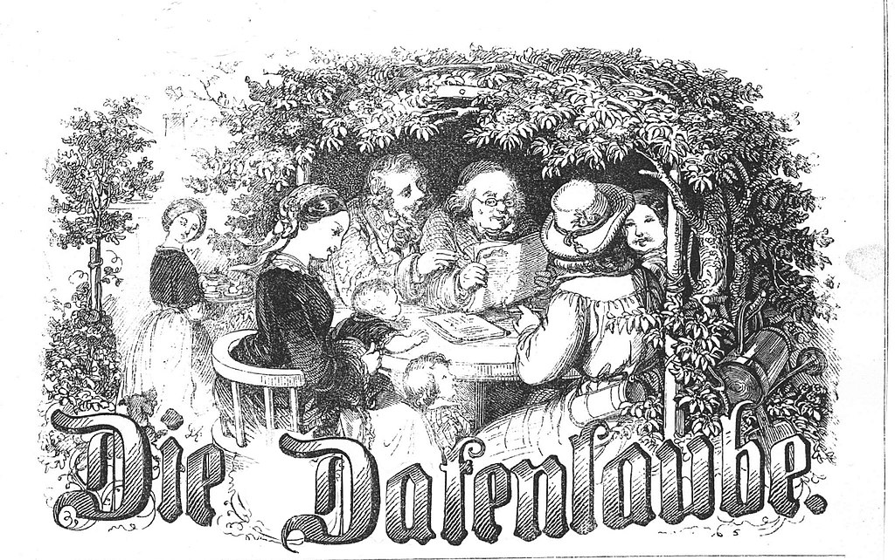

# Digitalisierung {#sec-digitalisierung}

::: {.callout-note title="Zusammenfassung"}

Neben der reinen Bewahrung von Kulturgütern stellt sich Bibliotheken und anderen Kultureinrichtungen die Herausforderung, diese weltweit im Netz zugänglich zu machen. Die Digitalisierung von Kulturgut erfordert verschiedene Prozesse und Tools, die in diesem Kapitel vorgestellt werden.

:::

## Grundlagen

Digitalisierung ist zu einer zentralen Aufgabe an vielen Bibliotheken geworden. Über die Jahren haben sich für diese Aufgabe technische und organisatorische Standards und Workflows entwickelt und konsolidiert. So existieren inzwischen zahlreiche Softwaresysteme wie z.B. Workflow-Managementsysteme. 

### Ziele der Digitalisierung

Zu den Zielen der Digitalisierung zählen vor allem die Bestandserhaltung und Bestandsentwicklung. Durch die digitale Verfügbarmachung soll der Kundennutzen erhöht werden, indem Teilhabe und Zugang zu den Objekten erleichtert werden. Deshalb gibt es einen engen Bezug zu Themen wie Open Access oder Open Science. Durch eine erhöhte Sichtbarkeit der Institutionen bzw. einzelner Objekte und Sammlungszusammenhängen wird die Steigerung der institutionellen Relevanz angestrebt.

### Begriffsbestimmung

**Digitalisierung** steht in diesem Kapitel für die Überführung von materiellen
Kulturgütern in digitale Formate.  Bibliotheken und andere kulturbewahrende
Institutionen nehmen sich für die Digitalisierung sowohl Schriftgut (Bücher,
Handschriften, Nachlässe) als auch audiovisuelle Medien und andere Objekttypen
vor. Dabei wird oft auch von **Retrodigitalisierung** oder
**Bestandsdigitalisierung** gesprochen, wenn die Objekte nicht originär digital
sind ("born-digital"), sondern bereits physische vorlagen und erst später
digitalisiert werden.

### Geschichte

Als Vorläufer der Digitalisierung kann die Mikroverfilmung betrachtet
werden, bei der bereits seit dem 19. Jahrhundert analoge Dokumente mit
dem Ziel der Langzeiterhaltung, der Vervielfältigung oder als
platzsparender Ersatz für Originale in ein anderes analoges Format
transformiert wurden. Die Überführung in digitale Formate begann in den
1990er Jahren. Das Ziel war hier zunächst vor allem die weltweite
Zugänglichmachung von besonderen Werken oder Beständen für die
wissenschaftliche Nutzung. Waren es zunächst vor allem bedeutende
Druckwerke des 16., 17. und 18. Jahrhunderts, die digitalisiert wurden,
hat sich der Fokus der Digitalisierung auch zeitlich, thematisch und
formal sehr erweitert.

In Deutschland war und ist die Deutsche Forschungsgemeinschaft (DFG) ein
wesentlicher Akteur, der durch Projektförderung erhebliche Impulse für die
großflächige Retrodigitalisierung gegeben hat. Gleichzeitig sorgten die in
geförderten Projekten verbindlichen
[DFG-Praxisregeln](https://zenodo.org/records/7435724), die auch in anderen
Projekten oft angewendet werden, für ein hohes Maß an Einheitlichkeit und
Interoperabilität zwischen verschiedenen Beständen. Neben technischen
Parametern für den [Scan-Prozess](#scanner-und-scanverfahren) (Auflösung,
Farbtiefe u.a.) und Speicherformaten (TIFF unkomprimierte Master-Images) werden
dort Standards zur [Speicherung von Metadaten](#metadaten-und-schnittstellen)
festgelegt, die von der Library of Congress entwickelt wurden und weiter
gepflegt werden. Die DFG hat darüber hinaus mit dem
[DFG-Viewer](https://dfg-viewer.de/) einen Minimalstandard in der
[Objektpräsentation](#präsentieren) entwickeln lassen. Zu den Standards der
DFG-Förderung gehört auch, dass jedes Werk nur einmal digitalisiert werden
soll.

Eine weitere große Digitalisierungs-Initiative ging und geht von Google
aus, die weltweit und in Deutschland insbesondere bei der Bayerischen
Staatsbibliothek in großem Umfang alte Druckwerke digitalisieren (Google
Books).

Ergänzend digitalisieren, veröffentlichen, erschließen und editieren
private Akteure digitale Kulturgüter -- Akteure in Wikimedia-, Open
Data- und Open Science-Gemeinschaften, oder sie arbeiten ehrenamtlich in
einschlägigen bibliothekarischen Projekten mit.

### Status quo

Zahlreiche Bibliotheken mit umfangreichen unikalen Beständen haben sich
auf den Weg gemacht, Retrodigitalisierung als festes Arbeitsfeld in die
eigene Organisation aufzunehmen. Für die Unterstützung der Prozesse und
für die Präsentation der Ergebnisse im Web haben sich unterschiedliche
Softwarelösungen etabliert, zu denen aktive Anwendergemeinschaften
gehören. Zusammen mit den geklärten Standards ist ein Rahmen geschaffen,
in dem diese Bibliotheken kontinuierlich neue Digitalisierungsprojekte
starten. Größere Häuser öffnen zum Teil ihre Infrastruktur anderen
kleineren Einrichtungen in Landesprogrammen wie z.B. in
[Sachsen](https://www.slub-dresden.de/ueber-uns/projekte/landesdigitalisierungsprogramm)
oder
[Hamburg](https://www.sub.uni-hamburg.de/bibliotheken/projekte-der-stabi/hamburger-kulturgut-im-netz-hakin.html).
In Berlin unterstützt die Arbeitsstelle
[digiS](https://www.digis-berlin.de/digis/) mit einem
jährlichen
[Förderprogramm](https://www.digis-berlin.de/foerderprogramm/info/)
seit 2012 Digitalisierungsprojekte in unterschiedlichen technischen
Umgebungen - um nur einige Beispiele aus der heterogenen föderalen
Struktur herauszugreifen.

### Ausblick

Neben der reinen bildhaften Digitalisierung wird von Forschenden
zunehmend auch eine Erstellung und Bereitstellung von Volltexten
erwartet. Diese kann entweder über einfache Text-Bild-Zuordnung oder
auch mit aufwändiger semantischer Auszeichnung erfolgen. Die von der DFG
geförderte Initiative OCR-D erstellt Werkzeuge und Infrastrukturen, um
für die Werke des 16., 17. und 18. Jahrhunderts, aber auch für viele
weitere Digitalisate eine effiziente und alltagstaugliche
Volltext-Erstellung zu ermöglichen.

Außer Druckwerken und Handschriften werden zunehmend weitere Medien und
Objekte digitalisiert. Das sind nicht nur einschlägige Textdokumente aus
Bibliotheken und Archiven, sondern auch Objekte aus Sammlungen und
Museen, die teilweise auch in 3D digitalisiert werden, und audiovisuelle
Medien. Außerdem wird versucht, zusätzliche Attribute der materiellen
Objekte zu erfassen (z.B. Strukturerkennung, Kontextinformationen).

Zudem werden sich GLAM-Einrichtungen auch immer stärker des Bedarfes
bewusst, Digitalisate auch jenseits eigener Portale auffindbar und
nutzbar zu machen (siehe [Digitalisierung als Beitrag zur Open GLAM-Bewegung](#digitalisierung-als-beitrag-zur-open-glam-bewegung)).

## Prozesse

Die Digitalisierung von Kulturgütern gliedert sich in mehrere Prozessschritte.
Es haben sich dabei einrichtungsübergreifend ähnliche Prozessketten etabliert,
zu deren Unterstützung [Workflowmanagementsysteme](#workflowmanagementsysteme)
(WMS) entwickelt wurden und die Projektsteuerung erleichtern.

{#fig-prozess-digitalisierung}

Als Ausgangspunkt jedes Digitalisierungs-Vorhabens ist eine gründliche
Planung der Arbeitsschritte unverzichtbar. Dabei sind die lokalen
Rahmenbedingungen und die Infrastruktur der digitalisierenden
Einrichtung ebenso zu berücksichtigen wie die konkreten Ziele, die zu
erzeugenden Formate und Ergebnisse sowie die Verknüpfungen zu externen
datenverarbeitenden Systemen. Die
[DFG-Praxisregeln](https://doi.org/10.5281/zenodo.7435724)
geben wichtige Hinweise, was bei den Prozessen beachtet werden sollte.
WMS können diese Schritte steuern und teilweise auch automatisieren.

Für die Planung von Zeitungsdigitalisierung sollte im Vorwege besonders
genau auf die Einzelschritte im Prozess geschaut werden oder kollegiale
Beratung aus anderen Häusern eingeholt werden, um angesichts der Massen
an Material den effizientesten Weg bei der Erschließung zu finden, evtl.
Dienstleister optimal einzubinden und alle Möglichkeiten von
Automatisierung auszuschöpfen.

### Vorbereiten: Auswahl von Objekten

Eine sinnvolle Auswahl zu digitalisierender Objekte hängt von Faktoren
ab, deren Wichtigkeit gegeneinander abzuwägen ist. Dazu zählen
beispielsweise

-   die bestehenden Kapazitäten: verfügbare Scanverfahren,
    Arbeitsplätze, personelle Verfügbarkeiten),

-   die technischen Ausstattung: Scanner, Speicherkapazität, Anbindung
    an eine Langzeitarchivierung

-   zeitliche Faktoren: Projektlaufzeit, Förderbedingungen, Anlässe,

-   Digitalisierungswürdigkeit: Einzigartigkeit, Nachfrage

-   Erhaltungszustand: Dringlichkeit, Machbarkeit

-   existierende Vorarbeiten: vorhandene Metadaten, Vervollständigung
    bereits angefangener Vorhaben

Die Prioritäten für die eigene Bestandsdigitalisierung sollten immer
wieder überprüft werden, wenn sich die genannten Faktoren ändern.

Nach der Auswahl von zu digitalisierenden Objekten folgen weitere
vorbereitende Schritte. Dazu gehören z.B.

-   das Ausheben der Werke aus dem Bestand

-   das Überprüfen und ggf. das Herstellen der
    Digitalisierungs-Tauglichkeit

-   das Anlegen von Vorgängen im Workflowmanagementsystem

-   das Erzeugen von Laufzetteln

-   die Vorbereitung von Übergaben physischer Objekte an etwaige
    Scan-Dienstleister

### Digitalisieren

Die Entscheidung für das oder die am besten geeigneten
Digitalisierungsverfahren ist individuell am Objekt zu treffen und hängt
von verschiedenen Faktoren ab, wie der Art des Objekts, der gewünschten
Genauigkeit und den verfügbaren Ressourcen.

#### 2D-Objekte

Für das Scannen von 2D-Objekten ("Flachware") hat sich als Zielformat
der Bilddigitalisierung unkomprimiertes
[TIFF](https://de.wikipedia.org/wiki/Tagged_Image_File_Format)
etabliert. Es werden mit Aufsichtscannern oder fotografischen
Reproständen Einzelseiten aufgenommen und vom Bildausschnitt her wird
mit schwarzem Rand digitalisiert. Verschiedene Auflösungen ("Derivate")
für die Webpräsentation werden nachgelagert erzeugt oder dynamisch von
einem Bildserver zur Verfügung gestellt.

Für die verschiedenen Digitalisierungsvorhaben bilden die
[DFG-Praxisregeln](https://doi.org/10.5281/zenodo.7435724)
eine gute Orientierungshilfe - für die Auflösung, den Farbraum oder
andere technische Parameter. Für die Beurteilung und Sicherstellung der
objektiven Bildqualität haben sich zudem Digitalisierungsstandards
etabliert, die mittlerweile auch von Scannerherstellern und
Scandienstleistern berücksichtigt werden. Erwähnenswert sind hier vor
allem
[Metamorfoze](https://www.metamorfoze.nl/english/digitization)
und der daraus hervorgegangene [ISO-19263
Standard](https://www.iso.org/standard/64220.html) .

Bei der Zeitungsdigitalisierung ist im Interesse der Forschung die Erzeugung
von Volltexten nach der Digitalisierung ein wichtiges Ziel.  Diese Perspektive
bedingt im Hinblick auf die Qualität der Texterkennung (OCR) eine Präferenz für
eine Digitalisierung vom Original gegenüber einer Digitalisierung vom
Mikrofilm.

#### 3D-Objekte

Mittlerweile haben einige Bibliotheken angefangen, über flache,
zweidimensionale Informationen hinaus auch die Tiefe und Mehrdimensionalität
des kulturellen Erbes und Wissens innerhalb ihrer Bestände zu erfassen.
Bibliotheksbestände sind häufig heterogen und ergeben sich aus einer
fortgesetzten Sammlungsgeschichte, sodass auch spezielle dreidimensionale
Objekte, wie Globen, Spiel- oder PopUp-Bücher oder historische Objekte des
Buchdrucks wie Lettern, Teil eines Bestandes sein können. In diesen Fällen hat
sich eine Digitalisierung in allen drei Dimensionen als ein entscheidendes
Werkzeug erwiesen, um die Mehrdimensionalität in digitale Formate zu übertragen
und um über Inhalte hinaus den Zustand und Details als Kulturerbe-Objekte
wiederzugeben. Dies betrifft ebenso seltene Bücher und Manuskripte mit
einzigartigen oder kunstvollen Bindungen. Um die drei Dimensionen angemessen
abzubilden, sind [spezielle Erfassungsmethoden](#scanner-und-scanverfahren)
notwendig.

#### AV-Medien

Bibliotheken und andere GLAM-Einrichtungen archivieren häufig auch
analoge audiovisuelle Medien. Für die Digitalisierung der
unterschiedlichen Quellen (z.B. Magnettonbänder, Film von 8mm bis 35mm,
Selbstschnittplatten, Videobänder) werden im Falle einer
Massendigitalisierung zumeist externe Dienstleister beauftragt, sodass
die Herausforderungen hier in erster Linie in der inhaltlichen
Erschließung und der Erhaltung des originalen Materials liegen.

**Für alle Materialarten gilt:** Eigene Scanner sind nur erforderlich,
wenn der Scanprozess nicht an einen Dienstleister ausgelagert werden
soll oder kann. Nach der Auswahl geeigneter Geräte (am besten nach
Beratung durch erfahrene Einrichtungen) empfiehlt sich eine
Teststellung, bei der diese unter Realbedingungen erprobt werden können.

### Erschließen

#### Erschließen von Metadaten

Erschließen bedeutet das Zusammentragen von allen verfügbaren Informationen zu
einem Objekt und die Codierung in Form von Metadaten (siehe @sec-metadaten). Im
Kontext der Digitalisierung sind drei Arten von Metadaten (@sec-arten-von-metadaten) besonders relevant:

-   **Administrative Metadaten** mit Informationen zu Herkunft,
    Erhaltungszustand, technische Merkmale, Rechteinformationen.

-   **Deskriptive Metadaten** zur bibliografischen Beschreibung des
    Objektes.

-   **Strukturelle Metadaten** für Gliederungselemente wie z.B. Kapitel
    in Texten, Segmente in 3D-Objekten, Frames in Filmen.

Bibliografische Basisdaten wie auch strukturelle Metadaten können in
einem WMS entweder importiert oder manuell erfasst werden. Viele der
Systeme sind dafür individuell konfigurierbar und können je nach Art des
Projektes angepasst werden. Ein wichtiges Metadatum sind
[Identifikatoren](#identifikatoren)
(URN, DOI, PURL ...) und deren Generierung. Für die Strukturierung von
Textdokumenten ist das [Stukturdatenset für den
DFG-Viewer](https://dfg-viewer.de/strukturdatenset) ein
praxistauglicher Referenzrahmen.

Um die Nachnutzung der digitalisierten Objekte zweifelsfrei zu
kennzeichnen, gehören Informationen zur Lizenzierung in die
administrativen Metadaten. Dafür hat eine Expertengruppe innerhalb von
DINI detaillierte [Empfehlungen für Rechteinformationen in
Metadaten](https://wiki.dnb.de/pages/viewpage.action?pageId=217533652)
aufgestellt.

Strategien für das Crowdsourcing von Erschließungsarbeiten in offenen
Informationsinfrastrukturen wie dem Wikiversum ermöglichen potenziell
zusätzliche Mehrwerte, auch im Nachhinein und durch Dritte.

#### Zusätzliche inhaltliche Erschließung durch Volltexte und Annotationen

Erschließung endet nicht bei der Zuordnung von Metadaten. Ziel der
Erschließung ist auch eine Abbildung des Werkes in nachnutzbarer Form.
Bei Textdokumenten ist das die Generierung von Volltexten. Für die
Auswahl eines Verfahrens und deren Parametrisierung sind Eigenschaften
der Vorlage (Schriftart, Layout, Sprache, Papier- und Druckqualität
u.a.) sowie die benötigte Qualität der Volltexte entscheidend.

Waren anfangs vor allem kommerzielle OCR-Werkzeuge dominierend (z.B.
[ABBYY](https://de.wikipedia.org/wiki/ABBYY)), haben sich
mittlerweile einige Open Source-Projekte (z.B.
[Tesseract](https://de.wikipedia.org/wiki/Tesseract_(Software)))
entwickelt, die qualitativ vergleichbare oder bessere Ergebnisse
erzeugen können. Dank neuer technologischer Ansätze sind auch Lösungen
für handschriftliche Dokumente verfügbar (z.B.
[OCR4all](https://www.ocr4all.org/about/ocr4all)). Mit
Förderung durch die DFG arbeitet die Initiative OCR-D an einem frei
nutzbaren Workflow, der neben der eigentlichen Volltexterkennung weitere
Schritte (z.B. automatische Layouterkennung) einbindet, die die Qualität
der Erschließung verbessern.

Die Generierung von Volltexten kann als (automatischer) Prozessschritt
im [Workflowmanagementsystem](#workflowmanagementsysteme) eingebunden werden. Die Ergebnisse werden
in der Regel in [standardisierten Datenformaten](#metadaten-und-schnittstellen)
geliefert und können dann in Präsentationssystemen z.B. für die
Volltextsuche genutzt oder zum Download angeboten werden.

Neben Volltexten können je nach Kontext auch Annotationen als weiteres
Element der Erschließung eine Rolle spielen, die aber in der Regel nicht
im Digitalisierungsprozess, sondern erst im Nachhinein entstehen.

### Präsentieren

Die Präsentation von digitalisierten Objekten und den dazugehörigen
Metadaten im Web ist ein wesentliches Ziel der
Digitalisierungs-Aktivitäten.

Die Präsentation der digitalisierten Objekte hängt von der Art von
Objekten und beabsichtigten Nutzungsszenarien ab und erfordert eigene
Werkzeuge, die unabhängig von dem genutzten Workflowmanagementsystem
ausgewählt und konfiguriert werden. Basis für Präsentationslösungen sind
die im Workflow erzeugten standardisierten XML-Files (METS/MODS).

Funktional wird von einer Präsentationslösung eine konfigurierbare
Recherche-Umgebung für Metadaten und Volltexte erwartet. Bei der
Präsentation des einzelnen Objektes werden die Strukturdaten zusammen
mit den dazu erfassten Metadaten als Inhaltsverzeichnis angeboten und es
werden zur Arbeit mit den Scans Bildwerkzeuge erwartet (z.B. Zoomen,
Rotieren, Thumbnail-Übersicht). Zunehmend wichtige Funktionen sind
Download-Angebote oder die Bereitstellung von iiif-Manifesten zur
Weiternutzung in anderen Viewern.

Mit dem [DFG-Viewer](http://dfg-viewer.de/) existiert eine
Minimallösung für die Anzeige von Digitalisaten, die aus dem Katalog
verlinkt werden kann. Für eine umfassendere Präsentation von
Digitalisaten entscheiden sich Einrichtungen für eine Integration der
Digitalisate in ein existierendes Repositorium oder für den Aufbau von
Web-Angeboten mit speziellen Werkzeugen für Digitalisate wie z. B.
*Kitodo.Presentation*. Ein wichtiges Element für mehr Sichtbarkeit der
eigenen Digitalisierungs-Aktivitäten ist eine Datenlieferung an die
Deutsche Digitale Bibliothek.

Zunehmend relevanter wird die Suche nach Lösungen für eine Präsentation
von rechtebehafteten Materialien für eingeschränkte Personenkreise.
[Repositorien](forschungsnahe-dienste.md#repositorien-für-forschungsergebnisse) haben hier in der Regel schon anpassbare Lösungen. Bei der Präsentation
von Digitalisaten existieren prototypische oder an Institutionen
individuell angepasste technische Lösungen. Standards für die
Beschreibung von Zugriffsrechten in den Metadaten oder generische
Präsentationslösungen auf Basis dieser Metadaten befinden sich noch im
Abstimmungsprozess oder der Entwicklung.

Wikimedia Commons kann darüber hinaus als Medienspeicher fungieren. 
Von dort werden digitalisierte Objekte und 'born digital'-Dokumente in Wikipedia und andere Webseiten eingebettet. Die Erschließung mit strukturierten Daten erfolgt mittels Wikidata
(siehe [Digitalisierung als Beitrag zur Open GLAM-Bewegung](#digitalisierung-als-beitrag-zur-open-glam-bewegung)).

## Werkzeuge

### Scanner und Scanverfahren

#### 2D

Scanner und ihre Verfahren lassen sich grundlegend nach der Eigenschaft
ihrer zu scannenden Objekte und der Zielsetzung des Scan-Ergebnisses
unterscheiden.

Im Bereich des 2D-Scans unterstützen z.B. spezielle Buchscanner den
Scanprozess im Rahmen der Digitalisierung effizient und für das zu
digitalisierende Material auf schonende Weise. Das sind in der Regel
Auflichtscanner oder fotografische Systeme, bei denen das Material von
oben abgelichtet wird. Je nach Art und Zustand des Materials können
dabei Buchwippen bzw. -wiegen mit verschiedenen Winkeln oder Glasplatten
eingesetzt werden. Roboter können das automatische Umblättern der Seiten
erledigen, sind dabei aber für empfindliche Bestände weniger schonend.
Berührungslose Scanner sind vor allem für Handschriften vorgesehen.

{#fig-buchscanner}

Die 2D-Scanner können sich in verschiedenen Eigenschaften wie Größe der
Formate, Farbtiefe, Auflösung, Art und Qualität der Optik und Mechanik
sowie in der Verarbeitungsgeschwindigkeit unterscheiden. Um eine hohe
und gleichbleibende Bildqualität zu gewährleisten, ist eine regelmäßige
Kalibrierung der Systeme und Auswertung der Aufnahmen anhand von
Test-Targets (z.B. UTT-Target oder GoldenThread) erforderlich. Neben der
Hardware unterscheiden sich Scanner in der Software, durch die Rohdaten
des Scanners für die weitere Nutzung bearbeitet (z.B. beschneidet oder
glättet), optimiert und in gewünschten Zielformaten speichert.

#### 3D

Bei der 3D-Erfassung eines Objektes kann zwischen photo- und
scanbasierten Verfahren unterschieden werden.

So werden bei der Photogrammetrie Fotos aus verschiedenen Blickwinkeln
aufgenommen. Dabei wird die Anzahl der Fotos derart erhöht, dass sie mit
Hilfe von Software zu einem 3D-Modell verarbeitet werden können. Nach
diesem Prinzip funktionieren auch 3D-Scanning-Apps für Smartphones, die
3D-Scans von Objekten mithilfe der Kamera eines Smartphones ermöglichen.

Demgegenüber stehen verschiedene Scanverfahren. Beim Laser-Scanning
werden z.B. Laserstrahlen auf das Objekt gerichtet, und die
reflektierten Daten werden verwendet, um ein präzises 3D-Modell zu
erstellen. Neben dem Laser lassen sich solche 3D-Modelle auch mit
strukturiertem Licht (Streifenlichtscans) oder Computertomographie
erzeugen.

Bei der 3D-Modellierung wird ein 3D-Modell nach Vorlagen manuell und mit
Hilfe von spezifischer Software erstellt. Dies kommt insbesondere für
die digitale Rekonstruktion von physisch nicht erhaltenen (Teilen von)
Objekten zur Anwendung.

Alle Verfahren können miteinander kombiniert werden.

Wird beispielsweise ein Pop-up Buch oder ein Globus 3D-digitalisiert,
sollen zusätzlich die kinetischen Aspekte (ein Globus dreht sich um
seine Achse, bei einem Pop-up Buch lässt sich eine Lasche herausziehen
usw.) unter Umständen auch im Digitalisat nachvollziehbar bleiben.
Besteht das Originalobjekt aus Einzelteilen und werden diese
entsprechend in Segmenten digitalisiert, können diese Segmente
interaktiv nutzbar gemacht werden oder/und Animationen eingesetzt
werden. Ein einfacher Scan reicht in diesem Fall nicht aus, da hier
lediglich \"die Hülle im Ganzen\" erfasst wird. Eine manuelle
Nachbearbeitung ist nötig.

### Workflowmanagementsysteme

Bei diesen Systemen handelt es sich im Grunde um klassische
Workflowmanagementsysteme
([WMS](https://de.wikipedia.org/wiki/Workflow-Management-System)),
die auf die Abbildung und Modellierung der [oben beschriebenen Prozesse](#prozesse)
spezialisiert sind. Das Ziel der Systeme ist es,
die Prozesse technisch abzubilden und zu organisieren bzw. die Zustände
der im Prozess befindlichen Objekte zu speichern und darzustellen.

{#fig-wms-workflow}

Aufgrund der hohen Spezialisierung ist die Auswahl an WMS für
bibliothekarische Digitalisierungsprozesse überschaubar. Dazu gehören
sowohl kommerzielle Produkte, wie z.B. [Visual Library](https://www.semantics.de/visual_library/)
aber auch frei verfügbare Open Source Systeme wie [*Kitodo*](https://www.kitodo.org/).

Der wesentliche Unterschied zwischen den Tools -- neben der Frage der
Lizenz -- ist deren Modularität. Bei einigen Lösungen sind z.B. die
Erstellung, Anreicherung und Präsentation fest in einem System
zusammengefasst, andere wählen z.B. den Ansatz, die Präsentation von der
Erstellung zu trennen, sodass die Darstellung z.B. auch mit
spezialisierten Präsentationswerkzeugen, wie Content-Management-Systemen
erfolgen kann.

### Metadaten und Schnittstellen

An vielen Stellen des Digitalisierungsprozesses sind Schnittstellen
(APIs) zu Drittsystemen notwendig. Das gilt sowohl für die Einbindung
externer Metadaten (beispielsweise der Import aus Nachweissystemen via
*SRU* aus Verbundkatalogen oder Kalliope) als auch die Weitergabe von
Daten an externe Portale wie die Deutsche Digitale Bibliothek (*DDB*).

Als Austauschformat verwenden diese Schnittstellen meist
[XML-Datenformate](#xml-basierte-datenformate)
wie *PICA/XML*, *METS/MODS*, *EAD* und *LIDO*, die auf Struktur- oder
Metadaten digitalisierter Objekte spezialisiert sind.
[Relevante Schnittstellen](#schnittstellen)
sind vor allem *SRU*, *OAI-PMH* und *IIIF*. Die Nutzung gemeinsamer
Datenformate ermöglicht unter anderem die Auffindbarkeit, Verknüpfung,
Präsentation und Verwendung von Objekten in unterschiedlichen
Zusammenhängen.

Für einzelne Ressourcentypen und Anwendungen existieren oft genauere
Anwendungsprofile, die die Verwendung von Metadaten-Standards erweitern
oder einschränken.

**Beispiel:** Das
METS/MODS-[Anwendungsprofile](https://wiki.deutsche-digitale-bibliothek.de/display/DFD/5.+Anwendungsprofile+und+Best+Practice+Guides)
der Deutschen Digitalen Bibliothek legt Anforderungen an Metadaten fest,
wenn diese in das Portal eingebunden werden sollen. Zur [Validierung
der
Daten](https://wiki.deutsche-digitale-bibliothek.de/display/DFD/Schematron-Validierungen+der+Fachstelle+Bibliothek#SchematronValidierungenderFachstelleBibliothek-Schematron-Dateien)
stellt die DDB passende Werkzeuge zur Verfügung.

### Betriebsmodelle

Bei dem Einsatz der Werkzeuge im Digitalisierungsprozess stellt sich
immer die Frage, ob sich die Anschaffung der Hardware oder die
hausinterne Installation und Anpassung von Software lohnt oder aber
Bestandteile ausgelagert werden können. Wie bei allen IT-Systemen sind
grundsätzlich [drei Betriebsmodelle](management.md#sec-betriebsmodelle) denkbar:

-   **Lokale Installation**: Hard- und Software wird durch
    betriebseigenes Personal gehostet, betreut und weiterentwickelt.
    Dieses Modell ist vor allem dann empfehlenswert, wenn bereits
    Digitalisierungskompetenz in der Institution vorhanden ist und die
    Digitalisierung einen dauerhaften Schwerpunkt in den
    Alltagsprozessen einnimmt bzw. einnehmen soll.

-   **Externes (Cloud-)Hosting**: Sofern nicht z.B. rechtliche Gründe
    dagegen sprechen, ist dieses Modell empfehlenswert, wenn nur
    punktuell oder in geringem Umfang digitalisiert werden soll und
    dabei keine eigene Expertise notwendig ist oder aufgebaut werden
    soll.

-   **Hybrid-Lösungen:** Es werden nur Teile des Prozesses ausgelagert,
    z.B. das Scannen der Objekte, während z. B. die
    Inhaltsanreicherung durch Metadaten im Haus verbleibt.

Die Hybrid-Variante wird im Alltag am häufigsten umgesetzt. Die
Herausforderung besteht darin, die Schnittstellen zwischen externen und
internen Prozessen genau zu definieren und festzulegen. So muss zum
Beispiel externen Scan-Dienstleistern Zugriff auf das intern betreute
Workflowmanagementsystem gewährt werden, damit digitalisierte Objekte
direkt im System abgelegt werden können.

## Digitalisierung als Beitrag zur Open GLAM-Bewegung

Mit Digitalisierung leisten Bibliotheken und andere GLAM-Einrichtungen
wichtige Beiträge dazu, dass Kulturgüter weltweit zugänglich, gut
auffindbar und nachnutzbar sind. Neben der einrichtungseigenen
Präsentation und aggregierenden Portalen wie der "Deutschen Digitalen
Bibliothek" oder der "Europeana" spielen auch offene Wissensplattformen
im Web eine wichtige Rolle, um Daten zugänglich zu machen, zu teilen und
Nutzende an der Erschließung zu beteiligen. Entsprechende Möglichkeiten
sollen im Folgenden skizziert werden, da es sich um einen wichtigen
Trend bei der Digitalisierung und Nutzung handelt.

Offener Zugang und offene Lizenzen für freie Nutzungsszenarien,
standardisierte Schnittstellen und offene Metadaten vereinfachen das
Teilen von Daten bzw. Informationen aus digitalisierten Quellen --
Texten, Illustrationen und Sammlungen -- als freies Wissen.

### Veranstaltungsformate und Handlungsfelder

Hackathons und Editathons sind Veranstaltungsformate, um kurzfristig die
Bekanntheit digitaler Sammlungen zu steigern, Datenexperimente zu
ermöglichen und Datenkollaborationen in Pilotprojekten anzustoßen. Dabei
können Impulse entstehen für weiterentwickelte Datenanwendungen.
Lerneffekte entstehen dabei nicht nur bei den beteiligten Menschen,
sondern auch institutionell bei den beteiligten Bibliotheken und anderen
GLAM, die ggf. Bedürfnisse, Ideen und Defizite von Nutzenden
kennenlernen. Ein Beispiel Hackathons ist die Initiative ["Coding da
Vinci"](https://codingdavinci.de/).

Crowdsourcing und Citizen Science sind Handlungsfelder, die in
Bibliotheken zunehmend Aufmerksamkeit wecken. Hierbei gewinnen
Bibliotheken über externe engagierte Dritte zusätzliche Ressourcen für
die Erschließung, Auswertung oder Korrektur von Daten.

::: {.callout-tip title="Beispiel"}

Im Projekt "[Die
Datenlaube](https://de.wikiversity.org/wiki/DieDatenlaube)" erfasst
und korrigiert in der deutschsprachigen Wikisource eine Gemeinschaft
Ehrenamtlicher seit 2008 die von verschiedenen Bibliotheken
bereitgestellten Scans der Illustrierten "Die Gartenlaube". Diese
Wikisource-Volltexte und -Illustrationen werden mit offenen Metadaten in
Wikidata strukturiert erschlossen.

{width=45% #fig-datenlaube}

:::

### Offene Infrastrukturen

Offene digitale Infrastrukturen spielen für die Speicherung,
Erschließung und Vernetzung von Digitalisaten eine wichtige Rolle, nicht
zuletzt auch, um die beschriebene Beteiligung zu ermöglichen. Das
prominenteste Beispiel dafür sind die Projekte der Wikimedia-Foundation,
deren Grundprinzipien von Offenheit und Referenzierbarkeit die
bibliothekarischen Erschließungs- und Präsentationskomponenten ergänzen:

-   **Wikimedia Commons** fungiert als zentraler Medienspeicher.
    Die Erschließung kann bis zur Details von Bildpositionen reichen.
    Die Illustrationen dieses Handbuchs sind in Wikimedia Commons
    [in einer Medienkategorie](https://commons.wikimedia.org/wiki/Category:Handbuch_IT_in_Bibliotheken)
    gebündelt (siehe Abbildungsverzeichnis im @sec-abbildungen).

-   Mit der offenen Wissensdatenbank (Knowledge Graph) **Wikidata** können
    insbesondere Metadaten strukturiert und damit maschinenlesbar
    gespeichert, gemeinsam editiert, visualisiert, analysiert, geteilt
    und verknüpft werden.

-   Die vielsprachigen Versionen der **Wikipedia** speichern Wissen in
    enzyklopädischen Artikeln und ermöglichen so die Zusammenführung
    von Digitalisaten mit Texten, Illustrationen aus den Wikimedia
    Commons, Referenzen, Links und damit Kontext.

-   **Wikisource** ist eine Quellensammlung gemeinfreier Werke und besteht
    sowohl aus transkribierten Volltexten und deren Illustrationen als
    auch thematischen Linksammlungen zu relevanten Digitalisaten in
    Digitalen Sammlungen öffentlicher und wissenschaftlicher
    Bibliotheken, Archive, Museen und Galerien (GLAM).

Herausforderungen aus IT-bibliothekarischer Sicht bestehen darin,
Wikimedia-Portale und bibliothekarische Werkzeuge durch Schnittstellen
und Datentransformation ([ETL-Tools](#etl-prozess))
miteinander zu verknüpfen. GLAM-Labore (Open GLAM Labs) können dafür als
Experimentier- und Ausbildungsort fungieren -- in Bibliotheken und
institutionenübergreifend z.B. im Rahmen von
Landesdigitalisierungsprogrammen.

## Checkliste für Digitalisierungsprojekte

Diese **Checkliste** dient als Leitfaden für die Planung und Umsetzung
von Digitalisierungsprojekten in Bibliotheken und hilft sicherzustellen,
dass die Ziele erreicht und die digitalen Sammlungen effektiv genutzt
werden können.

**Vorbereitungsphase:**

1. *Festlegung der Ziele*: Klären Sie die Hauptziele und den Zweck der
Digitalisierung (z.B. Zugänglichkeit, Erhaltung, Forschung).

2. *Ressourcenplanung*: Ermitteln Sie die erforderlichen Ressourcen wie
Verfügbarkeit der Objekte, Personal, Technologie, Budget und Zeitrahmen.

3. *Rechtliche Überlegungen*: Klären Sie urheberrechtliche und
rechtliche Fragen bezüglich der digitalisierten Materialien.

4. *Auswahl der Objekte*: Wählen Sie die Objekte aus, die digitalisiert
werden sollen, u. a. basierend auf ihrer Bedeutung und ihrem Zustand.

5. *Metadatenplanung*: Entwickeln Sie einen Plan zur Erfassung und
Verwaltung von Metadaten für die digitalisierten Materialien.

**Technische Umsetzung:**

6. *Scantechnologie*: Wählen Sie die geeignete Scantechnologie und
-auflösung entsprechend der Art der Objekte und deren Verwendungszweck
aus.

7. *Qualitätskontrolle*: Implementieren Sie Prozesse zur Sicherstellung
der Qualität der Digitalisate.

8. *Dateiformate*: Entscheiden Sie über die geeigneten Dateiformate für
die digitalisierten Materialien.

9. *Speicher und Sicherung*: Planen Sie die Speicherung und regelmäßige
Sicherung der digitalen Sammlung.

**Metadaten und Beschreibung:**

10. *Metadatenstandards*: Verwenden Sie etablierte Metadatenstandards,
um die Beschreibung der Objekte zu standardisieren.

11. *Dokumentation*: Dokumentieren Sie den Digitalisierungsprozess und
die verwendeten Metadaten.

12. *Zugänglichkeitsprüfung*: Überprüfen Sie, ob die digitalen
Sammlungen barrierefrei und benutzerfreundlich sind.

**Langzeitpflege**:

13. *Erhaltungsstrategien*: Planen Sie langfristige
Erhaltungsstrategien für digitale Materialien.

14. *Aktualisierung und Migration*: Berücksichtigen Sie die
Notwendigkeit von Aktualisierungen und Migrationen von Dateiformaten und
Systemen.

**Zugang und Bereitstellung:**

15. *Plattformwahl*: Wählen Sie die geeignete Plattform oder das
geeignete System zur Präsentation und Verwaltung der digitalen
Sammlungen.

16. *Nutzungsrechte*: Klären Sie die Nutzungsrechte und -bedingungen
für die digitalen Inhalte.

17. *Nutzerfeedback*: Implementieren Sie Mechanismen zur Erfassung von
Nutzerfeedback zur Verbesserung der digitalen Sammlungen.

**Veröffentlichung und Dissemination:**

18. *Verbreitung*: Planen Sie die Verbreitung der digitalisierten
Sammlungen über Online-Kanäle, soziale Medien und Partnerschaften.

19. *Marketing*: Entwickeln Sie Marketingstrategien, um die digitalen
Sammlungen einem breiten Publikum bekannt zu machen.

20. *Evaluation*: Führen Sie regelmäßige Bewertungen durch, um den
Erfolg Ihrer Digitalisierungsprojekte zu messen und zu verbessern.

## Zusammenfassung und Ausblick

Viele Bibliotheken mit historischen Beständen sind im Feld der
Kulturgutdigitalisierung engagiert und kooperativ unterwegs. Werkzeuge,
Standards und Dienstleister stehen zur Verfügung, um die unikalen Bestände ins
Netz zu bringen. Um die Bandbreite der Objekte zu erweitern, finden gerade
wichtige Entwicklungen statt, um auch AV-Medien und Objekte jenseits von 2D in
die Routine aufzunehmen. Ebenso werden die Bibliotheken mit den Ergebnissen aus
OCR-D immer mehr in der Lage sein, auch ohne Expertenwissen gute Volltexte zu
erzeugen bzw. ihre gesamten Digitalisate inkl. handschriftlicher Dokumente mit
Volltexten anzureichern. Hier sind ggf. auch kooperative Infrastrukturen
aufzubauen, um die Fortschritte in den technischen Möglichkeiten schnell zur
Verfügung zu stellen und eine regelmäßige Erneuerung der Volltexte zum Standard
werden zu lassen. Daneben gilt es, gezielt [Kompetenzaufbau](#kompetenzen)
unter den Mitarbeitenden zu betreiben, um den Aufbau und Betrieb solcher
Infrastrukturen zu gewährleisten.

Erste Bibliotheken machen sich mit der schnell wachsenden Menge an
Volltexten auf den Weg, mit Hilfe ausgewählter Tools aus dem Feld des
Maschinenlernens, ihre Suche semantisch anzureichern auf Basis der
vorgeschalteten automatisierten Analyseverfahren.

Mit dem großen Schatz der Volltexte wird es darüber hinaus wichtiger
werden, diesen auch den Forscher:innen zusätzlich über eine API
anzubieten, um individuelle Korpora für den Download in eigene
Umgebungen zusammenstellen zu können. Hier landet man dann auch schnell
bei der Suche nach weitergehenden nachhaltigen Lösungen für
urheberrechtlich geschützte Materialien.

Aber auch die kollaborativen Aktivitäten an einzelnen Digitalisaten im
Wikiversum oder in Citizen Science Projekten sind getragen von dem
Leitgedanken, dass die digitalisierten Kulturgüter in neue Zusammenhänge
gestellt werden und Interessierte zu einem Thema zusammenbringen.

