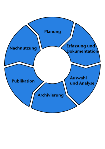
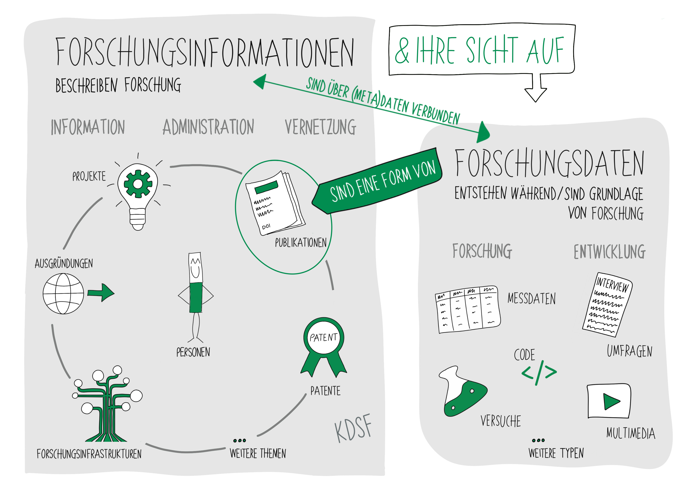
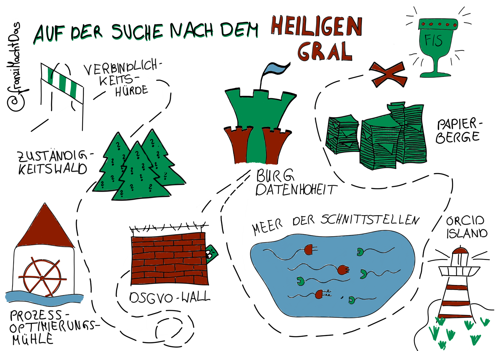
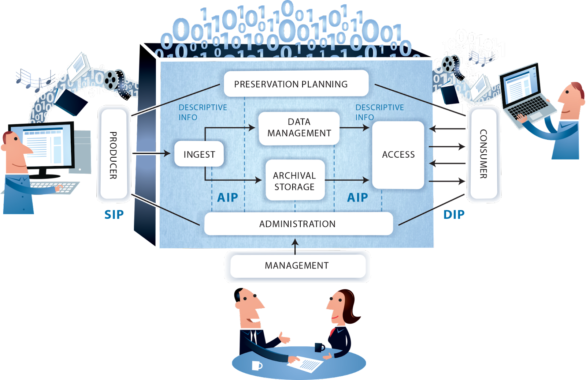

# Forschungsnahe Dienste {#sec-forschungsnahe-dienste}

::: {.callout-note title="Zusammenfassung"}

Bibliotheken bieten [Dienste für die Wissenschaft](#einleitung) im Rahmen des
digitalen Wandels von Publikationsprozessen und Open Science an. Dazu gehören
in diesem Kapitel vorgestellte [Dienste zur Publikation](#publikationsdienste), zur [Verwaltung von Forschungsdaten](#forschungsdatenmanagement) und
[Forschungssoftware](#forschungssoftware) sowie [Informationen über
Forschungsprozesse](#forschungsinformationssysteme). Abschließend werden verschiedene übergreifende Themen wie [Zertifikate und Standards](#zertifikate-und-standards) und [Langzeitarchivierung](#langzeitarchivierung) behandelt.

:::

## Einleitung

Unter forschungsnahen Diensten werden verschiedene Bibliotheksservices
zusammengefasst, die Wissenschaftler\*innen im gesamten
Forschungsprozess unterstützen und die überwiegend im Kontext von
digitalem Wandel und Open Science angesiedelt sind
(<https://www.o-bib.de/bib/article/view/5718>).
Dazu zählen z. B. Services in den Bereichen [Forschungsdatenmanagement],
Bibliometrie sowie verschiedene [Publikationsdienste].

Einige dieser Dienste, z. B. Repositorien für Zeitschriftenartikel, die unter
Open-Access-Bedingungen zweitveröffentlicht werden dürfen, gehören schon seit
Jahrzehnten zum Dienstleistungsrepertoire wissenschaftlicher Bibliotheken.
Inzwischen betreiben größere Einrichtungen zudem oft spezialisierte
Repositorien für ein Spektrum verschiedener Objekttypen: Publikationen wie
Zeitschriften, Monografien und Sammelbände, sowie Open Educational Resources
(*OER*), Forschungsdaten, Forschungssoftware und mehr. Dazu gehören auch
diverse Dienste, die übergreifend den Forschungsoutput bestimmter lokaler oder
fachlicher Forschungscommunities besser auffindbar oder messbar machen sollen.
Darunter fallen Forschungsinformationssysteme und Dienstleistungen im Bereich
von Metriken oder zur Verwaltung von Artikelveröffentlichungsgebühren in
Open-Access-Journals (*APCs*).

::: {.callout-important}
## Definition

**Open Science** bezeichnet den Ansatz, wissenschaftliche Forschungsergebnisse, Daten und Methoden frei zugänglich und transparent zu teilen. Teilaspekte davon sind Open Access, Open Data, OER und Open Source. Ziel ist es, die Zusammenarbeit sowie die Reproduzierbarkeit von Forschung zu fördern, Innovationen zu beschleunigen und den gesellschaftlichen Nutzen wissenschaftlicher Erkenntnisse zu maximieren. Dieser offene Ansatz erleichtert es Forschenden weltweit, Informationen frei zu nutzen, zu teilen und weiterzuentwickeln.

:::

Forschungsförderer und Ministerien erwarten in Deutschland mittlerweile von den
Forschungseinrichtungen eine Transformation des Publikationswesens hin zu Open
Access und Open Data. Dazu gehören themenbezogene institutionelle
Policies, Beratungs- und Schulungsangebote sowie technische Dienste.
Auf der Ebene der europäischen Forschungsförderung wird u. a. versucht, durch Initiativen wie *[CoARA](https://coara.eu/)*
die Maßstäbe der Forschungsbewertung weiterzuentwickeln - weg von
klassisch bibliometrischen Indikatoren wie h-Index und
Journal-Impact-Factor hin zu einer Würdigung vielfältiger
Forschungsergebnisse.

In Abgrenzung zur Dominanz von Großverlagen ist im Bereich der
wissenschaftlichen Informationsinfrastrukturen darüber hinaus der
Anspruch entstanden, Dienste -- bis hin zur Ebene von Entwicklung und
Betrieb zugehöriger IT-Infrastrukturen -- durch die Communities der
Forschenden selbst zu betreiben. In der englischsprachigen
Fachdiskussion sind dazu Begriffe wie "scholar-led publishing" oder
"scholar-led conferences" geprägt worden, vgl. exemplarisch hierzu das
*[Scholar-Led.Network Manifesto](https://graphite.page/scholar-led-manifesto/)*.
Bibliotheken sehen sich hier als vertrauenswürdige, öffentlich
finanzierte Dienstleister für die Wissenschaftscommunities.

Der Einsatz von und die aktive Mitarbeit an Open Source-Software ist bei den
forschungsnahen Diensten stärker als in anderen Bereichen der Bibliotheks-IT
eine Selbstverständlichkeit. Auch die Bedeutung der gemeinschaftlichen Pflege offener Standards, Datenmodelle und Daten-Gemeingüter ist hier besonders ausgeprägt.

## Publikationsdienste

Die Veröffentlichung wissenschaftlicher Erkenntnisse ist ein zentraler
Bestandteil des wissenschaftlichen Arbeitens. Solange sich dieser Prozess noch in den Geschäftsprozessen klassischer
Subskriptionszeitschriften abbildete, befanden sich wissenschaftliche Bibliotheken 
eher auf der Seite der Medienbereitstellung. Mit zunehmender Stärkung des
Open-Access-Gedankens und dem Aufkommen neuer Geschäftsmodelle rückten
wissenschaftliche Bibliotheken stärker in die Rolle des\*der Unterstützenden und
Ermöglichenden. Die Digitalität der gesamten Prozesskette vom Schreiben bis
zur Veröffentlichung der Beiträge in teilweise von den Bibliotheken getragenen
Infrastrukturen erfordert die Einbindung unterschiedlicher IT-Werkzeuge, die im
Folgenden näher beschrieben werden.

### Publishing-Dienste für Journals und andere Publikationsformen

Open Access bedeutet, dass wissenschaftliche Literatur kostenfrei und
öffentlich im Internet zugänglich ist, sodass Interessierte die
Volltexte lesen, herunterladen, kopieren, verteilen, drucken, in ihnen
suchen, auf sie verweisen und sie auch sonst auf jede denkbare legale
Weise benutzen können, ohne finanzielle, gesetzliche oder technische
Barrieren jenseits von denen, die mit dem Internetzugang selbst
verbunden sind. Zum ersten Mal wurde dieser Gedanke in der
*[Grundsatzerklärung der Budapester Open-Access-Bewegung](https://www.budapestopenaccessinitiative.org/translations/german-translation)*
formuliert.

Durch die Transformationsprozesse im wissenschaftlichen Publikationswesen weg
von den traditionellen Abonnement-Modellen hin zu Open Access sehen sich
Bibliotheken zunehmend auch in der Rolle eines\*einer
Publikationsdienstleistenden. Dies kann einerseits die Gründung eines
Universitätsverlages bedeuten, andererseits aber auch die Bereitstellung der notwendigen 
Infrastruktur für wissenschaftliche Zeitschriften. Begünstigt durch
Kostenverschiebung vom Lesen hin Publizieren wird der
scholar-led-Ansatz immer gefragter und Bibliotheken müssen in diesem
Bereich Expertise aufbauen.

Zur Schaffung einer technischen Infrastruktur für Zeitschriften lässt sich z.B.
mit der Software *[Open Journal Systems
(OJS)](https://ojs-de.net/ueber-ojs)* eine Plattform zur Verfügung stellen,
welche die strukturierte Veröffentlichung von Zeitschriften(-artikeln)
ermöglicht. Parallel dazu müssen auch die erforderlichen Abläufe und
Organisationsstrukturen angepasst werden.  Personelle Ressourcen müssen hier
ebenso bedacht werden. In erster Linie gilt es, die Herausgeber\*innen-Teams
der Zeitschriften zu unterstützen.  Gleichzeitig sollte die Bibliothek auch
technischen Support für einreichende Autor\*innen bieten. Der Funktionsumfang
von *OJS* ermöglicht es auch, einen Workflow für den Peer-Review-Prozess
abzubilden. Auch hier liegt Potenzial für die Unterstützung durch Bibliotheken.
Wichtig ist somit ein Überblick über den Gesamtprozess des wissenschaftlichen
Publizierens und nicht nur die Software-Aspekte. Für die Publikation von Monographien gibt es z.B. mit [Open Monograph Press](https://pkp.sfu.ca/software/omp/) (*OMP*) eine Software, die von der gleichen Organisation wie *OJS* angeboten und weiterentwickelt wird. 

Parallel dazu entwickeln sich derzeit alternative Publikations-Plattformen wie
Preprint-Dienste, (Micro-)Blogs, Data Journals und ähnliche Dienste, die
traditionelle Publikationswege wie peer-reviewte Journals ergänzen, siehe dazu
auch die entsprechende *[Publikation der Initiative Knowledge
Exchange](https://doi.org/10.21428/996e2e37.3ebdc864)*. Hier können
Bibliotheken ebenso in die Rolle des\*der Dienstleistenden treten, Instanzen
geeigneter Open-Source-Software hosten und diese Entwicklung unterstützen. Dies
kann auch im Zusammenhang mit der externen Kommunikation von Bibliotheken (siehe @sec-kommunikation) betrachtet werden. Ergänzend gibt es zahlreiche
weitere Dienste, die das Open-Access-Publizieren vor allem administrativ
unterstützen, von denen im Folgenden einige kurz erläutert werden.

### Open-Access-Dienste

Neben der Unterstützung bei Open-Access-Veröffentlichungen haben sich im
Zusammenhang mit der Open-Access-Transformation weitere IT-Dienste in
Bibliotheken entwickelt.

#### Verlags-Software

Da im Sinne der "scholar-led infrastructure" zunehmend
Universitätsverlage gegründet werden, existieren hier auch eigene
Software-Lösungen für die Verwaltung der Titel, Lagerbestände,
Kund\*innen-, Adress- und Versanddaten. Häufig ist ein eigener Webshop
mit entsprechenden Funktionalitäten integriert und es gibt
Schnittstellen zur Buchhaltung und Auslieferung. Für kleinere Verlage
reicht vermutlich ein einfacher Webshop aus; Spezialsoftware kann
verlagsspezifische Anforderungen allerdings besser abbilden. Betrieb und
Administration der Programme gehören mit in das zugehörige
Dienstleistungsportfolio.

#### Publikationsfonds-Verwaltung

Publikationsfonds zur Finanzierung von Open-Access-Publikationen sind an
vielen wissenschaftlichen Bibliotheken fest verankerte Hilfsmittel, um
die Transformation des wissenschaftlichen Publikationswesens hin zu Open
Access zu unterstützen. Durch sie werden anfallende *Article Processing
Charges* (*APC*) entsprechend  vorgegebener Kriterien der Einrichtung
(mindestens anteilig) zentral gezahlt. Zum Monitoring der entstehenden
Kosten ist häufig eine Tabellenkalkulationssoftware ausreichend. Für
einen Vergleich verschiedener Einrichtungen und ein einheitliches
Reporting existieren jedoch Services wie
*[OpenAPC](https://openapc.net/)*. Zur einheitlichen
Darstellung aller Publikationskosten hat sich mit
*[OpenCost](https://www.opencost.de/metadatenschema/)* ein
xml-Metadatenschema etabliert.

#### Open Refine

Sollen Daten aus unterschiedlichen Quellen zusammengeführt werden oder
ein Abgleich gegen externe Datenbanken stattfinden, ist
*[OpenRefine](https://openrefine.org/)* ein geeignetes
Werkzeug: Über offene Schnittstellen können Datensätze sowohl erweitert
als auch beispielsweise in Wikidata exportiert werden. Hierbei ist keine
zentrale Installation notwendig. Die Software wird lokal auf den
Endgeräten ausgeführt. Lediglich eine korrekte Einstellung der Firewall,
um die Kommunikation mit externen Datenbanken zu ermöglichen, gilt es zu
beachten.

#### Journal-Finder-Werkzeuge

Neben den üblichen Fragen zu Lizenzen bei Open-Access-Publikationen
spielt auch die Wahl eines geeigneten Journals eine zentrale Rolle.
Derzeit verbreitete Journal-Finder-Werkzeuge wie
*[B!SON](https://service.tib.eu/bison/)* oder der
*[oa.finder](https://finder.open-access.network/)* greifen
für die Journal-Daten zwar beide auf das *Directory of Open Access
Journals* (*[DOAJ](https://doaj.org/)*) zu, verfolgen jedoch
unterschiedliche Ansätze. Der *oa.finder* zeigt eine Liste von
Zeitschriften mit Filteroptionen und den jeweiligen Förderbedingungen
an. Diese werden aus bestehenden Transformationsverträgen abgeleitet und
enthalten keine spezifischen Förderbedingungen. *B!SON* bietet
teilnehmenden Einrichtungen die Möglichkeit, eine eigene Liste mit
Förderbedingungen zu hinterlegen. Treffer werden direkt mit den
korrekten Förderbedingungen angezeigt. Zu diesem Zweck muss ein
Web-Backend entsprechend der Vertragssituation gepflegt werden.

### Repositorien für Forschungsergebnisse

Zentral für die Veröffentlichung jedweder Art von wissenschaftlichem
Output ist ein geeigneter Ort für deren Veröffentlichung, ganz besonders
im Hinblick auf die zunehmende Datengetriebenheit der Wissenschaften.

Heute haben sich Open-Access-Repositorien als verlässliche Speicherdienste für
wissenschaftliche Ergebnisse etabliert, seien es [Forschungsdaten], textuelle
sichergestellt werden, dass publizierte Ergebnisse in der veröffentlichten Form
erhalten werden, d. h. nicht verändert oder gelöscht werden. Da
Internetadressen als flüchtig gelten, werden zur Identifikation [Persistent
Identifier-Systeme](#persistent-identifier) eingesetzt. Die Zitierfähigkeit und
damit der langfristige, möglichst originalgetreue Erhalt der einmal
eingestellten Informationen grenzen Repositorien gegenüber anderen
Arbeitsplattformen wie Sync-and-Share-Plattformen (z. B. *Nextcloud*),
Content-Management-Systemen (CMS) zur Erstellung von Blogs und Internetseiten
sowie virtuellen Forschungsumgebungen mit integrierten Funktionen z. B. für die
Datenanalyse ab.

Es lassen sich grundlegend zwei Typen von Repositorien unterscheiden:
Disziplinspezifische Repositorien sammeln die Inhalte einer bestimmten
Forschungsdisziplin (Suche nach Disziplin möglich über
*[re3data](https://www.re3data.org/)*), während generische
Repositorien Inhalte unterschiedlicher Disziplinen aufnehmen (z. B.
*[Zenodo](https://zenodo.org)*). Einen Sonderfall
fachübergreifender Repositorien bilden institutionelle Repositorien, die
speziell für die Mitglieder der jeweiligen Institution zur Verfügung
stehen. Einige Repositorien widmen sich gezielt der Sammlung
bestimmter Datentypen (z. B. Preprint- oder Publikationsserver,
Forschungsdatenrepositorien, Bilddatenbanken etc.). Insbesondere im
Bereich Forschungsdaten und OER gibt es seitens
der Nutzenden häufig den Wunsch, dass in Repositorien eine
interaktive Arbeit mit den Materialien möglich ist. Derzeit sind
Repositorien in der Regel noch ausschließlich auf die sichere
Speicherung und Bereitstellung der Inhalte ausgerichtet - eine
Erweiterung um Funktionalitäten z. B. zur Visualisierung oder Analyse
würden sie in die Nähe von virtuellen Forschungsumgebungen rücken.
Häufig werden Repositorien und Repositoriensoftware zudem mit der
digitalen [Langzeitarchivierung](#langzeitarchivierung) als 
Kernfunktionalität in Verbindung gebracht - aus Sicht von Repositorien-Betreiber\*innen und
-Entwickler\*innen handelt es sich bei der digitalen
Langzeitarchivierung allerdings eher um eine Spezialfunktionalität, die
nur für bestimmte Nutzungsszenarien relevant und daher auch nicht in
allen Repositorien gegeben ist. Mit dem proprietären System
*[Rosetta](https://exlibrisgroup.com/de/produkte/rosetta/)*
und der Open Source-Lösung
*[Archivematica](https://www.archivematica.org)* seien hier
nur zwei Beispiele für Systeme genannt, die sich auf den Erhalt von
Informationen im Sinne der Langzeitarchivierung spezialisieren.

::: {.callout-important}
## Definition

Der Begriff **Repository** bzw. **Repositorium** wird in diesem Kapitel
vorwiegend für Plattformen verwendet, in denen Forschungsergebnisse
dauerhaft archiviert, beschrieben, auffindbar und zugänglich gemacht
werden. Darüber hinaus wird der Begriff Repository auch für
Versionsverwaltungssysteme wie *Git* verwendet, die vorwiegend von
Softwareprojekten genutzt werden, um es einer geschlossenen oder offenen
Community zu ermöglichen, transparent und konfliktfrei zur Codebasis des
jeweiligen Projekts beizutragen. U. a.
*[Zenodo](https://www.zenodo.org)* erlaubt über eine
Schnittstelle zum Code-Verwaltungssystem *GitHub* die Archivierung von
Softwareprojekten und ähnlichem entsprechend den Konventionen von
Repositorien für Forschungsergebnisse, einschließlich der Vergabe von 
Digital Object Identifiers (*DOIs*).

:::

Das *[Open Directory of Open Access Repositories](http://v2.sherpa.ac.uk/opendoar/)* (*OpenDOAR*) stellt [Statistiken
über die Verbreitung von
Softwarelösungen](https://v2.sherpa.ac.uk/view/repository_visualisations/1.html)
für Repositorien für Forschungsergebnisse bereit: Meistgenutztes System
weltweit ist *[DSpace](https://www.dspace.org)*, das auch in Deutschland
zunehmend Verbreitung findet. Während *DSpace* vor allem von Universitäten
eingesetzt wird, ist bei Fachhochschulen und Hochschule für Angewandte Wissenschaften
*[OPUS](https://www.opus-repository.org/)* stark verbreitet, das meist durch
den Kooperativen Bibliotheksverbund Berlin-Brandenburg (KOBV) oder das
Bibliotheksservice-Zentrum Baden-Württemberg (BSZ) gehostet wird. Der
Gemeinsame Bibliotheksverbund (GBV) bietet mit
*[MyCoRe](http://www.mycore.org)* eine weitere Repositoriensoftwarelösung an.
*OPUS* und *MyCoRe* finden bislang ausschließlich im deutschsprachigen Raum
Anwendung, während *DSpace* von einer globalen Community getragen wird. Für
Forschungsdatenrepositorien kommen *[DSpace](http://www.dspace.org/)*
und die auf Forschungsdaten spezialisierte Software
*[Dataverse](https://dataverse.org)* zum Einsatz.

## Forschungsdatenmanagement

[Forschungsdaten]: #forschungsdatenmanagement

Die digitale Transformation hat Forschungsprozesse grundlegend
verändert: In zahlreichen Fachdisziplinen entstehen an
Forschungseinrichtungen täglich große Mengen digitaler Daten, die
als Forschungsgegenstand dienen, angereichert, analysiert oder
visualisiert werden. Dabei stehen Wissenschaftler\*innen vor der
Herausforderung, diese Daten nicht nur zu verwalten, sondern sie auch
langfristig und nachvollziehbar vorzuhalten und möglichst offen zur
Nachnutzung zur Verfügung zu stellen. Maßgeblich sind hierfür die
sogenannten **FAIR-Prinzipien**, denen zufolge Forschungsdaten auffindbar
(findable), zugänglich (accessible), interoperabel (interoperable) und
nachnutzbar (reusable) sein sollen (vgl.
[https://doi.org/10.1038/sdata.2016.18](https://doi.org/10.1038/sdata.2016.18)).

::: {.callout-important}
## Definition

**Forschungsdaten** sind alle digital vorliegenden Daten, die während des
Forschungsprozesses entstehen (z. B. Messdaten, Laborwerte, Videoaufnahmen,
Umfrageergebnisse). Klar davon abzugrenzen sind
[Forschungsinformationen](#forschungsinformationssysteme). Der Lebenszyklus von Forschungsdaten beinhaltet die Erstellung, Speicherung, Archivierung bis hin zur Löschung aussortierter Daten.

:::

{#fig-forschungsdatenlebenszyklus width=50%}

Die Schnittmenge von Forschungsdaten und Forschungsinformationen liegt, wie in
@fig-fis-fdm dargestellt, im Bereich Publikationen. Während sich allerdings
Forschungsinformationen eher auf klassische, kontrolliert publizierte Dokumente
beziehen, geht die Publikation von Forschungsdaten weit darüber hinaus und
schließt alle Formen von Aufzeichnungen wie Notizen, Zwischenergebnisse
und [Forschungssoftware](#forschungssoftware) mit ein.

{#fig-fis-fdm width=95%}

Services zum Forschungsdatenmanagement (*FDM*) sollen Wissenschaftler\*innen
beim Umgang mit ihren Forschungsdaten unterstützen, und zwar über den
gesamten Forschungsdaten-Lebenszyklus hinweg, d. h. von der Datenplanung
über die Datenerhebung und -analyse bis hin zur Datenarchivierung,
-publikation und -nachnutzung. Bibliotheken nehmen beim Aufbau und
Betrieb entsprechender Services eine zentrale Rolle ein - in aller Regel
sind sie hierbei nicht die einzigen Akteur\*innen, sondern das
Serviceportfolio wird arbeitsteilig von
Bibliotheken, Rechenzentren, Forschungsabteilungen und ggf. weiteren
Akteur\*innen angeboten. Angesichts der großen Heterogenität
disziplinspezifischer Datentypen gelangen diese in aller Regel
fachübergreifenden *FDM*-Dienste häufig an ihre Grenzen: Diese
Erkenntnis ist konstitutiv für die seit 2020 im Aufbau befindliche
Nationale Forschungsdateninfrastruktur (NFDI), in der fachspezifische und
institutionsübergreifende Dienste entwickelt werden. In diesem
Zusammenhang entwickeln sich derzeit neue Berufe wie Data Steward
oder Data Librarian, die fachspezifische Unterstützung beim
*FDM* leisten und entweder zentral an den
*FDM*-Servicestellen oder dezentral in Projekten oder Fachbereichen
angesiedelt sind.

Die von Bibliotheken angebotenen Services zum *FDM* umfassen in der Regel
sowohl nicht-technische Services (z. B. Schulungs- und Beratungsangebote) als
auch verschiedene technische Dienste. Zu den wichtigsten technischen Diensten
für das *FDM*, die von Bibliotheken (mit-)betrieben werden, gehören
[Repositorien für Forschungsergebnisse](#repositorien-für-forschungsergebnisse). Diese
ermöglichen die Veröffentlichung von Forschungsdaten als eigene
Informationsobjekte gemäß den FAIR-Prinzipien Daneben werden häufig weitere
*FDM*-Tools angeboten, von denen einige im Folgenden vorgestellt werden.

### Tools zur Erstellung von Datenmanagementplänen

Um den Umgang mit Forschungsdaten über ein komplettes Projekt zu
beschreiben, hat sich der **Datenmanagementplan (*DMP*)** als geeignetes
Format erwiesen. Derartige Pläne werden zunehmend von
Forschungsförderern bei der Antragstellung oder in der Frühphase des
Projekts erwartet. Sie basieren häufig auf für die Förderlinie bzw. das
Fachgebiet spezifischen Fragenkatalogen. Durch die einheitlichen
Fragelisten und fest definierte Ausgabeformate lässt sich so ein
menschen- und maschinenlesbares Dokument generieren. Um diese
Fragenkataloge einheitlich zur Verfügung zu stellen und ggf. mit
einrichtungs- oder programmspezifischen Daten anzureichern, wurden
bereits einige Software-Werkzeuge entwickelt. In Deutschland verbreitet
einem von der Deutschen Forschungsgemeinschaft (DFG) geförderten Projekt entstandene 
*[Research Data Management Organizer](https://rdmorganiser.github.io/)* (*RDMO*), für
den, unterstützt durch *NFDI*-Konsortien, ständig neue Fragenkataloge
in einer Gemeinschaftsarbeit entwickelt werden. Obwohl einige
öffentliche Instanzen der Software existieren, die z. B. einen Login
über die *ORCID* ermöglichen, kann die Open-Source-Software auch selbst
gehostet und inhaltlich sowie visuell auf die Bedarfe der jeweiligen
Einrichtung zugeschnitten werden. *DMP* können innerhalb dieser Software
kollaborativ erstellt werden, indem Personen als Mitarbeitende in
das eigene Projekt eingeladen werden. Für EU-Projekte ist mit Stand 2023
die Software *[ARGOS](https://argos.openaire.eu/)*
verfügbar, die eine direkte Einbindung der *DMP* in die
*European Open Science Cloud* (*[EOSC](https://eosc-portal.eu/)*) ermöglicht. Für Software
als Forschungsdatum beginnen sich Softwaremanagementpläne zu etablieren.

### Elektronische Laborbücher

Die Dokumentation der Forschungsergebnisse ist ein zentraler Punkt im
Forschungsdaten-Lebenszyklus. Digital entstandene Daten sollten ohne
Medienbruch mit ihrer Dokumentation verknüpft und zugehörige Metadaten
erfasst werden. Hierzu gibt es eine Reihe dedizierter Software-Lösungen,
die unter dem Begriff elektronische Laborbücher (abgekürzt häufig *ELN*
von *electronic laboratory notebook*) zusammengefasst werden. Neben
kommerziellen Programmen wie
*[LabFolder](https://labfolder.com/de/)*, bei denen
Bibliotheken eher in der Rolle des\*der Vermittelnden sind, gewinnen
Open-Source-Lösungen zunehmend an Bedeutung. Diese können Bibliotheken
auf eigenen Servern hosten und selbst administrieren, sind jedoch bei
der Entwicklung neuer Features auf eine Community bzw. den\*die Entwickler\*in
oder eigene Fachkräfte angewiesen. Beispiele sind hier
*[eLabFTW](https://www.elabftw.net/)* für generische *ELN*
bzw. *[Chemotion](https://chemotion.net/)* für eine eher
fachspezifische Lösung. Eine [Handreichung zur Einführung eines
*ELN*](https://doi.org/10.17192/bfdm.2023.5.8553) an der
eigenen Einrichtung wurde 2023 von einer einrichtungsübergreifenden
Autor\*innengruppe erstellt. Open-Source-*ELN* erfahren häufig
Unterstützung durch *NFDI*-Konsortien. Der daraus entstandene Wunsch
eines einheitlichen Transferformats der Laborbucheinträge und
gemeinsamer Spezifikationen wird im *[ELN
Consortium](https://github.com/TheELNConsortium)*
adressiert.
Hilfestellung bei der Auswahl eines passenden Produkts bietet z. B. der
*[ELN-Finder](https://eln-finder.ulb.tu-darmstadt.de/home)*.

### Git 

Als freie Software zur Versionsverwaltung ist *Git* ein Standardtool der
Softwareentwicklung geworden. Durch einfache Befehle auf der Kommandozeile oder
zusätzlich installierte Software mit grafischem Interface lassen sich textuelle
Daten auf dem eigenen System mit einem externen (Code-)Repositorium abgleichen,
das die notwendigen Protokolle versteht. Neben dem großen Anbieter *GitHub*
gibt es die lokal zu installierende Software *GitLab*, um ein solches
Repositorium in der eigenen IT-Infrastruktur bereitzustellen. Durch die im
Protokoll integrierte Versionskontrolle der Daten lassen sich Änderungen im
Code einfach nachvollziehen und ggf. zurückrollen. Kollaborative Arbeit in
verteilten Teams wird z. B. über eine parallele Entwicklungsstruktur in
"branches" ermöglicht, die mit dem Hauptprojekt zu einem gewünschten Zeitraum
zusammengeführt werden können.  Bei diesem Funktionsumfang wird schnell klar,
dass *Git* auch jenseits der forschungsnahen Dienste eine Vielzahl von
Anwendungsmöglichkeiten hat. Die Einbindung in eigene Services wird von
@Cyra2022 am Beispiel der Landesinitiative FDM.NRW erläutert.  Eine
Möglichkeit, die Funktion der Software spielerisch zu erkunden, bietet
beispielsweise die vom Bundesministerium für Bildung und Forschung geförderte
Webseite [ohmygit.org](https://ohmygit.org).

[Forschungssoftware](#forschungssoftware) lässt sich, nicht nur wegen der
Verwaltung mit Git oder ähnlichen Programmen, nicht einfach komplett analog zu
den Forschungsdaten behandeln, sondern bedarf eines genaueren Blicks.

## Forschungssoftware

Bei der Betrachtung von Forschungsprozessen setzt sich zunehmend die Erkenntnis
durch, dass auch die dabei zum Einsatz kommende Software ein Teil der
Forschungsdaten ist (@Grossmann2023). Dies ist häufig kein kommerziell
erhältliches Produkt, sondern ein speziell auf das Forschungsproblem
zugeschnittener, selbst programmierter Code. Wird derartige Software nicht
korrekt gesichert, versioniert und dokumentiert, leidet die Reproduzierbarkeit
von Forschungsdaten. Komplexe externe Probleme wie prekäre
Beschäftigungsverhältnisse können zusätzlich zum Verwaisen von
Softwareprojekten führen, wenn diese nur lokal durch einzelne engagierte
Personen vorangetrieben wurden. Zusätzlich führt eine Veröffentlichung der
Forschungssoftware zu einer Auffindbarkeit und Zitierbarkeit, sodass diese zum
wissenschaftlichen Output der Forschenden einen signifikanten Beitrag leisten
kann. Aus der Wissenschaft getriebene Vereinigungen wie *[de-RSE e.
V.](https://de-rse.org/)* treten als Vereinszweck für den Stellenwert von
Forschungssoftware ein.  Auch die FAIR-Prinzipien sollten für
Forschungssoftware Anwendung finden (@Barker2022).  Hier liegt es auch an den
Bibliotheken, ein Bewusstsein dafür zu schaffen (z. B. durch dedizierte
Policies) und die benötigte Infrastruktur bereitzustellen.

Zur Zitierbarkeit von Forschungssoftware/Code dient die Generierung von
entsprechenden Metadaten, etwa über
[https://codemeta.github.io/](https://codemeta.github.io/)
und
*[CITATION.cff](https://citation-file-format.github.io/)*,
um menschen- und maschinenlesbare Zitierinformationen für Software und
Datensätze angeben zu können. Ein entsprechendes Beispiel ist
[die Datei CITATION.cff](https://github.com/pro4bib/handbuch-it-in-bibliotheken/blob/main/CITATION.cff)
im Quelltext dieses Handbuchs.

Die Bereitstellung eines Coderepositoriums, in der Regel über *Git*,
sollte zum Standardangebot zählen. Für eine interaktive
wissenschaftliche Datenauswertung bietet sich zusätzlich der Betrieb
eines *[JupyterHub](https://jupyter.org/hub)* an. Dieser
ermöglicht die Nutzung von Jupyter Notebooks auf einem zentralen Server
der Einrichtung und ist so nicht abhängig von den jeweiligen
Rechenleistungen der verfügbaren Endgeräte. Zusätzlich sollte geprüft
werden, inwiefern eine Archivierung der Software bzw. eines gesamten
Repositoriums in der eigenen Infrastruktur nötig und sinnvoll ist.
Anbieter wie *[Software
Heritage](https://www.softwareheritage.org/)* bieten eine
Archivierung auf externen Servern an. Zumindest in diesem Fall ist es
als UNESCO-Projekt als geeignete Alternative zu betrachten.

Die Verknüpfung der im Gesamtprozess entstehenden Metadaten mit Systemen
wie dem Forschungsinformationssystem (*FIS*) oder Forschungsdatenrepositorien hinsichtlich der
Auffindbarkeit dieser wissenschaftlichen Ergebnisse ist ein Punkt, der
eine Betrachtung der kompletten [Toolchain](#toolchains) notwendig macht.

## Forschungsinformationssysteme

::: {.callout-important}
## Definition

**Forschungsinformationen** sind Angaben über Aktivitäten, Ergebnisse und
Infrastrukturen von Forschungsprozessen wie z. B. Projekte,
Publikationen und Forschungseinrichtungen. Davon zu unterscheiden sind
[Forschungsdaten].

:::

Neben Forschungsdaten gewinnt auch die strukturierte Erfassung von
Forschungsinformationen an Bedeutung. Entsprechende Systeme werden
**Forschungsinformationssysteme** (*FIS*) genannt. Dabei handelt es sich um
Datenbanksysteme, die speziell für die Erfassung, Organisation,
Speicherung und Verknüpfung von **Forschungsinformationen**
konzipiert wurden. Sie können interne Anwendungen wie die
leistungsorientierte Mittelvergabe unterstützen und für die
Außendarstellung der Einrichtung genutzt werden. Eine Übersicht von
Forschungsinformationen und ihre Sicht auf Forschungsdaten gibt @fig-fis-fdm.

*FIS* führen Informationen zusammen, die dezentral in verschiedenen
hochschulinternen Systemen (z. B. Drittmittelverwaltung,
Personalverwaltungssysteme, Repositorien) und externen Quellsystemen (z.
B. *Scopus*, *ORCID*) vorgehalten werden, um einen strukturierten und
aktuellen Überblick über die Forschungsleistungen beispielsweise einer
Einrichtung, eines (Bundes-)Landes oder einer Fachdisziplin zu gewinnen.

Die genauen Daten, die Nutzung der Daten und der Funktionsumfang eines *FIS*
sind nicht festgelegt bzw. klar definiert. Verschiedene Softwarelösungen
verfolgen unterschiedliche Ansätze. Bei einige steht die Auffindbarkeit von
Forschungsergebnissen und deren Verknüpfung mit den Forschenden im Vordergrund,
andere Systeme fokussieren  eher auf dem Berichtswesen und Monitoring und ggf.
darauf aufbauende Anreizsysteme. Wiederum andere Systeme legen den Schwerpunkt
auf die Präsentation der Forschungsaktivitäten  und deren
öffentlichkeitswirksamen Bereitstellung . Die Systeme passen sich zunehmend
aneinander an bzw. werden die Funktionen immer häufiger  in einem System
kombiniert.

*FIS* sollten von Anfang an als Daueraufgabe einer Einrichtung betrachtet
und entsprechende finanzielle und personelle Ressourcen eingeplant
werden. Bei der Einführung eines *FIS* handelt es sich um ein langjähriges
Organisationsentwicklungsprojekt, das eine Offenheit für Veränderungen
in den Prozessen und Workflows der Einrichtung voraussetzt.

Eine zentrale Herausforderung beim Aufbau eines *FIS* besteht darin, einen
Überblick über die bestehenden Quellsysteme der Einrichtung zu gewinnen.
In diesem Zusammenhang ist zu ermitteln, welche internen und
externen Systeme relevant sind und wer die entsprechenden
Ansprechpersonen an der Einrichtung sind. Dies betrifft u. a. die
Bibliothek (z. B. Repositorien), die Personalverwaltung
(Identitätsmanagement), die Drittmittelverwaltung (Datenbank für
Projekte), die Doktorand\*innenverwaltung oder die Patentverwaltung der
Einrichtung.

Neben der Identifikation der relevanten Datenquellen stellt die
Integration der Daten in das *FIS* meist die größte Herausforderung dar.
So muss zum einen für fehlende oder ungeeignete Schnittstellen eine
Lösung gefunden werden. Zum anderen variieren Qualität und Konsistenz
der vorhandenen Daten mitunter stark, was zusätzliche Zeit für die
Datenbereinigung und -konvertierung erfordert. Gleichzeitig ist die
Sicherstellung der Datenintegrität und -qualität von entscheidender
Bedeutung, um zu gewährleisten, dass das *FIS* korrekte und
aussagekräftige Informationen liefert.

Der Markt für *FIS*-Software ist sehr dynamisch. Vor dem Hintergrund, dass sich
gerade viele Forschungseinrichtungen in der Planungs- und Aufbauphase von
*FIS* befinden, kommen in Deutschland immer neue
Softwarelösungen zum Einsatz. Es zeigt sich ein vielgestaltiges Bild aus
kommerziellen Produkten (z. B. *PURE*, *Converis*, *HISinOne-RES*), Open
Source-Lösungen (z. B. *DSpace-CRIS*, *VIVO*) und Eigenentwicklungen. An
deutschen Forschungseinrichtungen wird mittlerweile häufig *HISinOne-RES*
genutzt - befördert u. a. durch Landesinitiativen wie *CRIS.NRW*,
HeFIS oder *FIS-Thüringen* sowie den Umstand, dass es aktuell das einzige
Produkt am Markt ist, dessen Datenmodell direkt am **Kerndatensatz Forschung
(*KDSF*)** ausgerichtet ist.  Obwohl sich ein Rückgang an Eigenentwicklungen
andeutet, sind sie immer noch weit verbreitet. Des Weiteren gibt es die bereits
lange etablierten kommerziellen Systeme *Converis* und *PURE*. Der Einsatz von
Open Source-Lösungen wie *DSpace-CRIS* und *VIVO* nimmt erst in den letzten
Jahren merklich zu -- u. a. befördert durch das Verbundprojekt Hamburg
Open Science.

An vielen Einrichtungen besteht das Bestreben, dass das *FIS* zusätzlich die
Funktionalität eines [Repositoriums](#repositorien-für-forschungsergebnisse)
übernehmen soll. Ein Vorteil eines solchen vereinigten Systems wird zum einen
in den geringeren Systemkosten gesehen, zum anderen erscheint es weniger
aufwendig, die bibliografischen Einträge in einem *FIS* schlicht mit den
dazugehörigen Dateien anzureichern statt einen Workflow für das Zusammenspiel
zwischen *FIS* und Repositorium zu entwickeln. Dem entgegen stehen die
verschiedenen Zielsetzungen beider Systeme: Während es bei einem *FIS* vor allem
darum geht, möglichst alle Forschungsaktivitäten z. B. einer Einrichtung in
einem System zu erfassen, steht bei einem Repositorium die nachhaltige
Bereitstellung der Ressourcen selbst im Vordergrund (z. B. textuelle
Publikationen oder Forschungsdaten). Ein Problem bei Mischsystemen ergibt sich
auch hinsichtlich Retrieval und Zugriff: So werden Forschende bei einer Suche
in externen Suchmaschinen z. B. erst im *FIS* feststellen, dass nur bei einem
Teil der Treffer tatsächlich Zugang zu den Ressourcen selbst besteht, sie in den
meisten Fällen jedoch lediglich Nachweise der Ressourcen finden. In der Praxis
sind *FIS*-Repositorien-Mischsysteme dennoch aufgrund von
Ressourcenknappheit nicht wegzudenken (@Schirrwagen2022).

Nichtsdestoweniger sind die Publikationsdaten ein wichtiger Bestandteil jedes
*FIS*. Aus diesem Grund ist das *FIS* eine gute erste Anlaufstelle, um interne
bibliometrische Recherchen über den Output der eigenen Forschenden
durchzuführen. Darüber hinaus sind primär Anfragen in externen Datenbanken als
ergänzende Arbeitsschritte notwendig.

Um eine Interoperabilität der unterschiedlichen Systeme und eine gute
Auffindbarkeit der enthaltenen Ressourcen zu ermöglichen, ist eine
Standardisierung notwendig - z. B. über Zertifikate,
[Metadatenstandards](#metadatenstandards) und Schnittstellen, wie sie unter
anderem von den Arbeitsgemeinschaften des [DINI e.V.](https://dini.de/)
(Deutsche Initiative Netzwerkinformation) vorangetrieben werden. Die in
diesem Zusammenhang wichtigen Grundlagen werden in den folgenden Abschnitten
erläutert.

## Gemeinsame Ressourcen

### Zertifikate und Standards

Forschungsnahe Dienste bewegen sich an der Schnittstelle
zwischen Wissenschaft und Infrastruktureinrichtungen, welche die Dienste
betreiben. Zertifikate erfüllen in diesem Zusammenhang verschiedene
Funktionen. Sie sind als vertrauensbildende Maßnahmen gedacht, die
Qualitätsmerkmale der Dienstleistungen sein sollen. Das
*[DINI-Zertifikat für Open-Access-Publikationsdienste](https://dini.de/dienste-projekte/dini-zertifikat)*
versteht sich seit jeher auch als Ratgeber bei Einrichtung,
Weiterentwicklung und Betrieb solcher Dienstleistungen, der "Maßstäbe,
Richtlinien und Best Practices" vermitteln will. Letztlich dienen
Zertifikate auch dem Schaffen von Standards, welche die Interoperabilität
der Dienste ermöglichen. Neben dem DINI-Zertifikat sind in Bezug auf
forschungsnahe Dienste das *[Core Trust
Seal](https://www.coretrustseal.org)* sowie das
*[Nestor-Siegel für vertrauenswürdige digitale
Langzeitarchive](https://www.langzeitarchivierung.de/Webs/nestor/DE/Zertifizierung/nestor_Siegel/siegel.html)*
zu nennen. Während es mit der DIN Norm 31644 (auch als ISO Norm 16363
verbreitet) "Information und Dokumentation - Kriterien für
vertrauenswürdige Langzeitarchive" eine offizielle Norm für die
Bewertung der Vertrauenswürdigkeit von Langzeitarchiven gibt, werden die
meisten Standards in diesem Bereich eher als Best Practices oder
Konventionen, denn als offizielle Normen eingeführt. Unabhängig von der
Frage, ob Zertifikate als vertrauensstiftend eingeschätzt werden, lohnt
es sich, die Dokumentation der Zertifikate als Ratgeber oder Checkliste
zu nutzen; sowohl beim Aufbau neuer Dienste als auch zur regelmäßigen
Überprüfung des eigenen Dienstes mit Blick auf neue Entwicklungen und
Optionen eigene Dienste weiterzuentwickeln.

Schon im *[Bethesda Statement on Open Access
Publishing](http://legacy.earlham.edu/~peters/fos/bethesda.htm)* taucht das
Stichwort Interoperabilität in Zusammenhang mit Repositorien auf. Dazu gibt es
verschiedene technische Ansätze (siehe u. a. unten
"[Schnittstellen](#schnittstellen)"). Neben den technischen Voraussetzungen, um
Inhalte zu teilen, braucht es jedoch auch eine Einigung über die inhaltliche
Aufbereitung der Informationen. Repositorien nutzen dazu strukturierte
Metadaten. Für die Bezeichnung von Dokumententypen haben die DINI AG
Elektronisches Publizieren und die DINI AG Forschungsinformationssysteme das
*[Gemeinsame Vokabular für Publikations- und
Dokumenttypen](https://doi.org/10.18452/24147)* herausgegeben. Im Sinne der
Standardisierung enthält das DINI-Zertifikat weitere Vorgaben, wie z. B. die
Klassifizierung nach zumindest den Dewey-Dezimalklassifikations-Sachgruppen
(*DDC*) der Deutschen Nationalbibliografie und macht Vorgaben an die
Ausgestaltung des Open Archives Initiative Protocol for Metadata Harvesting
(*OAI-PMH*). Diese Standards ermöglichen es Diensten wie z. B. der *Bielefeld
Academic Search Engine* und anderen Aggregatoren Inhalte aus verschiedenen
Quellen einzubinden, Metadaten maschinenlesbar zu erhalten und nachzunutzen.

### Metadaten

Metadaten sind Daten struktureller, technischer, administrativer,
bibliografischer und deskriptiver Natur, die Daten beschreiben (siehe @sec-metadaten). 
[Metadatenstandards und -schemas](#metadatenstandards) definieren, welche Inhalte in Metadaten erfasst
werden, also welche Metadatenfelder existieren und mit Werten belegt werden
können. Ein sehr einfaches Metadatenschema bilden die [Dublin Core
Element](https://www.dublincore.org/specifications/dublin-core/usageguide/elements/)
(kurz *Dublin Core*).
Im Rahmen der DOI-Registrierung werden auch Metadaten erhoben. Das
*[DataCite Schema](https://schema.datacite.org)* hat sich
dabei als ein wichtiges Metadatenschema etabliert, das 
auch unabhängig von DOIs zur Beschreibung von Forschungsdaten genutzt wird.
Darüber hinaus entwickeln die verschiedenen Fachdisziplinen eigene
domänenspezifische Standards. Eine Aufgabe wissenschaftlicher Bibliotheken
besteht in der Beratung bei der Auswahl geeigneter Metadatenschemata und
Standards. Übersichten gibt es unter Anderem bei
[FAIRsharing.org](https://fairsharing.org/search?fairsharingRegistry=Standard),
[forschungsdaten.info](https://www.forschungsdaten.info/themen/beschreiben-und-dokumentieren/metadaten-und-metadatenstandards)
und [format.gbv.de](https://format.gbv.de/).

### Persistent Identifier

Mit dem Aufkommen elektronischer Archive kam die Frage nach der Zitierbarkeit
auf. Auch wenn die technischen Protokolle, auf denen das Internet basiert,
sowohl im Domain Name System (*DNS*) als auch http(s) Mechanismen enthalten, um
URLs weiterzuleiten, bekamen URLs schnell den Ruf, flüchtig zu sein. Auch wenn
URLs, die nicht mehr oder auf andere Inhalte auflösen, immer auf
Managementprobleme zurückgehen, wurden *Persistent Identifier*-Systeme
geschaffen, welche diese Probleme beim Zitieren elektronischer Quellen
überwinden sollen. Dabei werden IDs geschaffen, die über einen sogenannten
Resolver aufgelöst werden können. Der Resolver ist vergleichbar mit einem
Melderegister: Man kann nach der aktuellen Adresse einer ID fragen und erhält
die jeweils aktuelle URL zurück, unter der sich die Ressourcen befinden sollen.
Die Antworten können also zu unterschiedlichen Zeitpunkten unterschiedlich
ausfallen.

Während die Deutsche Nationalbibliothek (DNB) bis heute auf URN:NBN als
*Persistent Identifier* (*PID*) setzt, haben sich im wissenschaftlichen Umfeld
DOIs für die Identifikation von Artikeln, Daten und anderen Inhalten
durchgesetzt. In Deutschland kommen dabei vor allem die
DOI-Registrierungsagenturen
*[DataCite](https://datacite.org)* und
*[CrossRef](https://www.crossref.org/)* zum Einsatz. Beide
vergeben DOIs sowohl für textuelle Publikationen als auch für Datensätze
und andere Inhalte. Von der technischen Einbindung her ist *DataCite*
moderner aufgestellt und leichter zu integrieren. Mit
*[ORCID](https://orcid.org/)* und
*[ROR](https://ror.org)* gibt es inzwischen weitere
PID-Systeme, die zunehmend Verbreitung finden und
Personen bzw. Einrichtungen eindeutig identifizieren.

Die Vergabe von PIDs für Publikationen (z. B. Texte, Forschungsdaten)
auf Publikationsservern bzw. Datenrepositorien wird teilweise von den
wissenschaftlichen Bibliotheken gewährleistet. Somit werden
Forschungsdaten nachhaltig unter entsprechenden Lizenzen öffentlich
verfügbar gemacht (Berg-Weiß et al. 2022). Mit dem Ziel, eine nationale
Beratungs- und Austauschplattform zu PID
aufzubauen, fördert die DFG seit 2023 das Projekt "[PID Network
Deutschland](https://www.pid-network.de/) - Netzwerk für
die Förderung von persistenten Identifikatoren in Wissenschaft und
Kultur".

### Langzeitarchivierung

Die dauerhafte Aufbewahrung und Lesbarkeit von digitalen Objekten zu
gewährleisten, stellt auch für Bibliotheken, die zunehmend für die Archivierung
von Open-Access-Publikationen, Forschungsdaten und anderen elektronischen
Ressourcen verantwortlich sind, eine große Herausforderung dar. Die sogenannte
**digitale Langzeitarchivierung (*LZA*)** beinhaltet neben der Speicherung
zusätzliche Maßnahmen wie die regelmäßige Überprüfung der Datenintegrität, die
Migration der Daten auf neue Speichermedien und die Anpassung an sich
verändernde Technologien. Digitale Informationen bleiben so langfristig
erhalten und auch in der Zukunft zugänglich. 

Bewahrt werden müssen der Bitstream der Datei sowie deren
Eigenschaften und Semantik.  Aktuell ist
*[PREMIS](https://www.loc.gov/standards/premis/)* in der *LZA* der wichtigste
Metadatenstandard. Das Datenmodell beinhaltet alle Informationen, die man
sowohl über die digitalen Objekte selbst (z. B.  Name, Dateiformat, Größe) als
auch über Akteur*innen, Rechte (z. B.  AccessRights, Embargofristen) und Prozesse
(z. B. Konvertierung, Migrationen, Reparatur, Formatvalidierung) wissen
sollte. 

Es gibt auf *LZA* spezialisierte Software wie *Rosetta* (*ExLibris*) oder *Libsafe*
(*libnova*). Diese Systeme basieren meist auf dem international anerkannten
Referenzmodell für digitale Archivierung *OAIS* (*[Open Archival Information
System, ISO 14721:2012](https://www.iso.org/standard/57284.html)*) und bieten
neben den Standardfunktionen eines Archivsystems (z. B. bitstream-preservation,
regelmäßige Integritätstests, Reduplizierung) auch Funktionen wie eine
Format-Validierung und implementierbare Workflows.

Auf der Webpage [COPTR](https://coptr.digipres.org/) - Community Owned
digital Preservation Tool Registry - werden diese und zahlreiche weitere
Tools und Workflows zur *LZA* vorgestellt. Als wichtige
Anlaufstelle für Fragen rund um die digitale *LZA* dient
außerdem das *[Kompetenznetzwerk nestor](https://www.langzeitarchivierung.de/)*, 
dessen Geschäftsstelle an der DNB
angesiedelt ist. Auch die *NFDI* behandelt "[Long-term Archival
(LTA)](https://doi.org/10.5281/zenodo.6451456)" in der [Sektion
"Common Infrastructures"](https://www.nfdi.de/section-infra/) als
Querschnittsthema.

{#fig-oais}

### Schnittstellen

Einen allgemeinen Überblick zu Schnittstellen liefert das @sec-metadaten. Im Folgenden gehen wir etwas
ausführlicher auf die wichtigsten Schnittstellen im Kontext forschungsnaher
Dienste ein.

Im Bereich von Repositorien hat sich das *[Open Archives Initative
Protocol for Metadata
Harvesting](https://www.openarchives.org/pmh/)* (*OAI-PMH*)
für den Austausch von Metadaten durchgesetzt. Dieses Protokoll wird
inzwischen auch im Zusammenspiel mit anderen forschungsnahen Diensten
wie z. B. *FIS* genutzt. Das Protokoll tauscht Metadaten in XML
aus. Es unterstützt mehrere Metadatenformate, wobei die Spezifikation
von *OAI-PMH* nur *Dublin Core* vorgibt und das Protokoll vorsieht, dass man
eine Liste mit weiteren unterstützten Formaten abrufen kann.

Für das Einbringen von Daten in Repositorien hat sich das Protokoll
*[Simple Webservice Offering Repository
Deposit](https://swordapp.org/)* (*SWORD*) durchgesetzt, wobei
auf die genaue Version dieses Standards geachtet werden muss. Einige
Open-Access-Verlage bieten an, Dokumente über *SWORD* direkt in
Repositorien zu übertragen.
*[DeepGreen](https://info.oa-deepgreen.de/)*, ein
Lieferdienst für Open-Access-Artikel, versorgt Repositorien über *SWORD*
mit Verlagsinhalten.

Speziell für die Arbeit mit Bildern, Bildviewern und Bilddatenbanken
wurde das *International Image Interoperability Framework (IIIF)*
entwickelt. IIIF deckt umfangreich verschiedene Funktionen ab, wie die
Ausgabe von Bildern in verschiedenen Formaten und Auflösungen oder
Zoomstufen, die strukturelle Beschreibung von Bildern, Suchanfragen in
einem Bildpool, Umgang mit Zugriffsbeschränkungen, Objektänderungen und
so weiter.

*OAI-PMH* und *SWORD* werden zum Teil zwar auch über Repositorien hinaus
verwendet, z. B. bei *FIS*. Verbreitung
und Einsatz beschränken sich jedoch weitgehend auf den Bereich der
forschungsnahen Dienste. Als weiter verbreitete Prinzipien zur
Bereitstellung von Informationen muss *Linked Data* gesehen werden. Die
Bereitstellung der Repositorieninhalte als *Linked Data* wird z. B.
von *DSpace* unterstützt, in der Praxis jedoch leider noch viel zu selten
aktiviert und genutzt.

Allgemein verbreiten sich derzeit *REST*-Schnittstellen, also
Schnittstellen zur Einbindung von Diensten über das Internet in
verschiedene Programme und Infrastrukturen. Auch forschungsnahe Dienste
profitieren sehr von der Bereitstellung von *REST*-Schnittstellen, damit
sie miteinander verschränkt und in andere Infrastrukturen eingebunden
werden können.

Im Bereich von Repositorien, der in Bezug auf Schnittstellen und
Standards oft Auswirkungen auf andere forschungsnahe Dienstleistungen
hat, wurden von der *[Coalition of Open Access
Repositories](https://www.coar-repositories.org/)* (*COAR*)
weitere neue Protokolle vorgeschlagen. Hierzu zählt Signposting, das
typisierte Links einsetzt, um von einer Ressource auf andere in
Verbindung stehende Ressourcen zu verlinken und so die Auffindbarkeit
durch Crawler und Bots erleichtern soll. Derzeit ist offen, ob Signposting sich durchsetzt. 
Wenn möglich, sollte sollte es in Repositorien aktiviert werden.

Eine aktuelle Entwicklung ist das *[Notify
Project](https://www.coar-repositories.org/notify/)*, das
ebenfalls von *COAR* betrieben wird. *Notify* soll es ermöglichen, dass
verschiedene forschungsnahe Dienste sich Nachrichten über Aktivitäten
senden und so auf Ressourcen aufmerksam machen. Als Beispiele gelten
automatisiert ablaufende Aktivitäten zwischen einem textuellen
Repositorium und einem Forschungsdatenrepositorium oder zwischen einem
Repositorium und einem Service für die Organisation des Peer-Reviewing.
*Notify* hat vor allem in den USA eine größere Förderung erhalten und wird
derzeit in Softwarelösungen für verschiedene forschungsnahe Dienste
integriert. Es ist zu erwarten,
dass *Notify* sich in diesem Bereich verankern und helfen wird, Dienste
dynamischer miteinander zu verknüpfen.

Von diesen Entwicklungen wird auch die Veröffentlichung von
Forschungsdaten profitieren. Bevor Daten allerdings in einem Zustand
sind, dass sie veröffentlicht werden können, durchlaufen sie einen
eigenen Lebenszyklus, bei dem unterstützende Dienste der Bibliotheken
zunehmend gefragt sind.

### Toolchains

:::{.callout-important}
## Definition

Eine **Toolchain** ("Werkzeugkette") ist eine Reihe von miteinander verbundenen
Anwendungen und Technologien, die gemeinsam eingesetzt werden, um spezifische
Aufgaben oder Arbeitsabläufe zu optimieren und zu automatisieren. Die
Einrichtung einer Toolchain hilft, den reibungslosen Informationsfluss
zwischen Arbeitsschritten zu verbessern.

:::

Forschungsnahe Dienste müssen immer im Kontext des Forschungsprozesses
und im Hinblick auf den Nutzen für die Forschenden betrachtet werden.
Dazu ist es wichtig, für jeden der Dienste, die an einer Einrichtung
genutzt werden, ein klares Profil zu erstellen. Hierbei muss
insbesondere geklärt werden, wie sich die Dienste voneinander abgrenzen,
damit Nutzenden klar kommuniziert werden kann, welcher Dienst wofür
verwendet wird.

Gleichzeitig muss auch das Zusammenspiel der einzelnen Dienste
analysiert werden. Wie knüpfen die verschiedenen Dienste aneinander an?
Wie kann der gebotene Mehrwert durch Verknüpfungen der Dienste
gesteigert werden? Welche Dienste bauen wie aufeinander auf? Diese
Fragen sind nur lokal und konkret zu vorhandenen oder in Planung
befindlichen Diensten zu beantworten.

Beispiel: An einer Bibliothek findet in Zusammenarbeit mit
Fachwissenschaftler\*innen ein großes Retro-Digitalisierungsprojekt statt. Für
die Verwaltung der [Digitalisierungsvorgänge](#digitalisierung) wird *Kitodo*
verwendet. Die Werke sind im BMS verzeichnet und die
Metadaten werden über die Search/Retrieve via URL-Schnittstelle (*SRU*) nach *Kitodo* importiert. Weitere
Strukturdaten werden in *Kitodo* direkt eingetragen. Nach dem Scannen werden die
Dokumente von *Kitodo* über die *REST-API* oder *SWORD* in das Repositorium exportiert.
Das Repositorium ruft weitere Metadaten über *SRU* aus dem Bibliothekskatalog ab
und vergibt DOIs, die wieder in das BMS
zurückgespeichert werden. Das *FIS* harvestet die
Inhalte über *OAI-PMH* regelmäßig und weist die Digitalisate nach, die im
Repositorium bereitgestellt werden.

In diesem ideellen Bild wird nicht betrachtet, wo die nötigen Systeme
stehen. Dies muss nicht immer ein lokal betriebenes System auf eigener
Hardware sein, sondern ist oftmals als externer Service verfügbar.

### Zusammenarbeit mit Dienstleistern

Selbstverständlich ist es nicht bei allen Problemstellungen möglich,
IT-Services für forschungsnahe Dienste im eigenen Haus anzubieten. Bei
bereits etablierten Anwendungen lohnt sich eine Kontaktaufnahme mit der
jeweiligen Verbundzentrale. Häufig werden dort bereits Services
angeboten, für die man kein zusätzliches Personal bzw. keine eigene
Infrastruktur einplanen muss. 
Wird die Verwendung einer bestimmten Software gefordert oder eine
bestimmte Art, die Software einzusetzen, die nicht im
Dienstleistungsportfolio der Verbundzentralen liegt, bietet sich die
Zusammenarbeit mit externen, kommerziellen Dienstleistern an. Wo immer
möglich, sollte Software von Open-Source-Communities Vorrang vor
proprietärer Software genießen, da sie vor Abhängigkeiten von einzelnen
Anbietern schützt und Weiterentwicklungen, welche in die Community
eingebracht werden, von anderen Einrichtungen wiederverwendet werden
können. Vor allem im Bereich der forschungsnahen Dienste sind
Open-Source-Lösungen oft vorherrschend. Ziel von
Infrastruktureinrichtungen sollte es sein, das zu erhalten, anstatt
den Aufbau proprietärer Software und neuer Oligopol- oder
Monopolstellungen zuzulassen. Der Mehrwert, den IT-Dienstleister bieten,
besteht ähnlich wie bei den Verbundzentralen darin, dass man selbst
personelle und ggf. Infrastrukturressourcen sparen kann. In den meisten
Fällen gibt es die Möglichkeit, entweder die Installation und Betreuung
des Dienstes auf lokaler Infrastruktur oder auch ein
"Rundum-Sorglos-Paket" mit Hosting beim Dienstleister inklusive
Betreuung einzukaufen.

Bei der Wahl des Anbieters gilt es, auf dessen Erfahrung im Umgang mit
Open-Source-Projekten allgemein und mit der gewünschten Software im
Speziellen zu achten. Genau wie nach Referenzen zu vergleichbaren
Projekten zu erkundigen, lohnt es sich, nach konkreten bereits geleisteten
Beiträgen zu der jeweiligen Open-Source-Lösung zu fragen. Wenn die
Open-Source-Lizenzen der jeweiligen Software keine Auflage machen, dass
Weiterentwicklungen unter derselben Lizenz verbreitet werden müssen,
sollte die Frage, unter welcher Softwarelizenz Weiterentwicklungen
stehen, zwingend im Vertrag geklärt werden.

Besonders weit verbreitete Softwarelösungen haben große
Entwicklergemeinschaften, die es einerseits zu unterstützen gilt, andererseits
auch die Community-getriebene Entwicklungsrichtung der Software zu
beachten ist. Ist der gewünschte Dienstleister noch neu, ist zumindest
eine anderweitige Erfahrung in ähnlichen Projekten wünschenswert. Eine
Recherche in öffentlichen Software-Repositorien der Projekte kann hier
zielführend sein.

## Zusammenfassung und Ausblick

Forschungsnahe Dienste können Wissenschaftler\*innen grundsätzlich über
den gesamten Forschungsprozess hinweg unterstützen -- das Portfolio
möglicher Services ist daher sehr groß. Bibliotheken setzen ihren
Schwerpunkt hierbei insbesondere auf Services zur Unterstützung des
Publikationsprozesses sowie des FDM.

Selbstverständlich ist es nicht bei allen Problemstellungen möglich,
IT-Services für forschungsnahe Dienste im eigenen Haus anzubieten. Bei bereits
etablierten Anwendungen lohnt sich eine Kontaktaufnahme mit der jeweiligen
Verbundzentrale. Häufig werden dort bereits Services angeboten, für die man
kein zusätzliches Personal bzw. keine eigene Infrastruktur einplanen muss.
Beispiele hierfür sind der Repository-Service
*[Reposis](https://www.gbv.de/informationen/Verbundzentrale/serviceangebote/reposis-repository-service)*
des GBV oder das Langzeitarchiv
*[Ewig](https://ewig.zib.de/)* des KOBV. Die Frage nach der Umsetzung von Diensten mit externer Hilfe allgemein im @sec-management behandelt.

Wie das vorliegende Kapitel gezeigt hat, umfassen diese
Services auch eine Vielzahl an IT-Diensten, so z. B.
Journal-Publishing-Systeme, Repositorien und
*FIS*. Der stabile und nachhaltige Betrieb
solcher Dienste umfasst technische, organisatorische und inhaltliche
Aspekte. Der Aufbau und Betrieb forschungsnaher Dienste an Bibliotheken
bindet daher umfangreiche Ressourcen und erfordert ggf. auch eine
Verlagerung von Ressourcen aus anderen Bereichen. Die Ausweitung des
bibliothekarischen Serviceportfolios um forschungsnahe Dienste ist daher
auch eine Frage der Organisations- und
Personalentwicklung.

