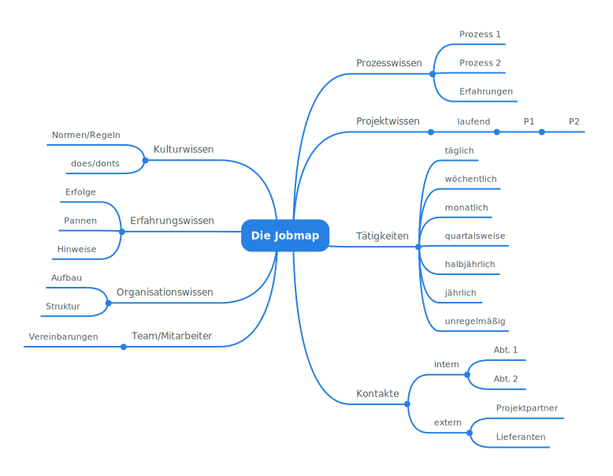
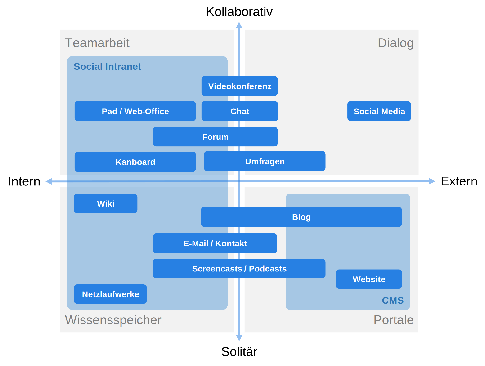

# Kommunikation {#sec-kommunikation}

::: {.callout-note title="Zusammenfassung"}

Bibliotheken bedienen verschiedene Kommunikationsräume. Für die [interne und
externe Kommunikation](#ziele) stehen verschiedene [Prozesse](#prozesse),
[Kanäle](#kanäle) und [Werkzeuge](#werkzeuge) zur Verfügung.

:::

## Einleitung

Im Verhältnis zwischen Intranet und Öffentlichkeitsarbeit bewegt sich
die moderne Bibliothekslandschaft zunehmend weg von einem dualen
Kommunikationsverständnis hin zu einem integrierten Ansatz.
Dabei überlappen Kommunikationsräume oft. Werkzeuge dienen sowohl der internen
Kommunikation als auch dem Dialog mit der Öffentlichkeit.

Indem Bibliotheksmitarbeitende aktiv mit Intranet-Tools und -Plattformen
arbeiten, bauen sie technische Fähigkeiten und Selbstvertrauen im Umgang
mit ähnlichen Kommunikationswerkzeugen für die externe Kommunikation
auf. Dadurch wird die Einführung von Intranetwerkzeugen zu einer
Schlüsselstrategie der Organisationsentwicklung. Mitarbeitende
verwandeln sich so in authentische Botschafter der digitalen
Transformation, interagieren kompetent und auf Augenhöhe mit den
Nutzenden und verkörpern eine innovative, nutzerzentrierte
Kommunikationsweise:

{#fig-stufenmodell}

## Ziele

Das Stufenmodell macht deutlich, dass der
Übergang von einem internen zu einem externen Publikum ein Kontinuum
darstellt. Dennoch lassen sich die **[Ziele interner](#ziele-interner-kommunikation)**
und **[externer Kommunikation](#ziele-externer-kommunikation)**
klar voneinander abgrenzen.

### Ziele interner Kommunikation

**Interne Kommunikation** bezieht sich auf den gezielten Austausch von
Informationen, Meinungen und Vorstellungen innerhalb einer Organisation.
Sie umfasst sämtliche Kommunikationsprozesse und -instrumente, die
darauf abzielen, die Mitarbeiter:innen eines Unternehmens oder einer
Einrichtung miteinander und mit der Organisation insgesamt zu vernetzen.
Hauptziele sind oft die Sicherstellung eines konsistenten
Informationsflusses, die Unterstützung der organisatorischen Ziele und
die Förderung einer positiven Unternehmenskultur. Im besten Falle
vermeidet gelungene interne Kommunikation Wissensinseln und zu starke
Wissensbindung an einzelne Personen.

**Wissensmanagement** beschreibt hingegen den Prozess des Erfassens,
Organisierens, Bewahrens, Anwendens und Weitergebens von Wissen
innerhalb einer Organisation. Dieses Wissen kann sowohl explizit (in
Dokumenten, Datenbanken etc.) als auch implizit (in den Köpfen der
Mitarbeitenden) vorhanden sein. Das Wissensmanagement zielt darauf ab,
das im Unternehmen vorhandene Wissen effektiv zu nutzen, um
Arbeitsprozesse zu verbessern, Innovationen zu fördern und die
Wettbewerbsfähigkeit zu sichern.

Bezogen auf die interne Kommunikation bedeutet dies:

-   Die **interne Kommunikation** ist ein zentrales Instrument des
    Wissensmanagements. Durch gezielte Kommunikationsmaßnahmen wird
    Wissen im Unternehmen verteilt, Mitarbeitende werden über
    Neuerungen informiert und der Austausch zwischen den Abteilungen
    wird gefördert.

-   Das **Wissensmanagement** wiederum stellt sicher, dass die in der
    internen Kommunikation übermittelten Informationen von Relevanz
    und Qualität sind und zur richtigen Zeit am richtigen Ort
    ankommen.

In der Praxis sind interne Kommunikation und Wissensmanagement oft eng
miteinander verknüpft, da eine effektive Kommunikation innerhalb einer
Organisation es erleichtert, Wissen zu identifizieren, zu teilen und
anzuwenden.

### Ziele externer Kommunikation

Bibliotheken bedienen eine Vielzahl verschiedener Zielgruppen. In den
Wissenschaftlichen Bibliotheken sind es Studierende, Lehrende und
Wissenschaftler\*innen. Öffentliche Bibliotheken bedienen sehr unterschiedliche
Bedürfnisse und Gruppen, für die sie jeweils spezielle Angebote bereit halten.
Dies gilt es bei der externen Kommunikation stets im Auge zu behalten.

**Externe Kommunikation** bezeichnet den systematischen und zielgerichteten
Austausch von Informationen, Meinungen und Vorstellungen zwischen einer
Organisation und ihren externen Stakeholdern. Dies sind in erster Linie die
Nutzenden der Bibliothek, kann aber darüber hinaus auch andere Bibliotheken,
Medien oder auch die breitere Öffentlichkeit bzw. die Politik umfassen. Externe
Kommunikation kann sowohl zur Imagepflege als auch zur Informationsweitergabe
über Produkte, Dienstleistungen oder andere relevante Entwicklungen in der
Bibliothek dienen. Je nach Anspruch der Bibliothek kann auch mehrsprachige
Kommunikation sinnvoll sein.

**Öffentlichkeitsarbeit** (PR) ist ein spezifischer Bereich der externen
Kommunikation, der sich darauf konzentriert, das Verständnis und das
Image einer Organisation in der Öffentlichkeit zu fördern und zu
pflegen. Die Ziele der Öffentlichkeitsarbeit können beinhalten:

-   Aufbau und Pflege eines positiven Images und eines guten Rufs der
    Organisation in der Öffentlichkeit.

-   Management von Krisensituationen und negativen Entwicklungen, die
    das Image der Organisation schädigen könnten.

-   Erhöhung der Sichtbarkeit und Anerkennung der Organisation, ihrer
    Produkte oder Dienstleistungen.

-   Einflussnahme auf die öffentliche Meinung oder politische
    Entscheidungsfindung.

Öffentlichkeitsarbeit verwendet eine Vielzahl von Kommunikationstools
und -strategien, darunter Pressemitteilungen, Veranstaltungen, Social
Media, Sponsoring und vieles mehr.

## Rahmenbedingungen 

Die Einführung digitaler Werkzeuge und Verfahren ist eingebettet in
verschiedene rechtliche und organisatorische Rahmenbedingungen:

-   **Beteiligungsverfahren**: Etablierung klarer Dienstvereinbarungen
    und intensiver Dialog mit dem Personalrat und dem Kollegium, um
    eine transparente und mitarbeiter:innenorientierte Implementierung
    von digitalen Werkzeugen sicherzustellen.

-   **DSGVO-Konformität**: Alle eingesetzten
    digitalen Lösungen und Technologien erfüllen die Anforderungen der
    [Datenschutz-Grundverordnung](#datenschutz) (DSGVO), um den Schutz
    personenbezogener Daten sicherzustellen. Dies beinhaltet die
    Prüfung und Klarstellung, ob bei der Nutzung bestimmter Dienste ein Vertrag zur
    Auftragsverarbeitung (AV-Vertrag) notwendig ist, sowie Aufnahme der
    Dienste in das Verfahrensverzeichnis.

-   **Betriebsmodell**: Für jedes Werkzeug ist die Entscheidung zu
    treffen, ob es a) im eigenen Rechenzentrum -- so vorhanden --
    betrieben wird, b) bei einem externen Hosting-Dienstleister
    aufgesetzt wird oder c) als Software-as-a-Service (SaaS) von
    Dienstleistern eingekauft wird. Die Entscheidung darüber hängt
    von der vorhandenen [IT-Infrastruktur](#betriebsmodelle) ab.

-   **Technische und organisatorische Maßnahmen (TOMs)**: Etablierung
    von TOMs, um sowohl den sicheren Betrieb der technischen
    Infrastruktur zu garantieren als auch bei möglichen
    Sicherheitsvorfällen vorbereitet und reaktionsschnell zu sein.

-   **Weiterbildung und Kompetenzaufbau**: Sicherstellung, dass das
    Bibliothekspersonal durch kontinuierliche Weiterbildungen,
    Schulungen und Dokumentation in den kompetenten und souveränen
    Umgang mit den neuen digitalen Werkzeugen eingeführt wird.

-   **Barrierefreiheit nach BITV 2**: Alle digitalen
    Angebote und Dienste sollen den Anforderungen der Barrierefreie
    Informationstechnik-Verordnung (BITV 2.0) entsprechen, um einen
    inklusiven und für alle zugänglichen digitalen Raum zu schaffen,
    der keine Nutzungsgruppe ausschließt und die Diversität der
    Gemeinschaft respektiert.

-   **Institutioneller Rahmen:** Tools in Bibliotheken sind oft abhängig
    von der Institution bzw. dem jeweiligen Träger. Software, die
    beispielsweise innerhalb einer Universität angewendet wird, nutzt
    die Bibliothek dann ebenfalls zur Kommunikation. Beispiele
    hierfür sind der Rocket-Chat oder Big Blue Button als
    Videokonferenztool.

Ein ausgeprägtes Maß an [digitaler Souveränität](#digitale-souveränität)
kann die Auseinandersetzung mit den aufgeführten
Rahmenbedingungen erheblich vereinfachen.

## Prozesse

Für welche Bibliotheksprozesse interne und externe Kommunikation
notwendig ist, wird in den folgenden Abschnitten beschrieben.

### Markenbildung

Auch in Bibliotheken spielt das **Corporate Design** eine wichtige Rolle
in der Öffentlichkeitsarbeit. Ein einheitliches Corporate Design stellt
sicher, dass die visuelle Identität, einschließlich Logos,
Farben und Schriftarten, in allen gedruckten und digitalen Materialien
konsistent ist. Die Einhaltung des Corporate Designs über alle
Kommunikationskanäle hinweg sorgt für ein kohärentes Auftreten der
Bibliothek und vermittelt den Eindruck von Stabilität und Seriosität. So
stärkt ein gutes Corporate Design unmittelbar das Vertrauen der
Nutzenden bzw. der Öffentlichkeit in die Bibliothek.

Gepflegt werden kann ein Corporate Design anhand eines **Styleguides**.
Dieser legt fest, wie visuelle Elemente in verschiedenen
Kommunikationskanälen verwendet werden sollen, sei es in gedruckten
Broschüren, bei Aushängen oder dem Leitsystem im Bibliotheksgebäude,
auf der Website und in sozialen Medien. Ggf. können auch
sprachliche Vorgaben gemacht werden. Dies erleichtert die Erstellung von
Marketingmaterialien und eine effektive Kommunikation der
Bibliotheksangebote. Durch die Verwendung von vordefinierten Vorlagen
und Design-Richtlinien können Bibliotheken nicht zuletzt auch die Kosten
für die Gestaltung von Materialien senken und Ressourcen effizienter
nutzen; das Rad muss (und sollte) nicht immer wieder neu erfunden
werden.

Wenn möglich, sollte man Pressematerial wie Logos, standardisierte
Infotexte zur Bibliothek für Journalist:innen zum Download auf der Website
anbieten, sodass diese schnell auf grundlegende Infos zugreifen können.

Auch die interne Kommunikation sollte sich entlang der Vorgaben
orientieren. Dies spart zum einen Zeit, da Vorlagen genutzt werden
können, und übt zum anderen den Gebrauch auch für externe Kommunikation.

### Redaktion

Für die Erstellung von internen wie externen Inhalten benötigt man Zeit
und Ideen. Um nicht unter "Zugzwang" zu geraten, hilft es, sich eine
Übersicht über die Inhalte zu machen, die man nach außen kommunizieren möchte und
zu diesen entsprechende Formate zu entwickeln oder festzulegen. Denn:
Meist mangelt es nicht an Themen, vielmehr hat man i.d.R. bereits sehr
viele Themen, die nur noch "verpackt" werden müssen.

Dabei helfen Fragen zum Beispiel nach dem Umfang und der Tiefe des
Inhaltes. Nicht jedes Thema eignet sich dafür, ein ausführliches Video zu
drehen. Andererseits kann es sein, dass ein Thema nicht in Form eines
einzelnen Social-Media-Posts verständlich aufbereitet werden kann. Es
geht also darum, sich über die unterschiedlichen medialen
Darstellungsformen - Video, Text, Text und Bild, Grafik, etc. - klar zu
werden und Themen zuzuordnen.

Auch innerhalb einer Darstellungsform gibt es unterschiedliche Formate:
informative Social Media Posts, ausführliche Blogbeiträge oder
verschiedene Videoformate. Gleichzeitig sollten die Voraussetzungen,
Möglichkeiten und Konventionen der Plattformen berücksichtigt werden.

Auch empfiehlt es sich, (grafische) Templates zu nutzen. Beispielsweise können bei
*[Canva](https://www.canva.com/) Templates für Infoposts, Veranstaltungshinweise,
Personenvorstellung etc. angelegt werden. So müssen die
vorgefertigten Templates nur noch mit Inhalten gefüllt werden. Auch bei der Produktion
von Videos ist die Arbeit mit Formaten (Interviews, Erklärvideos,
Tutorials), nach deren Muster die Videos erstellt werden, von Vorteil.

Es ist hilfreich bei der Erstellung eines konkreten Inhalts zu
überlegen, welche weiteren Formate sich anbieten. So braucht man die
inhaltliche Recherche/Arbeit nur einmal machen, kann diese aber in
mehrfacher Form und an verschiedenen Stellen wieder aufbereiten und
nachnutzen. Wird zum Beispiel ein ausführlicher Blogbeitrag zu einem
Thema verfasst, so lassen sich daraus häufig mehrere Social-Media-Posts
erstellen. Besonders bei der Produktion eines Videos bietet es sich an,
"Hinter den Kulissen" Content zu produzieren, z. B. indem man den
Entstehungsprozess dokumentiert durch kurze Videos und Fotos oder zu
einem ausführlichen Video eine Kurzversion dreht - wenn die Technik
schon mal steht.

-   **Vorproduzieren und Redaktionsplan nutzen**:\
    Neben tagesaktuellem Content, wie zum Beispiel Hinweisen auf
    Veranstaltungen, gibt es auch den sogenannten Evergreen Content,
    zeitlose Themen mit hoher Relevanz für die Zielgruppe.
    Bei WBs können das z. B. Inhalte zum wissenschaftlichen
    Publizieren, Forschungsdatenmanagement o. ä. sein, die sich auf
    verschiedenen Unterseiten des Webauftritts verbergen. Diese lassen
    sich für andere Plattformen aufbereiten, man kann sie
    vorproduzieren, beliebig erweitern und mit Hilfe eines
    Redaktionsplans ausspielen.

    In einem Redaktionsplan wird festgehalten, welche Inhalte wann (und
    von wem) publiziert werden. So behält man den Überblick und
    kann über einen längeren Zeitraum im Voraus planen, vor
    allem Evergreen Content lässt sich so gut verteilen. Es bietet sich
    an, eine Regelmäßigkeit für solchen Content festzulegen, wie etwa an
    einem bestimmten Tag in der Woche o. ä. In ÖBs eignen sich hierfür
    beispielsweise Buchempfehlungen oder regelmäßig wiederkehrende
    Veranstaltungen.

-   **Content anteasern/Social Storytelling**:\
    Vor allem "größerer"
    Content, wie zum Beispiel aufwändige Videoproduktionen sollte vorab
    auf den Social Media Plattformen durch kurze Begleitbeiträge angeteasert werden.
    Das können etwa Behind-the-scenes-Berichte oder allgemeine Infos zum Thema
    sein. So kann die Neugier der Nutzenden geweckt werden.

-   **Prozesse optimieren**:\
    Häufig wird in Bibliotheken die externe
    Kommunikation von mehr als einer Person übernommen. Zur
    Strukturierung und zur Absprache innerhalb eines Teams eignen sich
    verschiedene Kommunikationstools, vom 1:1 Gespräch über eine
    Chatgruppe bis hin zur Nutzung eines Redaktionsplanes, um
    gemeinsam Inhalte zu planen. Wichtig ist hierbei Konsistenz und
    die Nutzung der für den vorliegenden Zweck effektivsten Tools.
    Dabei sollten nicht zu viele unterschiedliche Kanäle genutzt
    werden, um nicht den Überblick zu verlieren. Es sollte vorab klar
    sein, welche Voraussetzungen erfüllt sein müssen, um bestimmte
    Formate zu kommunizieren. Dazu kann es hilfreich sein, einen
    Zeitplan sowie eine Checkliste zu erstellen, um sicherzugehen,
    dass alle relevanten Punkte abgedeckt sind (Wo wird Was Wie
    kommuniziert).

-   **Social Media Planung**:\
    Betreibt eine Bibliothek mehrere Social Media Kanäle, kann ein einziges Tool zur Planung und Veröffentlichung von Beiträgen sinnvoll sein. Damit kann der Content zeitlich und inhaltlich vorgeplant werden. Integrierte Analysewerkzeuge helfen zudem bei der Zeitplanung, indem die vergangenen Veröffentlichungen ausgewertet werden und der beste Zeitpunkt für die Zielgruppe ermittelt wird. Beispiele für Tools sind:

    - [Hootsuite](https://www.hootsuite.com/), (kommerziell, in der Basisversion frei nutzbar)
    - [Buffer](https://buffer.com/), (kommerziell, in der Basisversion frei nutzbar) 
    - [Trello](https://trello.com/) (kommerziell, in der Basisversion frei verfügbar)
    - [Fedica](https://fedica.com/) (kommerziell, in der Basisversion frei verfügbar)

### Wissensmanagement 

Explizites Wissen ist gesichert in Texten, Datenbanken und anderen
Dokumenten – doch wie sichern wir das implizite Wissen, das nur in den
Köpfen von Mitarbeitenden vorhanden ist? Für diesen Teil des
Wissensmanagements gibt es verschiedene mündliche und schriftliche
Verfahren. Dabei helfen unter anderem strukturierte Interviews,
Erzählungen (Storytelling), Visualisierungen, Verschriftlichung
mündlicher Anleitungen, Videobotschaften und nicht zuletzt das Vormachen
von Tätigkeiten. Zur kontrollierten Umsetzung des Wissenstransfers gibt
es mehrere Werkzeuge (Mittelmann, 2011):

-   Die **Jobmap** ist ein Instrument, das dazu dient, das Wissen
    ausscheidender Mitarbeiter\*innen systematisch festzuhalten und zu
    dokumentieren. Sie kann händisch oder mit Mindmapping-Werkzeugen
    erstellt werden. Sie kann als Protokoll eines moderierten
    Gesprächs zwischen Wissensgeber\*in (Ausscheidende\*r) und
    Wissensnehmer\*in (Nachfolger\*in) befüllt oder von Mitarbeiter\*innen
    selbst erstellt werden.

-   **Wissenslandkarten** (Knowledge Maps) sind grafische Darstellungen von
    Wissen in Organisationen. Sie dienen vor allem der Identifikation von
    Wissen in Unternehmen, verankern graphisch das Wissen von Experten und Teams,
    Wissensentwicklungsstationen sowie organisationale Fähigkeiten und Abläufe. Es
    werden nur Verweise, aber nicht das Wissen selbst abgebildet.

-   **Wissensträgerkarten** sind Wissenslandkarten für einzelne Personen und
    veranschaulichen, bei welchen
    Wissensträger\*innen welche Kompetenzen in welchen Wissensgebieten
    vorhanden sind. Sie vermitteln keine Wissensinhalte, sondern
    zeigen, welche Kompetenzen ein bestimmter Mitarbeitender hat und
    wer Wissensträger\*in für ein bestimmtes Gebiet ist.

-   **Persönlicher Wissenstransfer** kann in einem Gespräch stattfinden.

-   **Kodifizierter Wissenstransfer** wird mittels Informations- und
    Kommunikationssystemen wie z. B. Datenbanken, Laufwerk, CMS, Wiki
    erreicht.

-   Die **Infokarte** ist eine Themenkarte oder ein Mikroartikel zur Beschreibung einer Aufgabe.

-   Ein **Projektplan** fasst den vollständigen Ablauf des Wissenstransfers
    zusammen. Er enthält Informationen über die Zeitplanung, den
    Umfang, die Fälligkeitsdaten und die Ergebnisse.

{#fig-jobmap}

### Evaluation

Sind Tools oder Kanäle einmal eingeführt, wird leider oft nicht weiter
verfolgt, wie sie angenommen und genutzt werden. Regelmäßige Evaluation
der Nutzung und auch Fehlerauswertung helfen dabei, Schwachstellen zu
erkennen, Verbesserungen einzubinden und Tools oder Kanäle ggf. auch wieder
abzuschaffen bzw. durch andere abzulösen.

Viele Tools und Werkzeuge bringen ihre eigenen Statistiken und
Auswertungen mit. Aber auch eine einfache, regelmäßige Abfrage der
Nutzungsgewohnheiten der Mitarbeitenden hilft bereits, die
Praxistauglichkeit einzuschätzen. Daher ist es sinnvoll, die Evaluation
bereits bei der Planung, spätestens aber beim Start mit einzuplanen
(siehe @sec-anforderungen).

Neben herkömmlichen Nutzungsstatistiken (z. B. mittels des Open Source Tools
[*Matomo*](https://www.matomo.org/) für Webseiten oder mit integrierten
Analysewerkzeugen von Social Media Plattformen und *CMS*) können einheitliche
Fragebögen bei der Einschätzung helfen, ob Kanäle oder Tools geeignet sind, die
gesetzten Ziele zu erreichen.

Plattformen und Kanäle sollten regelmäßig evaluiert werden, um
festzustellen, ob die Zielgruppe über diesen Weg tatsächlich erreicht
wird.

## Werkzeuge

Der bekannte Sinnspruch "Wer als Werkzeug nur einen Hammer hat, sieht in
jedem Problem einen Nagel" gilt auch im digitalen Raum. Die
Positionierung zwischen den Extremen "wir bilden alles über das
Dateisystem ab" (ich habe nur einen Hammer) und "wir haben für jede
Anforderung ein spezialisiertes Werkzeug" (man schleppt einen großen
Werkzeugkasten durch die Gegend) ist alles andere als trivial.

Einen ersten Überblick bietet dieses Schaubild, was die populären
Werkzeuge entlang der Achsen Intern/Extern sowie Solitär/Kollaborativ
positioniert:

{#fig-tools}

Im Folgenden werden die grundlegenden Funktionen und Werkzeuge kurz beschrieben:

### Kommunikation

Synchrone und asynchrone Kommunikation sind zwei verschiedene Ansätze
für den Informationsaustausch, die jeweils ihre eigenen Vorteile und
Anwendungsgebiete haben. Bei synchroner Kommunikation tauschen die
Kommunikationspartner\*innen Informationen in Echtzeit aus. Sie erlaubt
sofortiges Feedback, d.h. Fragen können direkt gestellt und beantwortet
werden. Es müssen allerdings beide Parteien gleichzeitig verfügbar sein.
Das kann zu Ablenkungen bzw. Druck führen, da eine sofortige Reaktion
erwartet wird. Bei asynchroner Kommunikation findet der
Informationsaustausch zeitlich versetzt statt. Eine Person sendet
eine Nachricht und die andere antwortet, wenn es passt. Die
Kommunikationspartner\*innen sind also nicht an eine gemeinsame Zeit gebunden.
Das ermöglicht eine größere Flexibilität in der Zeitplanung und eröffnet
die Möglichkeit zur gründlichen Reflexion vor einer Antwort. Es ist
außerdem oft weniger störend für den Arbeitsfluss. Allerdings kann
asynchrone Kommunikation zu Verzögerungen und fehlendes sofortiges
Feedback zu Missverständnissen führen.

- **Telefon** ist das klassische Medium mit synchroner 1-zu-1 Kommunikation für
  schnelle Absprachen; mittlerweile durch die Verbreitung von Videokonferenzen,
  Chat etc. in der internen Kommunikation eher in den Hintergrund geraten.
  Mit Voice-over-IP und Weiterleitungen können Telefonnummern auch
  standortunabhängig genutzt werden.

- **E-Mail** ist ein Kommunikationsmedium, welches in den
  meisten Fällen vom Anbieter der IT-Infrastruktur angeboten wird.
  Ideal ist der Zugang per IMAP/SMTP und nicht nur über proprietäre
  Protokolle, sodass beliebige Clients genutzt werden können.

  Ursprünglich als elektronische Variante des Briefes
  für die asynchrone 1-zu-1 Kommunikation entwickelt, wird E-Mail
  auch häufig für die Gruppenkommunikation zweckentfremdet und
  teilweise synchron verstanden wenn eine sofortige Antwort erwartet wird.
  Für beide Einsatzszenarien gibt es bessere Alternativen.

-  **Videokonferenzsysteme** gibt es als eigenständige Tools oder die
   Videofunktion ist in andere Werkzeuge integriert. Kommerzielle Beispiele
   sind Microsoft Teams, Webex und Zoom. Daneben stehen freie Alternativen wie
   [jitsi](https://jitsi.org/) und [DFNconf](https://www.conf.dfn.de/) zur
   Verfügung.

   Um Besprechungsräume so auszustatten, dass Menschen auch per Videokonferenz
   teilnehmen können, ist
   technische Infrastruktur erforderlich. Die Anwesenden müssen für die
   Anwesenden sichtbar und hörbar sein, ohne dass die Anwesenden Headsets
   tragen müssen. Dies erreicht man mit einer Art überdimensionaler
   Webcam, die automatisch auf die sprechende Person fokussieren und im
   Idealfall auch Störgeräusche (Echos, Rauschen, Rascheln) ausblenden.
   Die gängigen Systeme im knapp vierstelligen Eurobereich genügen für
   Konferenzen mit bis zu sechs anwesenden Personen um einen Tisch herum.
   Sind mehr Personen anwesend, steigt der technische Aufwand stark an,
   wenn man häufig hybrid arbeiten möchte und die anwesenden Personen
   nicht benachteiligen möchte.

- **Chat** kann als synchrone und asynchrone Kommunikation 1-zu-1 und
  in Teams sowohl in der externen als auch in der internen Kommunikation
  verwendet werden:

  Chats können in Bibliothekswebsiten (Homepage, OPAC) ohne großen Aufwand
  integriert werden. Die Nutzung ist anonym oder unter Angabe
  von personenbezogenen Daten (z. B. E-Mail-Adresse) möglich.
  Chat-Anfragen werden zentral bearbeitet und können bei Bedarf
  weitergegeben werden. Ein Pool von Mitarbeitenden kann sich
  anmelden, die Anfragen werden vom System auf die
  Mitarbeitenden verteilt. Steht kein Mitarbeitender zur
  Verfügung, leitet die Software z. B. auf ein Mailformular um.
  Je nach Verwendung ist der Abschluss eines Vertrages zur
  Auftragsverarbeitung mit dem Anbieter notwendig. Chat-Systeme
  werden i.d.R. als *SaaS*-Lösung angeboten

  Chats zwischen Mitarbeiter\*innen dienen der niedrigschwelligen
  Kommunikation, oft als Alternative zu Telefon und E-Mail.
  Gruppenchats in Abteilungen können für einfache Fragen und
  Absprachen genutzt werden und Menschen, die mobil arbeiten,
  können mit einem Chatsystem besser integriert werden. Die
  Nutzung von kommerziellen Systemen, die noch dazu außerhalb
  von Europa gehostet werden, ist aus Datenschutzgründen nur in
  Ausnahmefällen zulässig (WhatsApp, Slack ...).
  Eine Alternative für Bibliotheken mit IT-Abteilung oder
  Rechenzentrum-Unterstützung ist die Nutzung von Open-Source-Software wie
  [mibew.org](https://mibew.org/) oder
  [rocket.chat](https://www.rocket.chat/secure-messaging-platform)
  die selbst betrieben werden können.

  Chat ist häufig Bestandteil von integrierten Webkonferenz- und Kommunikationsplattformen.
  Auch ein Forensystem wie Discourse bietet eine
  Chat-Komponente, sodass ernsthaft abgewogen werden sollte, ob es
  wirklich eine dezidierte Chat-Lösung braucht.

- **Videokonferenzsysteme** gibt es als eigenständige Tools, ein kommerzielles
  Beispiel ist Zoom. Daneben stehen freie Alternativen wie
  [jitsi](https://jitsi.org/) und [DFN conf](https://www.conf.dfn.de/) zur
  Verfügung. Eine Chatfunktion während der laufenden Konferenz ist dabei
  standardmäßig integriert, häufig können auch eine Umfragen benutzt werden.

- **Integrierte Webkonferenz- und Kommunikationsplattformen** kombinieren
  Videokonferenzen mit verschiedenen anderen Kommunikationslösungen. Die
  kommerziellen Tools Microsoft Teams und Cisco Webex integrieren Chatlösungen,
  auch außerhalb von Videokonferenzen,  für Gruppen und Einzelpersonen. Vor allem
  im Bildungsbereich wird die Open Source-Plattform BigBlueButton verwendet, die
  Präsentationen sowie Lern- und Inhaltsverwaltungssysteme. [Mattermost](https://mattermost.com/)
  ist ein weiteres Open Source-Beispiel, das viele verschiedenen Kommunikationswege
  vereint und auch Plugins für viele andere Werkzeuge bereitstellt, um eine
  All-In-One Lösung für Kollaborationen zu sein.

Je technisch anspruchsvoller die Kommunikationswerkzeuge werden, um so mehr
muss darauf geachtet werden, die gleichberechtige Teilnahme aller
Kommunikationspartner*innen zu ermöglichen (siehe Abschnitt [Infrastruktur](#werkzeuge-zur-kommunikation)).

### Contenterstellung

Unter Contenterstellung versteht man das Produzieren von Inhalten
(Informationen, Werbung, ...) in unterschiedlichen Medienarten und für
unterschiedliche Kanäle.  Mit Content wird immer eine bestimmte Zielgruppe
angesprochen. Inhalte sind zu [planen](#redaktion), zu erstellen und zu
veröffentlichen.

-   **Bild-/Grafikbearbeitung:** dient der Nachbearbeitung von
    Bilddateien (Schärfen, Farben, Dateigröße, Belichtung, Kontraste)

    - Bildbearbeitungs-Software z.B. *Affinity Photo*, *Adobe Photoshop*, *Canva*
    - freie Bilddatenbanken z.B. *Pixabay*, *CC-Search*
    - Grafikdesign z.B. *[Canva](https://www.canva.com/de_de/)*

-   **Audiobearbeitung:** hilft beim Schnitt von Audiodateien und dient
    der Klangoptimierung mit Effekten wie Equalizer, Kompressor oder
    Hall

    - Audiobearbeitungs-Software z.B. *[Audacity](https://www.audacity.de/)*
    - Professionelle Podcast-Produktion z.B. *[Ultraschall](https://ultraschall.fm/)*

-   Mit einer **Aufnahmesoftware** wird Videomaterial über Kameras aufgenommen
    oder zu Bildschirmaufzeichnungen (Screencasts) gemacht. Je nach
    Aufnahmegerät wird der Ton gleichzeitig aufgenommen oder muss separat
    eingespielt werden. Beispiele für Screencast-Software sind 
    *Camtasia*, *Screenflow* und *[OBS](https://obsproject.com/de)*.
    OBS kann zudem verwendet werden, um Inhalte auf Videoplattformen zu streamen.

-   Zur Nachbearbeitung von Roh-Videomaterial gibt es spezielle
    **Videobearbeitungssoftware**, die Video- und Tonspuren zusammenführen können. Beim
    Videoschnitt können verschiedene Sequenzen aus Quellmaterialien
    aneinandergereiht werden. Ebenso sind Veränderungen durch Filter oder
    Zusammenführen von verschiedenen Bild- und Videoaufnahmen möglich. In der Regel
    bieten die Tools diverse Exportmöglichkeiten in verschiedenen Qualitäten und
    Formaten. Beispiele für Bearbeitungssoftware sind *DaVinci Resolve*,
    *Camtasia* und *SimpleShow*. Letzteres dient insbesondere zur Erstellung von
    Lernvideos mit einzelnen Folien, auf denen ein Skript anhand von Schlagwörtern
    von der Software mit einfachen Grafiken illustriert wird. 

-   **Hardware**: Bei der Anschaffung von Hardware für Video- oder
    Podcastsaufnahmen sowie die Erstellung von Video-Tutorials in Bibliotheken ist es wichtig,
    Qualität und Funktionalität im Auge zu behalten. Mit der richtigen
    Ausrüstung können Bibliotheken professionelle Ergebnisse erzielen.
    Die Anschaffung muss dabei nicht zwangsläufig teuer sein. Es lohnt
    sich immer, in eine hochauflösende externe Kamera zu investieren.
    Auch ein qualitativ hochwertiges Mikrofon bzw. Headset ist
    unerlässlich für einen überzeugenden Klang. Die in Standard-Laptops
    integrierten Kameras und Mikrofone genügen üblicherweise nicht, um
    eine halbwegs professionelle Ton- und Bildqualität zu
    erzeugen. Bei geringem Budget ist
    die Hardware in einem guten Smartphone besser geeignet.
    Hilfestellung - für nahezu jeden Budgetrahmen - erhält man etwa im
    Podcast-Forum *[Sendegate](https://sendegate.de)* oder
    im [Wiki des Netzwerkes "Tutorials in Bibliotheken"](https://bibtutorials.miraheze.org/wiki/Hauptseite#Technik)

-   **Umfragen/Abstimmungen:** können mittels verschiedener Tools erstellt 
    und direkt online veröffentlicht werden
    (z.B. mit *SurveyMonkey*, *Limesurvey*, *Mentimeter*, *Lamapoll*).
    
-   **E-Learning-Software:** dient der Erstellung von Lernformen, die
    durch elektronische, technische oder digitale Medien unterstützt
    werden (z.B. *Capterra* und *Moodle*). Die Inhalte können auch als
    eigenständige Open Education Ressources (*OER*) publiziert und
    nachgenutzt werden.

-   **Gamification:** ist die Anwendung spielerischer Elemente im spielfremden Kontext.
    So können beispielsweise mit [*Actionbounds*](https://de.actionbound.com/)
    Multimedia-Guide für interaktive Stadtralleys und
    Handy-Schnitzeljagden auch für den Bibliothekskontext erstellt werden.
    Eine spielbasierte Lernplattform für Quizze ist [*Kahoot*](https://kahoot.com/).

### Echtzeit-Kollaboration

Kollaborative Online-Tools ermöglichen es Teams, in Echtzeit an
Dokumenten, Tabellen und Präsentationen zu arbeiten und diese gemeinsam
zu nutzen. Sie können die Zusammenarbeit innerhalb einer Bibliothek (und
darüber hinaus) deutlich beflügeln und effizienter gestalten. Dies gilt
insbesondere, wenn man es mit dem oftmals mühsamen Zusammenführen von
Dokumentversionen, die in klassischen Office-Lösungen in Einzelarbeit
entstanden sind, vergleicht. Das Spektrum reicht dabei vom digitalen
Notizzettel bis zum gemeinsam erarbeiteten Förderantrag, vom
Brainstorming bis zur fertig ausgearbeiteten Präsentation.

-   Für den ad hoc Einsatz bietet sich *HedgeDoc* als Open-Source-Tool für
    kollaboratives Schreiben in Echtzeit mit Markdown-Unterstützung an.

-   Für die gemeinsame Bearbeitung von klassischen Office-Formaten sind
    *OnlyOffice* und *Collabora* veritable Alternativen zu *Google Docs*, insbesondere
    unter Gesichtspunkten der [digitalen Souveränität](#digitale-souveränität).

-   Cloudspeicher sind die zeitgemäße Variante von [Netzwerklaufwerken](#fileservices) z. B.
    [*Nextcloud*](https://nextcloud.com/) bzw. [*ownCloud*](https://owncloud.com/de/) die
    gut mit *OnlyOffice* und *Collabora* zusammenspielen.

-   Online-Whiteboards sind digitale Tools, die ein traditionelles
    physisches Whiteboard simulieren. Sie ermöglichen es, in Echtzeit
    gemeinsam zu brainstormen, indem etwa Post-Its in den virtuellen
    Raum geklebt werden, aber auch um zu zeichnen und multimediale
    Inhalte zu integrieren. Damit eignen sie sich gut sowohl für die
    kreative Zusammenarbeit innerhalb der Bibliothek als auch für die
    Durchführung von Workshops und anderen Formaten mit Nutzenden.
    Verbreitet sind
    *[Conceptboard](https://conceptboard.com/de/)*
    und *[miro](https://miro.com/)*,
    ernstzunehmende offene Alternativen gibt es leider noch nicht.

## Kanäle

Es gibt verschiedene Online-Kanäle, mit Hilfe derer man die Nutzenden
informieren kann. Diese werden in den folgenden Abschnitten beschrieben.

### Website

Die Website wird im allgemeinen Sprachgebrauch häufig auch als Homepage
bezeichnet, im eigentlichen Sinne ist damit aber nur die Startseite eines 
[Internetauftritts](#Website) gemeint.
Die Website dient der Vorstellung der Bibliothek, ihrer verschiedenen
Angebote und Kontaktmöglichkeiten. Hier werden u.a. Neuigkeiten über
Veranstaltungen, digitale Angebote oder Kundenservices (z. B.
Anmeldemodalitäten) präsentiert.

Websites werden meistens auf Basis eines Content Management Systems
(CMS) erstellt. Mit Hilfe von Content Management Systemen können
redaktionelle Inhalte dargestellt, organisiert und bearbeitet werden,
ohne dass sich die Websiteredakteur\*innen mit dem Aufbau und dem Design
der Website beschäftigen müssen.

Öffentliche Bibliotheken sind oft Teil der kommunalen Infrastruktur,
Hochschulbibliotheken Teil der Universitätsinfrastruktur.  In diesen Fällen ist
die Bibliotheksseite häufig als Unterseite angelegt. Hier ist das CMS
vorgegeben und der Gestaltungsspielraum begrenzt; es sollte darauf geachtet
werden, dass die Grundfragen und -dienste mit einer solch vorgefertigten
Variante umgesetzt werden können. Alternativ kann es auch sein, dass allein ein
Webserver als technische Basis bereitgestellt wird und sich die Bibliothek
selbst um die Umsetzung einer Webseite kümmern muss. Im besten Fall hat die
Bibliothek eine eigene Domain, kann ein eigenes CMS auswählen und hat damit
auch die Gestaltungsfreiheit, beliebige Unterseiten anzulegen und eigene
Inhalte zu beschreiben. 

In beiden Fällen - ob eigene Domain oder eingegliedert in die übergeordnete
Einrichtung - gibt es in der Regel Designvorgaben wie eine Corporate Identity.
Dennoch sollten insbesondere bei der Planung und späteren Konzeption gängige
[Usability-Gesichtspunkte](#was-beeinflusst-den-nutzungseindruck)
berücksichtigt werden.

Folgende Basisinformationen für Bibliotheksbesucher\*innen und Interessierte
sollten zu finden sein

-   Öffnungszeiten, Anmeldemodalitäten, Gebühreninformationen
-   Veranstaltungshinweise
-   Digitale Angebote
-   Fachspezifische Angebote wie medienpädagogische Inhalte
-   Verlinkung zu Bibliotheks-OPAC oder anderen Online-Katalogen

Schließlich muss darauf geachtet werden, dass nicht nur die eigentliche
Webseite der Einrichtung die Basisinformationen enthält, sondern auch, dass
diese in einschlägigen Suchmaschinen indexiert sind, etwa die Adresse und
Öffnungszeiten in einer Google Suche und auf Google Maps.  Hierzu müssen
entsprechende SEO (Search Engine Optimization) Parameter eingestellt bzw. an
die jeweiligen Plattformen übermittelt werden.

Gängige CMS sind *Typo3*, *Wordpress* oder *Drupal*. Ob eine CMS vorgegeben ist
oder selbst festgelegt werden kann, ist von Institution zu Institution
unterschiedlich und von den Rahmenbedingungen abhängig. Das gleiche gilt
für das Hosting und den technischen Support der Website. Dies kann
entweder hausintern passieren, über einen Verbundpartner oder bei einem
kommerziellen Drittanbieter.

Ist eine Bibliothek in der komfortablen Lage, ein eigenes CMS
auszuwählen, sollten auch immer die anzubindenden Portale wie
Discovery-Systeme oder Repositorys berücksichtigt werden.

### Blog

Ein Blog ist eine spezielle Form einer Website und dient in erster Linie
als Plattform für die Veröffentlichung redaktioneller (Text-)Beiträge.
Blogbeiträge eignen sich vor allem für die Darstellung von Inhalten, die
ausführlicher und tiefer in eine Thematik einsteigen und über den rein
informativen Charakter hinausgehen. Ein Blog kann einerseits als ein
Bereich innerhalb eines Webauftritts angesiedelt werden oder als eigene
Website existieren.  Für das Aufsetzen eines eigenständigen Blogs eignet
sich vor allem das CMS *Wordpress*.

### Social Media

Über Social-Media-Kanäle kann die Zielgruppe schnell erreicht werden, es lassen
sich eigene Inhalte mit Nutzenden teilen und kann mit ihnen in Kontakt getreten
werden. Auch dienen Social-Media-Kanäle der Markenbildung. Jede
Social-Media-Plattform hat eigene Konventionen und Bedingungen, sowohl was die
Gestaltung der Beiträge angeht als auch die zugrunde liegenden Algorithmen, mit
denen man sich vertraut machen sollte. Ziel sollte es sein, möglichst viele
Nutzende zu erreichen und neue Nutzende dazu zu gewinnen. Um dieses Ziel zu
erreichen, ist es wichtig, nicht nur die eigenen Kanäle zu bespielen, sondern
auch mit anderen Kanälen zu interagieren.

Je nach Zielgruppe sind einzelne Social-Media-Kanäle mehr oder
weniger geeignet. Ist eine Zielgruppe auf einem Netzwerk nicht aktiv, so
lohnt es sich nicht, dieses Netzwerk zu bespielen und man sollte sich
eher auf die Plattformen fokussieren, in denen die eigene(n) Zielgruppe(n)
anzutreffen sind.

-   **Mastodon, Bluesky, Threads...:** Diese Plattformen für Kurznachrichten mit vor allem
    textbasierten Inhalten werden auch gerne genutzt, um auf Inhalte auf anderen Plattformen
    (Fachartikel, Blogbeiträge, Veranstaltungen..) zu verweisen. Für
    das deutschsprachige Bibliothekswesen ist insbesondere die Mastdon-Instanz
    [openbiblio.social](https://openbiblio.social) etabliert.

-   **Facebook, Instagram:** Inhalte in Form von Bildern/Grafiken, Texten, (Kurz-)Videos

-   **TikTok:** Videoportal für kurze Videos im Hochformat

-   **YouTube, Vimeo:** Plattformen für die Veröffentlichung von Videos

-   **Fediverse:** Netzwerk unterschiedlicher dezentraler Dienste, die mit dem
    gleichen Account genutzt werden können (siehe [FediDB](https://fedidb.com/) für eine
    statistische Übersicht; Mastodon ist sicherlich der
    bekannteste davon, aber auch das CMS WordPress gehört dazu, so dass sich
    WordPress-Beiträge in den unterschiedlichen Fediverse-Kanälen teilen lassen.

-   **LinkedIn:** Das ursprüngliche Berufsnetzwerk hat sich inzwischen zu
    einer allgemeinen Plattform entwickelt, auf der Inhalte geteilt und diskutiert
    werden, auch zu Themen aus Wissenschaft und Forschung. Über persönliche
    Accounts geteilte Inhalte erreichen allerdings eine deutlich höhere Reichweite
    als Inhalte von Unternehmensseiten.

### Newsletter

Newsletter sind redaktionell aufbereitete Texte und Grafiken, die an
einen bestimmten Verteilerkreis (Studierende, Kund\*innen) in einem
regelmäßigen Rhythmus versendet werden. Ein Beispiel sind
Veranstaltungsnewsletter der ÖBs. Dabei ist insbesondere der Datenschutz
zu beachten. Vor dem Versand ist eine Einwilligung jedes Empfängers
einzuholen, der durch Double-Opt-In verifiziert wurde. Es ist ratsam,
für den Versand einen Newsletter-Dienst zu nutzen, um technische
Fallstricke zu umgehen. Diese sind u.a. auf große Versandmengen, Umgang
mit zurückkommenden Mails oder Einwilligungsverwaltung spezialisiert.

### Mailinglisten und Foren

Mailinglisten dienen primär der Verteilung von Inhalten an Gruppen von Personen,
sie werden aber auch zu allgemeinen Diskussionen genutzt. Beispiele für Mailinglisten
aus dem Bibliotheksbereich sind
[bibnez](https://folks.email/mailman3/postorius/lists/bibnez.folks.email/) und
[Forum ÖB](https://listen.hbz-nrw.de/mailman/listinfo/forumoeb). Ein 
fachliches Forum für Austausch zu Metadaten und andere bibliothekarische
IT-Themen ist [metadaten.community](https://metadaten.community/).

### Offene Schnittstellen und Daten

Offene Daten verändern die Wissens- und Wissenschaftskommunikation auch in
Bibliotheken. Frei lizensierte und ggf. über [Schnittstellen](#schnittstellen)
wie *RSS* und ActivityPub (Fediverse) bereitgestellte Daten können verbreitet und
in neuen digitalen Publikationen und Social Media verknüpft werden.  Offene
Zitationsdaten ermöglichen bibliografische Analysen und Datenvisualisierungen,
die selbst als Gegenstand in der internen und externen
Wissenschaftskommunkation genutzt werden können.  Dabei ermöglichen offene
Werkzeuge wie Wikidata gewissermaßen eine "Demokratisierung" der
Metadatenproduktion und -pflege unabhängig bzw.  in Ergänzung zu traditionellen
Bibliothekssystemen. Wikidata fungiert dabei zudem als
"Linked-Open-Data"-Knoten (Datenhub) für Identifikatoren verschiedener
Datenquellen, die jeweils identische Entitäten beschreiben.

### Digitale Anzeigen/Poster

Unter digitalen Anzeigen werden alle Arten von elektronischen Displays
verstanden, die Informationen zu Institutionen oder Angeboten und
Veranstaltungen anzeigen. Beispiele sind Infotafeln und Wegweiser.

### Wikis

Ein Wiki ist eine webbasierte Sammlung von Informationen, Artikeln oder
Beiträgen zu bestimmten Themen. Diese können von Nutzenden selbst
bearbeitet werden. Es kann frei im Internet oder nur für einen
festgelegten Nutzerkreis (z.B. Mitarbeitende) verfügbar sein. Verbreitete
Beispiele für Wiki-Software sind MediaWiki, PmWiki, Xwiki und Confluence.

### Social Intranet

Bei der Vielzahl vorhandener Werkzeuge und Methoden besteht die
Gefahr, nach und nach eine immer weiter fragmentierte Softwarelandschaft
zu erzeugen mit entsprechend hohen Anforderungen an Betrieb,
Dokumentation und Schulungen. Ein sinnvoller Ansatz ist es deshalb,
zunächst das Verhältnis der verschiedenen Lösungen auf konzeptioneller
Ebene klar festzulegen, um Redundanzen zu vermeiden. Dieses Konzept kann
sich, soweit möglich, aber auch in einer technisch integrierten Lösung
für möglichst viele der genannten Aspekte widerspiegeln: einem so genannten
Social Intranet einem typischen internen 
[Infrastruktur-Angebot](infrastruktur.md#social-intranet).

::: {.callout-tip}

Ein **Social Intranet** ist ein internes, web-basiertes Netzwerk, das
speziell darauf ausgelegt ist, die Kommunikation, Zusammenarbeit und
Informationsverbreitung innerhalb einer Organisation zu fördern. Es
kombiniert die klassische Funktion eines Intranets, die
Informationserstellung und -bereitstellung, mit eher sozialen,
kommunikativen Funktionen und ermöglicht den Mitarbeitenden so den
einfachen Austausch von Informationen und Ideen.

:::

Ein gut geplantes und
eingerichtetes Social Intranet ist in der Lage, die meisten der oben
genannten Aspekte und Ideen abzudecken. Nicht immer in der vollen
Funktionstiefe, dafür aber in einer einheitlichen, gut nutz- und
administrierbaren Oberfläche. Auch sonst nur aufwändig implementierbare
Features wie eine Volltextsuche über alle Materialien wird problemlos
möglich.

Um im Bild vom Anfang des Kapitels zu bleiben: ein Social Intranet ist
weder ein Hammer noch ein schwerer Werkzeugkasten, sondern am ehesten
ein Schweizer Taschenmesser.

Kern der Idee eines Social Intranets ist, dass neben Dokumenten die
Menschen und deren Austausch untereinander im Fokus stehen. Daher kann
jede\*r Mitarbeiter\*in ein Profil pflegen, um seine\*ihre Rollen,
Fachgebiete und Kontaktinformationen zu teilen. Je nachdem, ob eher die
sozialen Features, die themenspezifischen Diskussionsräume oder die
Informationsbereitstellung im Vordergrund stehen, bieten sich zur
Implementierung Wiki-Software (etwa: Confluence, kommerziell) oder
Foren-Software (etwa: Discourse, Open Source) an.

## Zusammenfassung und Ausblick

Die externe Kommunikation dient dazu, Beziehungen zu externen
Stakeholdern zu pflegen. Dafür werden Webseiten, E-Mail-Marketing,
Social Media, Medienproduktionstools sowie weitere Kanäle und Werkzeuge genutzt. Die interne
Kommunikation konzentriert sich auf den Informationsaustausch innerhalb
einer Organisation. Hier kommen Tools wie Social Intranets,
Kollaborationstools und Videokonferenzsysteme zum Einsatz. Die aktuellen
Entwicklungen im Bereich der 
Künstlichen Intelligenz mit Large Language Models (*LLM*) haben das
Potenzial, die Art und Weise, wie Organisationen sowohl intern als auch
extern kommunizieren, tiefgreifend zu verändern. Sie können bspw. in
Chatbots und andere Support-Systeme integriert werden, um Anfragen von
Nutzenden - zumindest initial - in Echtzeit zu beantworten und so
Mitarbeitende zu entlasten. Auch bei der Erstellung von Content können
sie helfen, diesen schneller und kohärenter zu gestalten. Im Bereich des
Wissensmanagements könnten Mitarbeiter\*innen LLMs nutzen, um
spezifische, auch komplexe Fragen zu beantworten oder
Hintergrundinformationen zu bestimmten Themen zu erhalten, ohne dabei
ständig auf menschliche Experten zurückgreifen zu müssen. Es ist jedoch
wichtig, dabei ethische Überlegungen und Fragen zur Datenvertraulichkeit
zu berücksichtigen, insbesondere wenn LLMs in sensiblen
Kommunikationsbereichen eingesetzt werden.
