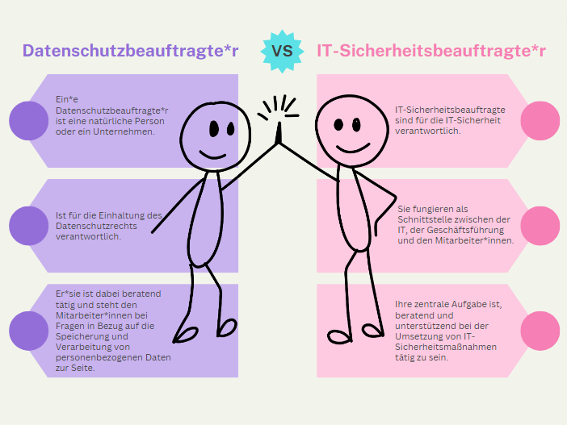
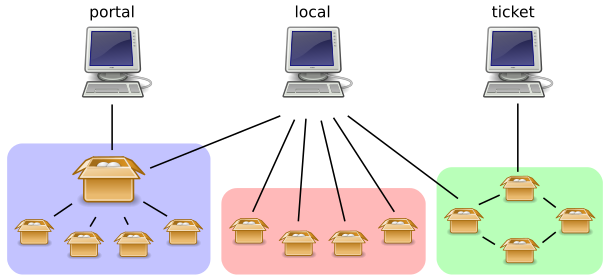
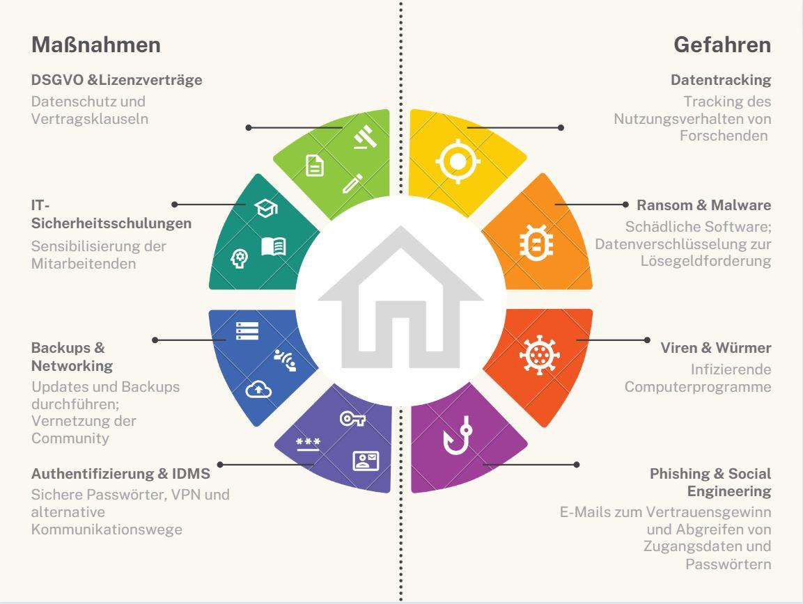

# Sicherheit & Datenschutz {#sec-sicherheit}

::: {.callout-note title="Zusammenfassung"}

Dieses Kapitel soll für das Thema IT-Sicherheit und Datenschutz sensibilisieren und geht dabei auch auf bibliotheksspezifische Besonderheiten ein. Nach der Beschreibung eines [Sicherheitsvorfalls](#sec-sicherheitsvorfall) werden [Richtlinien und Vorgaben](#sec-richtlinien-und-vorgaben) diskutiert, [Präventivmaßnahmen](#präventivmaßnahmen) vorgestellt und [Handlungsempfehlungen](#handlungsempfehlungen) gegeben.

:::

## Einleitung

In den letzten Jahren ist die Zahl der Angriffe auf Bildungseinrichtungen,
insbesondere Hochschulen und ihre Bibliotheken, deutlich gestiegen. Laut der
Hochschulrektorenkonferenz (HRK) waren bis Januar 2023 insgesamt 24 Hochschulen
bzw. Universitäten solchen cyberkriminellen Angriffen ausgesetzt und nahmen
Schaden [@MDR2023]. Informationseinrichtungen aller Sparten werden zudem mit
sicherheits- und datenschutzrelevanten Aufgaben konfrontiert.

Die Entwicklung hin zur Digitalisierung, Automatisierung und Virtualisierung
zieht nicht nur die Technisierung eigener Geschäftsgänge und Dienstleistungen
nach sich. Diese Entwicklung erfordert auch eine größere Sensibilität und
Aufmerksamkeit hinsichtlich der Sicherheit der eigenen Systeme. Safety und
Security sind hierfür wichtige, zu unterscheidende Grundprinzipien.

::: {.callout-important title="Definition"}

**Security** beinhaltet alle Maßnahmen zum Schutz vor Diebstahl oder
Beschädigung von Soft- und Hardware. **Safety** meint den sicherheitsbewussten
Umgang mit Netzwerken und Daten [@Hollaender2023].

:::

Darüber hinaus nimmt die Bedeutung des **Datenschutzes** weiter zu. Die
Verarbeitung von schützenswerten personenbezogenen Daten wird evtl. nicht nur
in der Bibliothek oder übergeordneten Einrichtung selbst vorgenommen, sondern
zunehmend von externen Dritten, wie bspw. Cloud-Infrastrukturen. Umso
bedeutender wird im Hinblick auf die Sicherheit die Datensparsamkeit und das
Bewusstsein, welche personenbezogenen Daten in welchen Systemen verarbeitet
werden oder verarbeitet werden müssen.

Bibliotheken verstehen sich als Orte, die ihre Informationen und
vielschichtigen Dienstleistungen i.d.R. einer großen Nutzendenschaft zur
Verfügung stellen. Sie tragen durch ihre Arbeit zur Umsetzung der
Openness-Strategie in Gesellschaft und Wissenschaft bei. Offenheit und
Transparenz sind schützenswerte Haltungen von Bibliotheken, welche gleichzeitig
aber auch eine größere Angriffsfläche ermöglichen.

Doch was macht Bibliotheken und Hochschulen so interessant für Angriffe? An
diesen Orten werden für Cyberkriminelle interessante Daten verwaltet. Dazu
gehören personenbezogene Daten von Nutzenden und Beschäftigten, schützenswerte
Forschungsdaten, Bewegungsdaten, Lizenzdaten, Daten zur Nutzung von Literatur,
etc. Die dabei abgegriffenen Daten können u.a. für Identitätsdiebstahl,
Offenlegung privater Informationen oder für die Erstellung eines detaillierten
Nutzerprofils herangezogen werden [@Hollaender2023].

IT-Sicherheit und Datenschutz sind auch immer eine Frage der Zuständigkeit. Je
nach Größe, Art und Organisationsstruktur der Bibliothek muss die IT-Sicherheit
mit den beteiligten Instanzen wie Stadtverwaltung, Verbundzentrale, den Rechen-
und IT-Zentren der Institution und den IT-Sicherheitsbeauftragten und
Datenschutzbeauftragten in Bezug auf die Verantwortlichkeiten abgestimmt
werden. Grundsätzlich liegt die Aufgabe der Sensibilisierung und Schulung des
Bibliothekspersonals im direkten Verantwortungsbereich der Bibliothek.

{#fig-datenschutz-datensicherheit}

Wenig ist zum Thema IT-Sicherheit in Bibliotheken veröffentlicht worden
[@Kost2022]. Deshalb soll dieses Kapitel zur Vorbeugung nicht nur für das Thema
IT-Sicherheit sensibilisieren, eine Beschreibung eines Sicherheitsvorfalls und
einen Überblick über die Richtlinien und Vorgaben geben, sondern auch für
Präventivmaßnahmen werben und Handlungsempfehlungen geben. Gleiches gilt für
den Datenschutz.

## Sicherheitsvorfall {#sec-sicherheitsvorfall}

### Einfallstore

Prominente Vorfälle in verschiedenen wissenschaftlichen Einrichtungen
haben in den letzten Jahren Schwachstellen in IT-Systemen offenbart, die
ernstzunehmende Sicherheitslücken darstellen. Dabei ist zu beachten,
dass sowohl Maschinen als auch Menschen verantwortlich für diese Lücken
sein können. Folgende sind die häufigsten Angriffsmethoden:

-   **Social Engineering:** Unter Social Engineering versteht
    man Methoden, die zum Vertrauensgewinn eingesetzt werden, um
    anschließend an sensible Informationen, Zugangsdaten für Systeme
    oder finanzielle Mittel zu gelangen. Social Engineering-Attacken
    können über persönliche Kontakte oder über Webdienste wie E-Mails
    oder Webseiten durchgeführt werden.

-   **Phishing:** Hierbei werden seriös wirkende E-Mails
    versendet, um den Empfänger\*innen Kennwörter oder
    Zahlungsinformationen zu entlocken, um so an sensible Daten zu
    gelangen. Die "Qualität" derartiger gefälschter E-Mails variiert
    stark. Es zeigt sich jedoch, dass sie kontinuierlich professioneller
    umgesetzt werden und schwieriger zu identifizieren sind. Häufig
    werden Phishing-Attacken mit Links auf präparierte Webseiten (sog.
    Watering Holes) kombiniert. In diesem Fall dienen sie auch als
    Haupteintrittstore für Malware.

-   **Malware**: alle Arten von Schadsoftware, die auf dem Zielrechner
    ausgeführt wird, um z.B. Daten auszuspionieren, das normale Systemverhalten
    zu unterbrechen oder Schäden zu verursachen. Typische Beispiele sind
    Ransomware, Viren oder Würmer.

-   **Ransomware:** Bei dieser Art des Angriffs wird der
    Zugriff auf Daten eingeschränkt oder unterbunden, z.B. durch
    Verschlüsselung. Für die Wiederherstellung des Zugriffs wird ein
    Lösegeld gefordert. Ransomware hat von allen Angriffsmethoden das
    größte Schadenspotential. Neben Lösegeldforderungen entstehen hohe
    Ausfalls- und Wiederherstellungskosten.\
    Als Beispiel: Für die direkten Kosten des Ransomware-Angriffs 2019
    auf die JLU Gießen werden mit Stand 2023 ca. 1,7 Mio. € für
    Schadensanalyse und -behebung kalkuliert. Zusätzliche Kosten für
    Aufwände und Workarounds sind in dieser Analyse nicht berücksichtigt
    und lassen sich schwer beziffern (@Kost2022).
 
-   **Viren** und **Würmer:** Schadprogramme, die sich selbständig replizieren 
    und/oder an andere Programme anhängen, um möglichst viele Rechner zu
    infizieren. Häufig dienen Viren und Würmer zur Verbreitung 
    der eigentlichen Schadsoftware.

-   **Denial-of-Service-Attacken (DoS):** ein Angriff, bei dem sehr viele
    gleichzeitige Anfragen an einen Server gestellt werden, um dessen
    Verfügbarkeit zu beeinträchtigen. Häufig kommen Distributed
    Denial-of-Service (DDoS) Angriffe vor, bei denen die Anfragen von vielen
    unterschiedlichen Systemen in einem koordinierten Einsatz gestellt werden.

### Bisherige Erfahrungen

Bisherige Erfahrungen zeigen die weitreichenden Auswirkungen eines
cyberkriminellen Angriffs auf Bibliotheken. In den meisten Fällen ist jedoch
nicht nur die Bibliothek alleine betroffen, sondern die gesamte Hochschule,
Kommune oder Forschungseinrichtun. Kommt es zu einem Angriff, ist es meist
notwendig, alle IT-Dienste herunterzufahren. Eine Abschottung einzelner Dienste
kann kaum vorgenommen werden. Man kann sich dies als einen "harten Cut" und ein
Herunterfahren aller eigenen Server und virtuellen Maschinen zur Eingrenzung
des schadhaften Fremdzugriffs vorstellen.  Diese harte Maßnahme wird
vorgenommen, da man nicht abschätzen kann, wo es im System schon zu welchen
Schäden gekommen ist. Die Folgen: es funktioniert schlimmstenfalls NICHTS mehr.
(W)LAN, Netzlaufwerke, Identity-Management und Anmeldedienste, E-Mail-Dienste,
Terminverwaltungstools, Personal-Verwaltungssysteme, Türschließmechanismen,
Zeiterfassung, IP-Telefonie, Lüftungs- und Beleuchtungssysteme, etc. Alle
netzbetriebenen Dienste sind ggf. für mehrere Tage, Wochen oder sogar Monate
außer Betrieb.

Im Ernstfall können die vorhandenen Dienstgeräte und
Kommunikationsdienste nicht mehr verwendet werden. Aufgrund dessen kann
man zur Kommunikation auf private Geräte (Notebooks, Smartphones, etc.,
sofern die Mitarbeiter\*innen bereit dazu sind) und alternative
E-Mail-Dienste ausweichen. Hier ist zu bedenken, dass diese
Adhoc-Lösungen nicht unbedingt den datenschutzrechtlichen Ansprüchen
entsprechen wenn keine Vertrag zur Auftragsdatenverarbeitung abgeschlossen wird.
Von besonderer Bedeutung ist in diesem Fall auch das
Identity Management System (IDMS), das nach einem Angriff gegebenenfalls
alternativ aufgebaut werden muss.

Die fortschreitende Digitalisierung, Automatisierung und Virtualisierung kann
durchaus auch hilfreich sein, wenn die Systeme nicht mehr ausschließlich im
eigenen Rechenzentrum betrieben werden. So können die extern betriebenen
Anwendungen ggfs. über alternative (mobile) Netzwerke und mit bereits geprüften
und wieder freigegebenen Notebooks schnell wieder genutzt werden. Als Beispiel
sei hier das Bibliotheksmanagementsystem (siehe @sec-bibliotheksmanagementsysteme)
genannt. Wenn dieses bei einem Dienstleister gehostet wird, ist es in der Regel
vom Angriff nicht betroffen, so dass die Ausleihe und Rückgabe wieder zeitnah
ermöglicht werden können.

Zu guter Letzt darf auch nicht unterschätzt werden, welche zeitlichen Ausmaße
ein Angriff einnehmen kann und welche psychischen und sozialen Auswirkungen er
verursacht. Mitunter muss mit monatelangen Einschränkungen gerechnet werden und
es kann nicht davon ausgegangen werden, dass alle Daten vollständig
wiederhergestellt werden können. Daher gilt es nicht nur, einen Angriff
möglichst zu vermeiden, sondern das Ausmaß möglicher Schäden zu minimieren.

## Richtlinien und Vorgaben {#sec-richtlinien-und-vorgaben}

Wie in jedem Bereich unseres Lebens finden sich auch in der
IT-Sicherheit mehrere Richtlinien und Vorgaben sowohl auf nationaler als
auch auf europäischer Ebene.

### IT-Sicherheit

Auf nationaler Ebene liegt die Zuständigkeit unter anderem beim
Bundesamt für Sicherheit in der Informationstechnik
([BSI](https://www.bsi.bund.de/DE/Das-BSI/Auftrag/auftrag_node.html)),
welches seit 1991 mit der Aufgabe betraut ist, das Regierungsnetz und
die kritischen Infrastrukturen (KRITIS) zu schützen. Auf Bundesebene
wurde es eine zentrale Anlaufstelle für Sicherheitsstandards, sowie
Meldestelle bei IT-Krisen. Es stellt unterschiedliche Normen zur
IT-Sicherung zur Verfügung. Wann welcher Standard greift, hängt von der
Komplexität des Einzelfalls ab.

Für Bibliotheken sind hierbei auch die "Checklisten zum
[IT-Grundschutz-Kompendium](https://www.bsi.bund.de/DE/Themen/Unternehmen-und-Organisationen/Standards-und-Zertifizierung/IT-Grundschutz/IT-Grundschutz-Kompendium/it-grundschutz-kompendium_node.html)"
nach dem BSI-Standard 200-2 sehr empfehlenswert, da in diesen der
aktuelle Stand der Integration des Grundschutzes überprüft werden kann.
In diesem Zusammenhang wird auch auf die ISO/IEC-27000-Familie
hingewiesen. In dieser Normenreihe sind neben definierten und stets
aktuell gehaltenen Standards, die Anforderungen an Information Security
Management Systems (ISMS), Empfehlungen für Kontrollmechanismen, als
auch Best-Practices-Empfehlungen zu Aufbau und Organisation von
Informationsfreiheit enthalten.

### Datenschutz

Weitere Institutionen, die einen entscheidenden Einfluss auf die
Vereinheitlichung des Datenschutzes in der Europäischen Union durch den
Erlass der Datenschutz-Grundverordnung
([DSGVO](https://www.bmwk.de/Redaktion/DE/Artikel/Digitale-Welt/europaeische-datenschutzgrundverordnung.html))
von 2016 hatten, sind das Europäische Parlament und der Europäische Rat.
Die DSGVO gilt seit 2018 unmittelbar in allen der EU zugehörigen Länder.
Sie regelt unter anderem, dass jede Person das Recht auf Schutz der sie
betreffenden personenbezogenen Daten hat. So dürfen Daten nur für einen
bestimmten Zweck erhoben (Zweckbindung) und auch nicht für andere
Vorhaben weiterverarbeitet werden (gem. Art 5 II DSGVO). Ferner wird in
Art 37 DSGVO die Ernennung eines Datenschutzbeauftragten geregelt.

Ergänzt wird diese Grundverordnung durch die einzelnen nationalen
gesetzgebenden Instanzen. In Deutschland geschieht dies sowohl auf
Bundes- als auch auf Landesebene, in Form des Bundesdatenschutzgesetzes
(BDSG) sowie der 16 Landesdatenschutzgesetze.

In Österreich wird die DSGVO ergänzt durch das Datenschutzgesetz (DSG)
und das Netz- und Informationssystemsicherheitsgesetz (NISG).

Ähnliche Gesetze wurden auch außerhalb der EU erlassen. So trat Anfang
September 2023 in der Schweiz die neue Verordnung über
Datenschutzzertifizierungen (VDSZ) in Kraft, welche sich an den
Grundzügen der DSGVO orientiert.

In ihrer besonderen Rolle als Institutionen für Informationsversorgung
und Bereitstellung von Wissensinfrastruktur greifen Bibliotheken auch
auf die Dienste externer Anbieter zurück, z.B. durch Verträge mit
Wissenschaftsverlagen über digitale Literaturangebote. Hierbei ist es
wichtig, dass Bibliotheken in diesen Verträgen darauf bestehen, dass das
Tracking des Nutzungsverhaltens der Forschenden ausgeschlossen wird
(@Reda2022), um die Wissenschaftsfreiheit und
die informationelle Selbstbestimmung zu schützen [@DFG2021].

Aufgrund der stetigen Weiterentwicklung von Software und neuen
Technologien hat die Europäische Kommission einen Vorschlag für ein
neues Gesetz zur Widerstandsfähigkeit von Cyberangriffen, den [Cyber
Resilience Act](https://digital-strategy.ec.europa.eu/en/policies/cyber-resilience-act),
auf den Weg gebracht. Gemäß diesem Vorschlag sollen Verbraucher\*innen
und Unternehmen beim Kauf von Produkten und Software mit digitalen
Komponenten geschützt werden, indem verbindliche
Cyber-Sicherheits-Anforderungen für diese Leistungen durch die
Hersteller eingeführt werden sollen. Im nächsten Schritt werden nun das
Europäische Parlament und der Europäische Rat über diesen Vorschlag
beraten.

## Präventivmaßnahmen

### Passwortsicherheit

Zu einem umfassenden IT-Sicherheitskonzept gehört, dass alle Beteiligten
einen bewussten Umgang mit Passwörtern praktizieren. Passwörter sollten
zum Beispiel nicht ohne Weiteres für Dritte zugänglich auf Papier oder
einem anderen Medium (z. B. unverschlüsselt auf dem Computer)
festgehalten werden. Bei Verdacht auf Angriff sollten alle betroffenen
Passwörter umgehend geändert werden. Bei einer großen Menge an
Passwörtern empfiehlt es sich, einen Passwort-Manager zu verwenden. Für
die Wahl des Passworts sollten die allgemein gültigen Empfehlungen
beachtet werden (beispielsweise die [Passwort-Empfehlungen des BSI]( Tipps zur Erstellung sicherer Passwörter: https://www.bsi.bund.de/DE/Themen/Verbraucherinnen-und-Verbraucher/Informationen-und-Empfehlungen/Cyber-Sicherheitsempfehlungen/Accountschutz/Sichere-Passwoerter-erstellen/sichere-passwoerter-erstellen_node.html)).

### Authentifizierung und Autorisierung

Unter Authentifizierung verstehen wir grundsätzlich das eindeutige
Erkennen eines Zugriffs auf eine Ressource wie z.B. einen Dienst oder
einen Computer, aber auch auf ein physisches Objekt wie z.B. einen
Drucker.

In der Regel erfolgt heutzutage der Zugriff über ein Netzwerk, d. h.,
auch die Authentifizierung muss über das Netzwerk erfolgen. Für Geräte
(Computer) kann dies durch technische Merkmale wie den Media Access Code
(MAC Adresse) oder - flexibler - über die IP-Adresse durchgeführt
werden. Diese Merkmale authentifizieren jedoch nur das Gerät und lassen
noch keine Aussage darüber zu, wer dieses Gerät gerade benutzt.

Eine Authentifizierung einer Person erfolgt meistens über eine
eindeutige Kennung und ein zugehöriges Passwort. Wenn möglich, sollten
verschiedene Authentifizierungsverfahren miteinander kombiniert werden.
Es wird dann auch von einer 2-Faktor-Authentifizierung (2FA) bzw. einer
Mehrfaktor-Authentifizierung (MFA) gesprochen.

Ist ein Zugriff eindeutig durch entsprechende Authentifizierung erkannt,
kann auf Basis verschiedener Informationen je nach Bedarf entschieden
werden, ob der Zugriff auch berechtigt ist. D. h., der Zugriff muss
autorisiert werden. Dies kann sehr individuell erfolgen (Konto A hat
Zugriff, Konto B nicht) oder anhand der Zugehörigkeit eines Kontos zu
einer bestimmten Personengruppe.

Alle Komponenten, die zur Authentifizierung und Autorisierung in einer
Einrichtung notwendig sind, werden auch als Authentifizierungs- und
Autorisierungsinfrastruktur (AAI) bezeichnet. Wurde in einer Einrichtung
eine AAI aufgebaut, auf welche jede Anwendung zurückgreifen kann, kann
man festlegen, dass nach einmaligem Login ein Zugriff auf alle
Anwendungen möglich und ein separates Einloggen nicht nötig ist. Dies
wird auch als **Single-Sign-On (SSO)** bezeichnet.

{#fig-sso}

**Links:** Benutzer\*in meldet sich auf einem **Portal** an und bekommt
Zugriff auf alle eingebundenen Dienste. **Mitte:** Benutzer\*in
speichert alle Anmeldedaten auf einem Datenträger oder im Netzwerk. Ein
**lokal**es Programm meldet ihn\*sie separat bei jedem Dienst, Portal oder
Ticketing-System ein. **Rechts:** Benutzer\*in meldet sich bei einem der
Dienste an und bekommt ein **Ticket** für den gesamten "Kreis der
Vertrauten".

Zentrale Komponenten sind hierbei der **Identity Provider (IDP)**, der auf
Basis des dahinterliegenden IDMS eine digitale Identität inkl. notwendiger
Benutzer\*innenattribute bereitstellt und an dem die einmalige Anmeldung
stattfindet. Die genutzten Anwendungen werden allgemein als **Service Provider
(SP)** bezeichnet.

Eine gute Möglichkeit, das Internet sicher zu nutzen, ist das **Virtual
Private Network (VPN)**. Das VPN verschlüsselt die Identität von
Internetnutzer\*innen. Damit wird es Dritten erschwert, die
Nutzer\*innen im Internet zu verfolgen und Daten abzugreifen. VPN nutzt
dabei eine Echtzeitverschlüsselung. Informationen werden in eine
unleserliche Form umgewandelt und können nur mit einem Schlüssel wieder
in die ursprüngliche leserliche Form gebracht werden.

### Updates und Backups

Eine sichere Hard- und Software ist unabdingbar. Rechner sollten
ausreichend geschützt sein. Dazu gehören unter anderem aktuelle
Virenscanner und automatische Updates des Virenscanners, des
Betriebssystems und jeder auf dem Rechner laufenden Software. Fehlende
Updates können als Einfallstore genutzt werden, um Schadsoftware auf den
Computer und damit auch in das Netzwerk einzuschleusen.

Falls es zu einem Angriff oder Ausfall des Systems kommt, muss auf
Backups zurückgegriffen werden. Dabei wird eine Sicherungskopie
angelegt, meist auf einem anderen Medium, wie z. B. einer externen
Festplatte. Server werden mittels eines RAID-Verfahrens gespiegelt, d.
h. die Daten werden auf einen zweiten Server übertragen. Da es bei einem
Backup auch zu Datenverlust oder -beschädigung kommen kann, empfiehlt es
sich, mehr als eine Kopie anzulegen, z. B. auf Magnetbändern.

::: {.callout-important title="Definition"}

Ein **Server** ist ein zentraler Rechner (virtuell oder
physikalisch), der Daten zur Verfügung hält und diese auf Anfrage
durch einen Client (PC, mobiles Gerät) zur Verfügung stellt.

:::

### Schulungen

Regelmäßige Weiterbildungen ermöglichen es den Mitarbeiter\*innen von
Bibliotheken, ihre Fähigkeiten auszubauen und die Sensibilität für Themen wie
IT-Sicherheit zu erhöhen. Die in @sec-richtlinien-und-vorgaben erwähnten
Rahmenbedingungen schaffen dabei ein Grundgerüst für Schulungsinhalte und
können für verpflichtende IT-Sicherheitsschulungen - wie sie bereits von
einigen Bibliotheken durchgeführt werden - verwendet werden.

Es sollten zwei Arten von Schulungen durchgeführt werden: für
Mitarbeiter\*innen und Nutzer\*innen. Mitarbeiter\*innen sollten dahingehend
sensibilisiert werden, dass sie mit schützenswerten Daten arbeiten. Es ist
bspw. wichtig, daran zu denken, dass gerade Geräte in Büros im Sichtfeld von
Personen durch sinnhafte Positionierung oder Blickschutzfilter vor unbefugtem
Sehen geschützt werden. Auf die Wichtigkeit sicherer Passwörter wurde bereits
weiter oben in diesem Abschnitt hingewiesen. Es sollte zudem auf die
Angriffsmöglichkeiten in @sec-sicherheitsvorfall aufmerksam gemacht werden.
Beispielhafte Erklärungen möglicher Angriffsszenarien und Möglichkeiten (z. B.
Tools) sich zu schützen, sollten aufgezeigt werden.

## Handlungsempfehlungen 

Sind öffentliche Einrichtungen (Hochschulen, Kommunen) von Cyberattacken
betroffen, hat dies allumfassende Folgen. Im schlimmsten Fall sind
sämtliche Dienste nicht mehr verfügbar und die Ausfallzeit und
Schadenshöhe weisen ins Ungewisse. Dann können Notfall- und
Sicherheitskonzepte teils detaillierte Anleitungen für die Ersthilfe
bieten. Generell gilt, dass Cyberattacken nicht nur eine kommunikative,
sondern häufig auch eine Organisationskrise nach sich ziehen.

{#fig-massnahmen-praevention}

Zum einen muss intern (mit vorbereiteten Notfallgeräten oder ggf. privaten
Endgeräten) und extern (mit Dienstleister\*innen, Bibliothekspartner\*innen,
Bibliotheksnutzer\*innen) kommuniziert werden u.a. über den Vorfall, und ggf.
weiterlaufende Dienste (cloudbasierte und von Drittanbieter\*innen). Besonders
cloudbasierte Dienste können im Notfall evt. gute Alternativlösungen bieten,
das gilt zum einen für alternative Loginverfahren z.B. bei extern gehosteten
Plattformen für E-Ressourcen, wenn das IDMS nicht zur Verfügung steht.

Ist das BMS einer Bibliothek cloudbasiert, kann ein Ausleihbetrieb mit
Notfallgeräten schneller wieder aufgenommen werden, da die Daten vor dem Hacker
besser geschützt sind. Ähnlich kann man mit eigenen Dokumenten vorgehen, in dem
das Active Directory des eigenen Systems ein tägliches Update erstellt und z.B.
im CSV-Format an eine Cloud exportiert. Im einfachsten Fall betrifft es nur
Notfalldokumente, die einem Krisenstab zugänglich sind. Tritt ein Notfall ein,
kann man über die Standard-Benutzeroberfläche der Cloud die gesicherten Skripte
starten. Der Cloudbetreiber sollte Erfahrungen mit Notfall-Lösungen und
Umgebungen haben. Trotzdem sollte die Bibliothek ihre Datensicherung gut planen
und cloudbasierte oder andere netzwerkunabhängige Backups länger vorhalten
(mindestens 14 Tage), um auf nicht infizierte Sicherungen zurückgreifen zu
können. Es ist ja nicht auszuschließen, dass die Angreifer die Zugangsdaten für
die Datensicherung abgreifen konnten. Daher sollte auch über eine
Verschlüsselung der Datensicherung in Erwägung gezogen werden. Genauso gilt es,
die Wiederherstellung der Daten zu planen und zu üben. Unerlässlich ist auch
eine gute Dokumentation der gesamten Notfall-Architektur.

Und zum anderen sind alternative Abläufe aufzubauen, um wieder an der
digitalen Arbeitswelt teilzunehmen und den Bibliotheksbetrieb
weitestgehend wieder anbieten zu können.

Die kommunikativen Anforderungen sind wie die organisatorischen als sehr
hoch einzuschätzen, da Informationseinrichtungen mit ihren analogen
Begegnungsmöglichkeiten Schnittstellen für eine ganze Hochschule sein
können. Für beide Aufgaben können andere Bibliotheken und externe Firmen
Unterstützung bieten.

Stehen Plan und eine Notfallumgebung, ist es unerlässlich, regelmäßige
Notfallübungen durchzuführen. Damit trainiert man die Abläufe und kann diese
regelmäßig überprüfen und optimieren [@Mueller2023]. Die dadurch entstehende
Routine kann Sicherheit für den Ernstfall geben. Dennoch darf man nicht
unterschätzen, dass ein Angriff auch persönliche Auswirkungen auf alle
Betroffenen hat.

## Fazit

Lässt man die Informationen in diesem Kapitel noch einmal Revue
passieren, bleibt als abschließendes Fazit frei nach Ringelnatz nur zu
sagen: "Sicher ist, dass nichts sicher ist. Selbst das nicht".
Trotzdem ist man der Gefahr nicht hilflos ausgeliefert. Durch
Präventivmaßnahmen, Notfall-Systeme und Pläne kann man einen Angriff
wohl nicht verhindern. Man kann jedoch versuchen, den Schaden und die
daraus folgenden Belastungen so gering wie möglich zu halten. In vielen
Bibliotheken entstehen derzeit individuelle Sicherheitskonzepte und neue
Sicherheitsmaßnahmen. Die nächsten Monate und Jahre werden zeigen, mit
welchen neuen Strategien sich Bibliotheken vor Cyberangriffen schützen
und sich auf diese vorbereiten können.

<!--
BIM22: Nadine Bolliger, Andrea Brandstätter, Birgit
Bretträger, Felix Burger, Jana Eigelsbach, Martin Enßlen, Thomas Graff,
Michael Haß, Céline Schmelzer, Juliane Schwarz, Anne Timm, Frauke
Ureidat, Karin von Wartburg

BIM23: Martin Brossard, Verena Kertelics, Selina Kiefer,
Anette Popall, Jessica Seidel, Dorothea Stawenow, Tatjana Waller
-->

